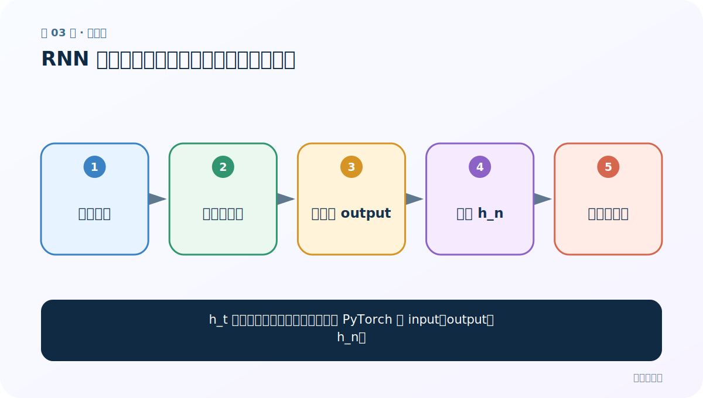
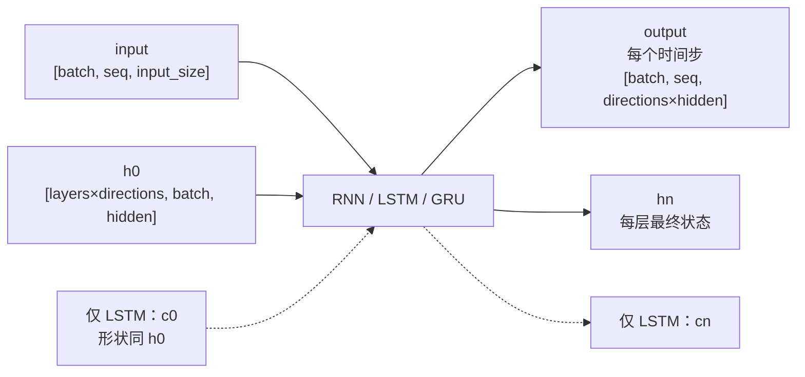

# 第 3 节：RNN 模型结构：公式、共享权重与张量形状

> 笔记编号 3/28 · 对应原视频 P40 · [打开这一集](https://www.bilibili.com/video/BV14mdfBDE4Q?p=40)

[← 上一节：2 RNN 分类：输入输出关系与内部结构是两个维度](./02-rnn-types.md) · [返回总目录](./README.md) · [下一节：4 RNN 基础代码：创建层、准备输入、运行并验形状 →](./04-rnn-basic-code.md)

## 这节解决什么问题

h_t 的公式看懂了，怎样把它对应到 PyTorch 的 input、output、h_n？



图从左向右读。先跟着数据或推理过程走一遍，再学习下面的术语。

## 辅助流程图


### PyTorch 循环层的张量形状



## 老师原声整理稿（按讲解顺序）

### 0:00–3:54　单步公式

老师从 h_t = tanh(W_x x_t + W_h h_(t-1) + b) 讲起。W_x 把当前输入投到隐藏空间，W_h 处理旧状态，二者相加再激活。权重在每个时间步相同。

### 3:54–7:52　output 与 h_n 不要混淆

PyTorch 循环层返回 output 和 h_n。output 收集最后一层在所有时间步的输出；h_n 收集每一层（以及每个方向）在最终时间步的状态。单层单向时，output 的最后时间步和 h_n[0] 数值相同，但形状和语义组织不同。

### 7:52–11:29　三类核心维度

input_size 是每个 token 的特征数，hidden_size 是状态维度，num_layers 是堆叠层数。若 batch_first=True，输入是 [batch, seq, input_size]；否则默认是 [seq, batch, input_size]。老师的课堂示意采用后一种顺序，因此阅读代码必须先检查 batch_first。

## 完整原声逐段记录

[查看本节按时间戳整理的完整音轨转写](./transcripts/p040.md)

逐段记录用于核查老师讲解是否遗漏；正文会进一步纠正口误和语音识别中的技术术语。

## 零基础先记住

- input_size 不等于序列长度
- output 含每个时间步，h_n 含最终状态
- batch_first 会改变前两维顺序

## 最小可运行代码

下面代码默认从项目根目录运行；专题配套实现见 [rnn_from_scratch 配套实现](../../rnn_from_scratch/README.md)。

```python
import torch
rnn = torch.nn.RNN(5, 6, batch_first=True)
x = torch.randn(2, 3, 5)
out, hn = rnn(x)
print(out.shape, hn.shape)
```

### 输入和输出怎么看

output=[2,3,6]，h_n=[1,2,6]；单层单向所以第一维为 1。

## 最容易踩的坑

不要只背“236、136”之类示例数字；应从 batch、seq、hidden 的含义推导。

## 本节知识链

`序列张量 → 时间步递推 → 所有步 output → 最终 h_n → 下游分类层`

## 自测

**问题：batch_first=True 时 [2,3,5] 分别是什么？**

<details>
<summary>点开核对答案</summary>

2 个样本、每个 3 个时间步、每步 5 维特征。

</details>

## 学完检查

- [ ] 我能用自己的话复述老师的讲解顺序
- [ ] 我能在运行前预测关键输出或张量形状
- [ ] 我知道这节方法最容易用错的地方
- [ ] 我能独立回答自测题

[← 上一节：2 RNN 分类：输入输出关系与内部结构是两个维度](./02-rnn-types.md) · [返回总目录](./README.md) · [下一节：4 RNN 基础代码：创建层、准备输入、运行并验形状 →](./04-rnn-basic-code.md)
