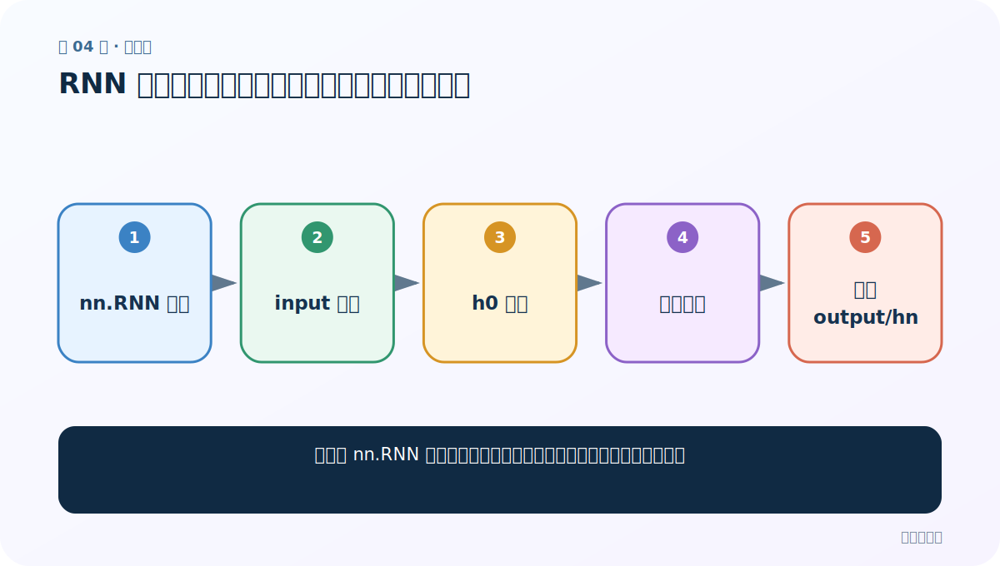
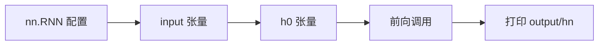
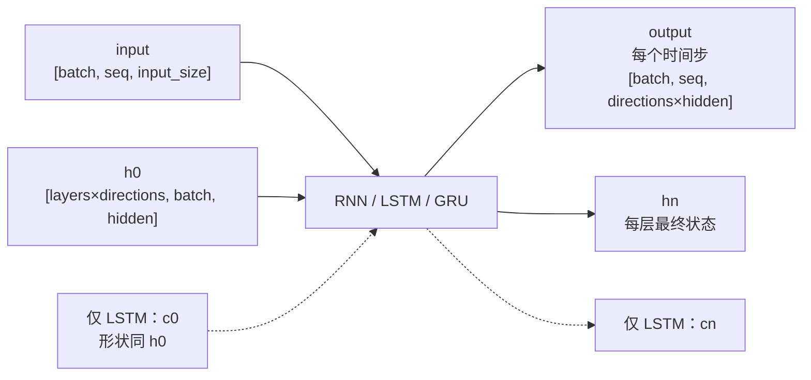

# 第 4 节：RNN 基础代码：创建层、准备输入、运行并验形状

> 笔记编号 4/28 · 对应原视频 P41 · [打开这一集](https://www.bilibili.com/video/BV14mdfBDE4Q?p=41)

[← 上一节：3 RNN 模型结构：公式、共享权重与张量形状](./03-rnn-structure.md) · [返回总目录](./README.md) · [下一节：5 修改句长：只应改变 output 的时间维 →](./05-change-sequence-length.md)

## 这节解决什么问题

如何用 nn.RNN 跑通一次前向传播，并用形状证明每个参数理解正确？



图从左向右读。先跟着数据或推理过程走一遍，再学习下面的术语。

## 辅助流程图



### PyTorch 循环层的张量形状



## 老师原声整理稿（按讲解顺序）

### 0:00–5:51　建立脚本与解释参数

老师先写 RNN 概念，再导入 torch/nn。创建 nn.RNN 时依次解释 input_size、hidden_size、num_layers；后两个维度不是“词数”和“类别数”。

### 5:51–10:48　准备 input 与 h0

输入张量要同时包含序列长度、批大小和每步特征维度；h0 的形状必须是 [num_layers×directions, batch, hidden_size]。课堂用随机数只是验证接口，不能代表真实文本编码。

### 10:48–15:44　调用与两个返回值

执行 output, h_n = rnn(input, h0)。老师逐维核对 output 保存所有时间步，h_n 保存每层最终隐藏状态，并让同学记住单层时 output[-1] 与 h_n[-1] 的关系。

### 15:49–20:25　从死记数字转向推导

课堂反复修改张量并打印形状。真正要掌握的是推导规则：改 batch，output/h_n 的 batch 维一起变；改 seq，只改 output 的时间维；改 hidden_size，二者最后一维一起变。

## 完整原声逐段记录

[查看本节按时间戳整理的完整音轨转写](./transcripts/p041.md)

逐段记录用于核查老师讲解是否遗漏；正文会进一步纠正口误和语音识别中的技术术语。

## 零基础先记住

- h0 也必须匹配层数、批量和隐藏维度
- 随机张量只用于接口测试
- 修改一个变量前先预测哪些维度会变

## 最小可运行代码

下面代码默认从项目根目录运行；专题配套实现见 [rnn_from_scratch 配套实现](../../rnn_from_scratch/README.md)。

```python
import torch
rnn = torch.nn.RNN(5, 6)
x = torch.randn(3, 2, 5)
h0 = torch.zeros(1, 2, 6)
out, hn = rnn(x, h0)
print(out.shape, hn.shape)
```

### 输入和输出怎么看

默认非 batch_first：output=[3,2,6]，h_n=[1,2,6]。

## 最容易踩的坑

h0 的第一维是层数×方向数，不是序列长度。

## 本节知识链

`nn.RNN 配置 → input 张量 → h0 张量 → 前向调用 → 打印 output/hn`

## 自测

**问题：把序列长度 3 改为 7，h_n 的形状会变吗？**

<details>
<summary>点开核对答案</summary>

不会；output 时间维变为 7，h_n 仍只保留最终状态。

</details>

## 学完检查

- [ ] 我能用自己的话复述老师的讲解顺序
- [ ] 我能在运行前预测关键输出或张量形状
- [ ] 我知道这节方法最容易用错的地方
- [ ] 我能独立回答自测题

[← 上一节：3 RNN 模型结构：公式、共享权重与张量形状](./03-rnn-structure.md) · [返回总目录](./README.md) · [下一节：5 修改句长：只应改变 output 的时间维 →](./05-change-sequence-length.md)
