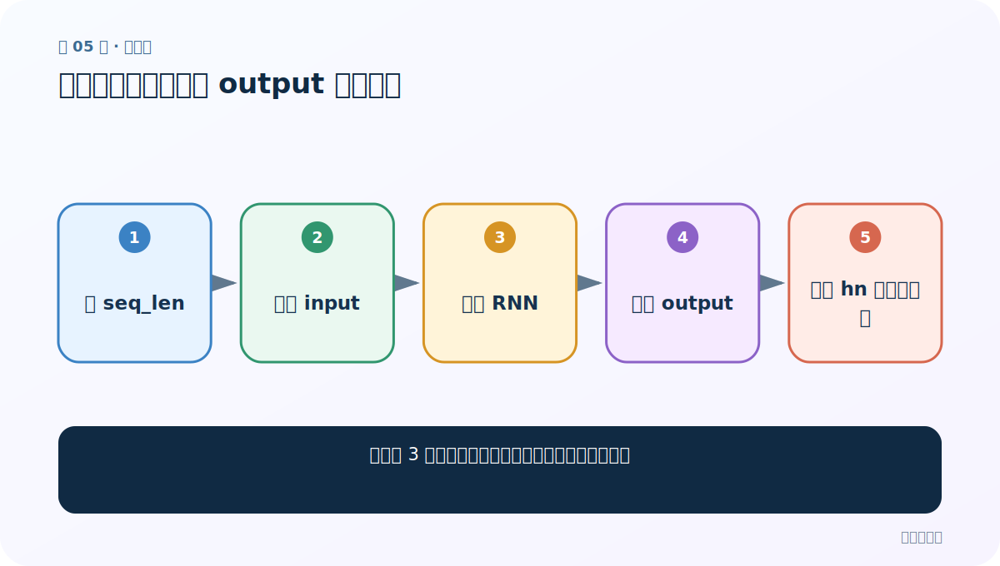
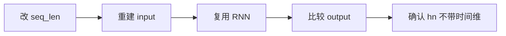
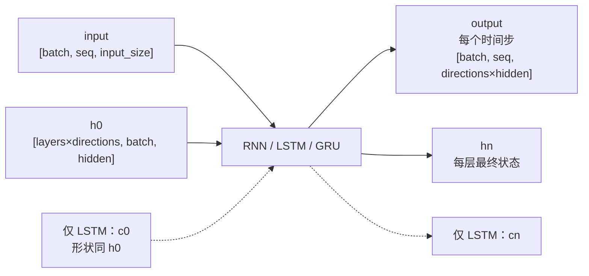

# 第 5 节：修改句长：只应改变 output 的时间维

> 笔记编号 5/28 · 对应原视频 P42 · [打开这一集](https://www.bilibili.com/video/BV14mdfBDE4Q?p=42)

[← 上一节：4 RNN 基础代码：创建层、准备输入、运行并验形状](./04-rnn-basic-code.md) · [返回总目录](./README.md) · [下一节：6 修改隐藏层与总结：维度代表模型的记忆容量 →](./06-change-hidden-size.md)

## 这节解决什么问题

序列从 3 步改为更多步时，哪些张量维度应该变化？



图从左向右读。先跟着数据或推理过程走一遍，再学习下面的术语。

## 辅助流程图



### PyTorch 循环层的张量形状




## 零基础精讲：先把这一节真正弄懂

### 先用一个场景理解

一句话从 7 个词换成 12 个词，只是要多读 5 步，不应改变每个词的输入宽度和记忆宽度。

### 沿数据流一步一步走

1. 改 seq_len
2. 重建 input
3. 复用 RNN
4. 比较 output
5. 确认 hn 不带时间维

上面每一步都对应流程图的一段。读图时不断问自己：“此刻张量里装的是什么，形状是什么，下一步为什么需要它？”

### 第一次看代码只盯住这里

改 seq_len 前先预测：output 的 L 会变，hn 没有 L 这一维，所以形状不随句长增加。

运行代码前先写出预期形状，运行后逐维核对。数值可以暂时算不出，但 B（批量）、L（长度）、D/H（特征或隐藏宽度）为什么出现，必须能说清。

### 本节边界

真实 batch 中句长不同还需 padding/packing；这里只是所有样本同时改长。

本节过关不是背公式，而是能从第 1 步讲到最后一步，并指出哪一个状态把前文带到了后面。

## 老师原声整理稿（按讲解顺序）

### 0:00–1:53　只改一个变量做对照

老师把输入的句子长度改长，其他 input_size、hidden_size、batch 和层数不动，然后要求运行前先猜形状。

### 1:53–3:26　观察结果

output 要为每个时间步保留一个隐藏输出，所以时间维随句长改变；h_n 只保存各层最终状态，不保留整条时间轴，因此形状不变。这个小实验是后面“取最后一步做分类”的基础。

## 完整原声逐段记录

[查看本节按时间戳整理的完整音轨转写](./transcripts/p042.md)

逐段记录用于核查老师讲解是否遗漏；正文会进一步纠正口误和语音识别中的技术术语。

## 零基础先记住

- seq_len 决定 output 的时间维
- h_n 不包含完整时间轴
- 控制变量实验比背结果可靠

## 最小可运行代码

下面代码默认从项目根目录运行；专题配套实现见 [rnn_from_scratch 配套实现](../../rnn_from_scratch/README.md)。

```python
import torch
rnn = torch.nn.RNN(5, 6, batch_first=True)
for length in (3, 7):
    out, hn = rnn(torch.randn(2, length, 5))
    print(length, out.shape, hn.shape)
```

### 输入和输出怎么看

output 从 [2,3,6] 变 [2,7,6]；h_n 始终 [1,2,6]。

## 最容易踩的坑

真实 batch 中句长不同还需 padding/packing；这里只是所有样本同时改长。

## 本节知识链

`改 seq_len → 重建 input → 复用 RNN → 比较 output → 确认 hn 不带时间维`

## 自测

**问题：为什么 h_n 不需要 seq_len 这一维？**

<details>
<summary>点开核对答案</summary>

它定义上就是每层、每方向的最终状态，而不是所有时间步。

</details>

## 学完检查

- [ ] 我能用自己的话复述老师的讲解顺序
- [ ] 我能在运行前预测关键输出或张量形状
- [ ] 我知道这节方法最容易用错的地方
- [ ] 我能独立回答自测题

[← 上一节：4 RNN 基础代码：创建层、准备输入、运行并验形状](./04-rnn-basic-code.md) · [返回总目录](./README.md) · [下一节：6 修改隐藏层与总结：维度代表模型的记忆容量 →](./06-change-hidden-size.md)
