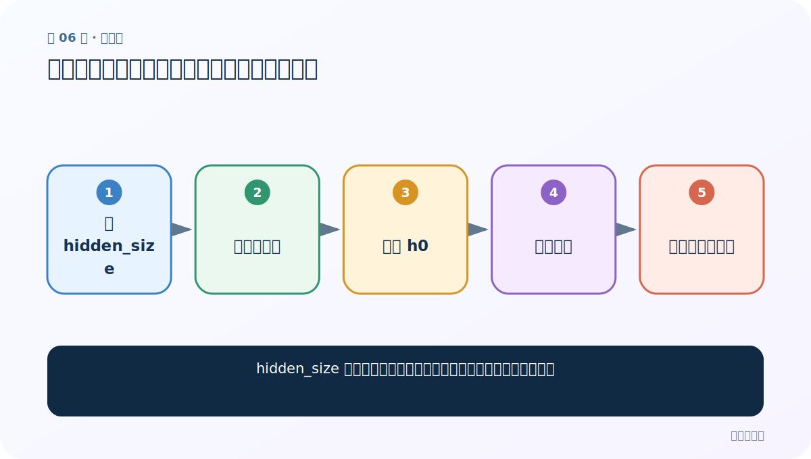
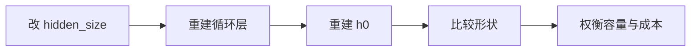
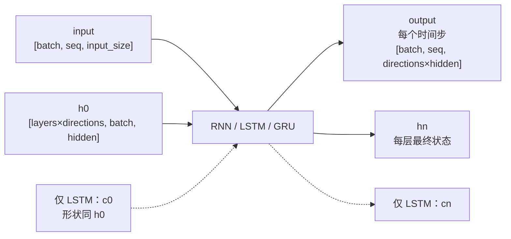

# 第 6 节：修改隐藏层与总结：维度代表模型的记忆容量

> 笔记编号 6/28 · 对应原视频 P43 · [打开这一集](https://www.bilibili.com/video/BV14mdfBDE4Q?p=43)

[← 上一节：5 修改句长：只应改变 output 的时间维](./05-change-sequence-length.md) · [返回总目录](./README.md) · [下一节：7 LSTM 图解（上）：遗忘门与输入门管理长期记忆 →](./07-lstm-diagram-part1.md)

## 这节解决什么问题

hidden_size 变大后，模型容量、输出形状和计算量如何一起变化？



图从左向右读。先跟着数据或推理过程走一遍，再学习下面的术语。

## 辅助流程图



### PyTorch 循环层的张量形状




## 零基础精讲：先把这一节真正弄懂

### 先用一个场景理解

hidden_size 像便签能写多少格。16 格改成 64 格，记忆和 output 的最后一维都会变，参数量也会增加。

### 沿数据流一步一步走

1. 改 hidden_size
2. 重建循环层
3. 重建 h0
4. 比较形状
5. 权衡容量与成本

上面每一步都对应流程图的一段。读图时不断问自己：“此刻张量里装的是什么，形状是什么，下一步为什么需要它？”

### 第一次看代码只盯住这里

只改 hidden_size，逐项检查 output、hn 和后续 Linear 层的输入维是否同步。

运行代码前先写出预期形状，运行后逐维核对。数值可以暂时算不出，但 B（批量）、L（长度）、D/H（特征或隐藏宽度）为什么出现，必须能说清。

### 本节边界

旧 h0 不能拿给 hidden_size 已变化的新模型。

本节过关不是背公式，而是能从第 1 步讲到最后一步，并指出哪一个状态把前文带到了后面。

## 老师原声整理稿（按讲解顺序）

### 0:00–4:49　修改 hidden_size

老师把隐藏维度改为新数值，并同步修改 h0。output 与 h_n 的最后一维随之改变；input 最后一维仍由 input_size 决定。

### 4:49–9:44　层数与批量也按公式推导

num_layers 增加会让 h_n 第一维增加，output 仍只暴露最后一层；batch 增加会同时改变 input、output、h_n 的批量维。课堂围绕多个数字例子反复核对。

### 9:44–16:35　容量不是越大越好

隐藏维度大能容纳更复杂模式，也增加参数、显存、训练时间和过拟合风险。老师最后回扣 input、output、h_n 的关系。实际选型应看验证集，而不是把“记得更多”简单等同于更准确。

## 完整原声逐段记录

[查看本节按时间戳整理的完整音轨转写](./transcripts/p043.md)

逐段记录用于核查老师讲解是否遗漏；正文会进一步纠正口误和语音识别中的技术术语。

## 零基础先记住

- hidden_size 控制循环状态宽度
- 改层配置后 h0 必须同步
- 容量增加伴随计算与过拟合成本

## 最小可运行代码

下面代码默认从项目根目录运行；专题配套实现见 [rnn_from_scratch 配套实现](../../rnn_from_scratch/README.md)。

```python
import torch
for hidden in (4, 12):
    rnn = torch.nn.RNN(5, hidden, num_layers=2, batch_first=True)
    out, hn = rnn(torch.randn(3, 7, 5))
    print(hidden, out.shape, hn.shape)
```

### 输入和输出怎么看

hidden=4 时 output [3,7,4]、hn [2,3,4]；hidden=12 时末维都变 12。

## 最容易踩的坑

旧 h0 不能拿给 hidden_size 已变化的新模型。

## 本节知识链

`改 hidden_size → 重建循环层 → 重建 h0 → 比较形状 → 权衡容量与成本`

## 自测

**问题：两层单向 RNN 的 h_n 第一维为什么是 2？**

<details>
<summary>点开核对答案</summary>

每层各保留一个最终隐藏状态。

</details>

## 学完检查

- [ ] 我能用自己的话复述老师的讲解顺序
- [ ] 我能在运行前预测关键输出或张量形状
- [ ] 我知道这节方法最容易用错的地方
- [ ] 我能独立回答自测题

[← 上一节：5 修改句长：只应改变 output 的时间维](./05-change-sequence-length.md) · [返回总目录](./README.md) · [下一节：7 LSTM 图解（上）：遗忘门与输入门管理长期记忆 →](./07-lstm-diagram-part1.md)
