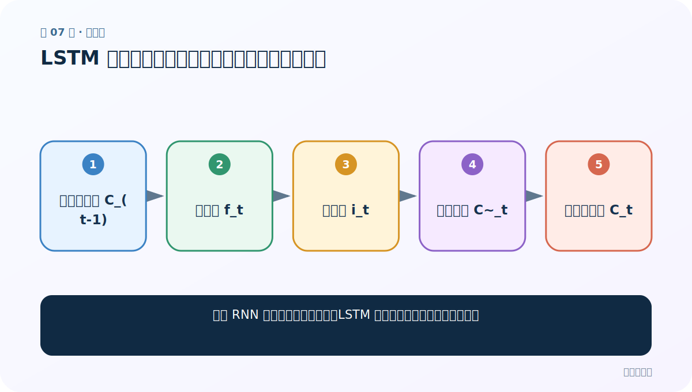
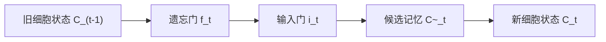
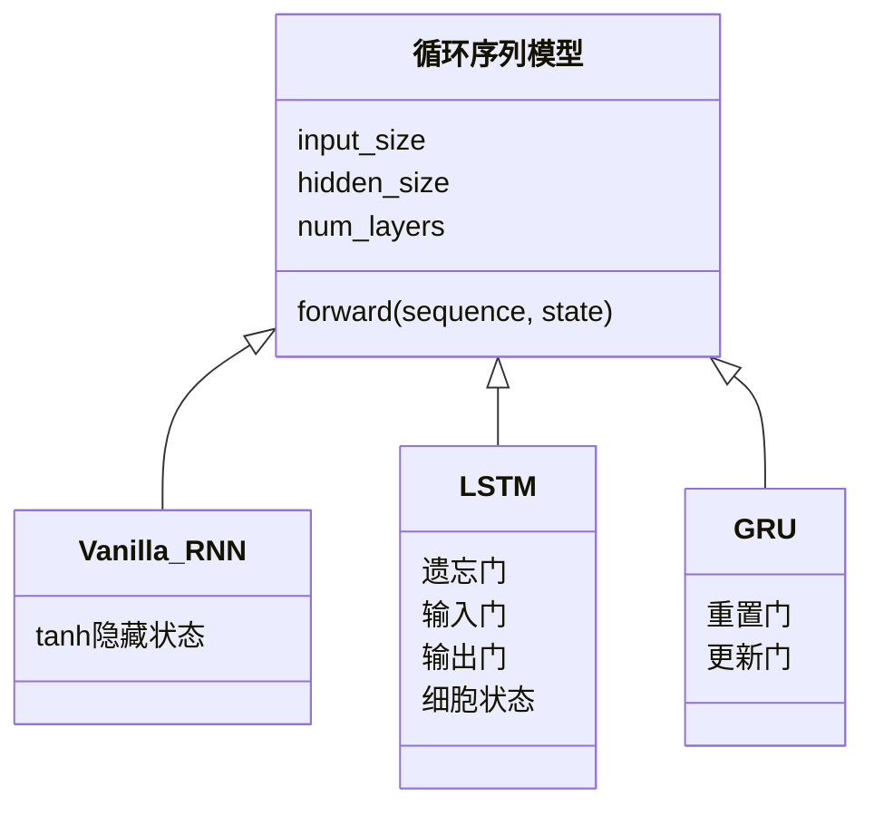

# 第 7 节：LSTM 图解（上）：遗忘门与输入门管理长期记忆

> 笔记编号 7/28 · 对应原视频 P44 · [打开这一集](https://www.bilibili.com/video/BV14mdfBDE4Q?p=44)

[← 上一节：6 修改隐藏层与总结：维度代表模型的记忆容量](./06-change-hidden-size.md) · [返回总目录](./README.md) · [下一节：8 LSTM 图解（下）：输出门产生当前隐藏状态 →](./08-lstm-diagram-part2.md)

## 这节解决什么问题

普通 RNN 的长期信息容易衰减，LSTM 怎样决定忘掉什么、写入什么？



图从左向右读。先跟着数据或推理过程走一遍，再学习下面的术语。

## 辅助流程图



### RNN 家族 UML 关系



## 老师原声整理稿（按讲解顺序）

### 0:00–4:51　为什么需要长期记忆通道

老师从普通 RNN 的梯度消失/爆炸讲起。LSTM 引入细胞状态 C，像一条相对稳定的记忆通道；门值经过 sigmoid 落在 0 到 1，用逐元素乘法控制信息比例。

### 4:51–10:57　遗忘门

把 x_t 与 h_(t-1) 拼接，经线性层和 sigmoid 得 f_t。f_t 接近 1 的位置更多保留旧记忆，接近 0 的位置更多擦除。它不是整句话只开或关一次，而是对每个隐藏维度分别控制。

### 10:57–16:51　输入门与候选记忆

输入门 i_t 决定写入比例；候选记忆 C~_t 通常由 tanh 产生新内容。二者相乘表示“哪些新信息写多少”。

### 16:51–20:57　更新细胞状态

C_t = f_t⊙C_(t-1) + i_t⊙C~_t。老师用生活中的保留旧信息、加入新信息解释加法。LSTM 缓解长期依赖，但不能保证彻底消除所有梯度问题。

## 完整原声逐段记录

[查看本节按时间戳整理的完整音轨转写](./transcripts/p044.md)

逐段记录用于核查老师讲解是否遗漏；正文会进一步纠正口误和语音识别中的技术术语。

## 零基础先记住

- 门是逐元素比例，不是单个布尔开关
- 遗忘门处理旧记忆，输入门控制新记忆
- 细胞状态通过加法更新

## 最小可运行代码

下面代码默认从项目根目录运行；专题配套实现见 [rnn_from_scratch 配套实现](../../rnn_from_scratch/README.md)。

```python
import torch
x = torch.randn(2, 3, 5)
lstm = torch.nn.LSTM(5, 7, batch_first=True)
out, (hn, cn) = lstm(x)
print(out.shape, hn.shape, cn.shape)
```

### 输入和输出怎么看

output=[2,3,7]，h_n 与 c_n 都是 [1,2,7]。

## 最容易踩的坑

不要把细胞状态叫“记忆门”；LSTM 是三扇门加一个细胞状态。

## 本节知识链

`旧细胞状态 C_(t-1) → 遗忘门 f_t → 输入门 i_t → 候选记忆 C~_t → 新细胞状态 C_t`

## 自测

**问题：f_t 接近 0 意味着什么？**

<details>
<summary>点开核对答案</summary>

对应维度的旧细胞记忆被大幅削弱。

</details>

## 学完检查

- [ ] 我能用自己的话复述老师的讲解顺序
- [ ] 我能在运行前预测关键输出或张量形状
- [ ] 我知道这节方法最容易用错的地方
- [ ] 我能独立回答自测题

[← 上一节：6 修改隐藏层与总结：维度代表模型的记忆容量](./06-change-hidden-size.md) · [返回总目录](./README.md) · [下一节：8 LSTM 图解（下）：输出门产生当前隐藏状态 →](./08-lstm-diagram-part2.md)
