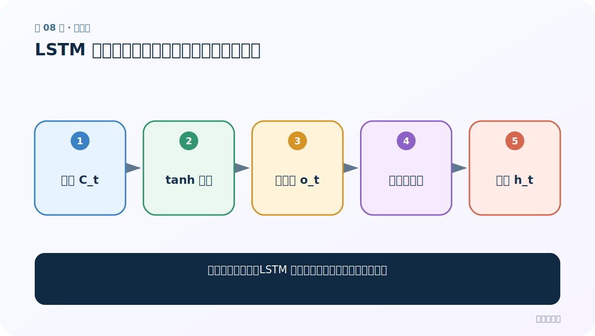
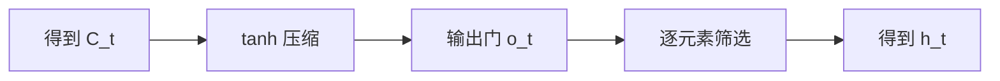
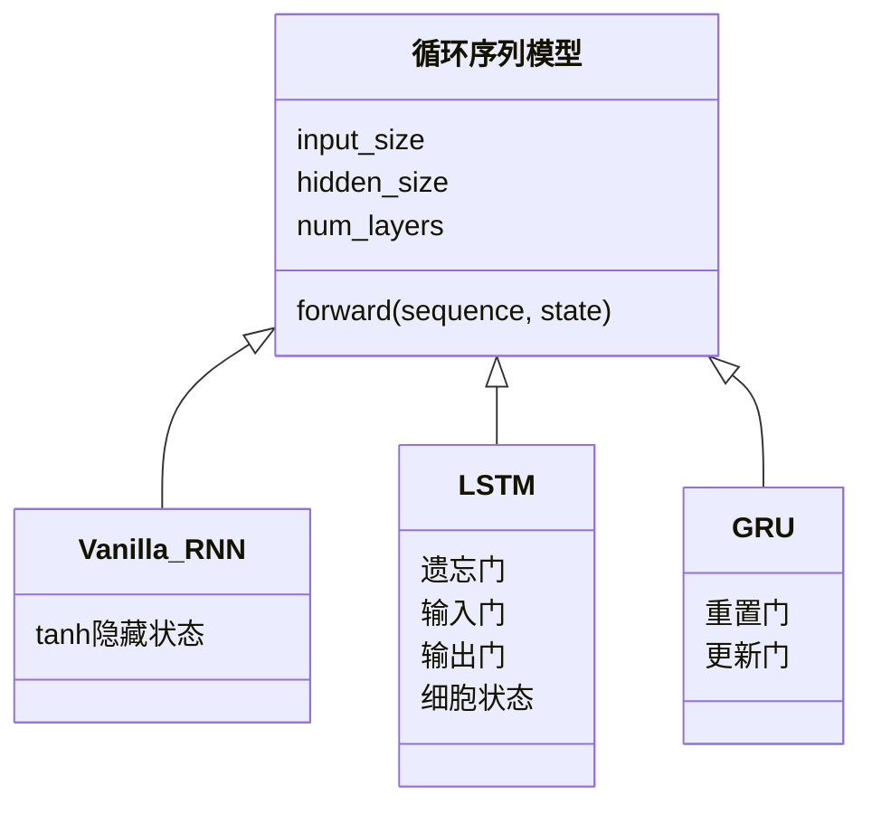

# 第 8 节：LSTM 图解（下）：输出门产生当前隐藏状态

> 笔记编号 8/28 · 对应原视频 P45 · [打开这一集](https://www.bilibili.com/video/BV14mdfBDE4Q?p=45)

[← 上一节：7 LSTM 图解（上）：遗忘门与输入门管理长期记忆](./07-lstm-diagram-part1.md) · [返回总目录](./README.md) · [下一节：9 Bi-LSTM：从前后两个方向理解同一位置 →](./09-bidirectional-lstm.md)

## 这节解决什么问题

细胞状态更新后，LSTM 怎样决定当前对外输出哪些信息？



图从左向右读。先跟着数据或推理过程走一遍，再学习下面的术语。

## 辅助流程图



### RNN 家族 UML 关系



## 老师原声整理稿（按讲解顺序）

### 0:00–5:50　接上半节的细胞状态

老师先复盘遗忘门、输入门和候选记忆，确认 C_t 已经融合旧记忆与新内容。

### 5:50–11:40　输出门

o_t = sigmoid(W_o[x_t,h_(t-1)] + b_o)，决定当前隐藏状态暴露哪些细胞信息。h_t = o_t⊙tanh(C_t)。C_t 是内部长期记忆，h_t 是当前时间步向下一层/下一步提供的表示。

### 11:40–18:34　三门一状态完整串联

先算遗忘比例，再算写入比例和候选内容，更新 C_t，最后由输出门产生 h_t。课堂反复让同学用大白话描述每个式子，而不是背字母。

### 18:34–26:10　优点与局限

LSTM 对长依赖通常优于普通 RNN，但门多、参数和计算更大，仍然按时间串行。老师预告 GRU 会合并部分结构。实际模型效果要由任务数据验证。

## 完整原声逐段记录

[查看本节按时间戳整理的完整音轨转写](./transcripts/p045.md)

逐段记录用于核查老师讲解是否遗漏；正文会进一步纠正口误和语音识别中的技术术语。

## 零基础先记住

- C_t 和 h_t 作用不同
- 输出门控制细胞记忆对外暴露比例
- LSTM 仍无法跨时间步完全并行

## 最小可运行代码

下面代码默认从项目根目录运行；专题配套实现见 [rnn_from_scratch 配套实现](../../rnn_from_scratch/README.md)。

```python
import torch
cell = torch.nn.LSTMCell(5, 7)
x_t = torch.randn(2, 5)
h = torch.zeros(2, 7); c = torch.zeros(2, 7)
h, c = cell(x_t, (h, c))
print(h.shape, c.shape)
```

### 输入和输出怎么看

单步产生同形状 h_t 和 c_t，都是 [batch, hidden]。

## 最容易踩的坑

h_t 不是 C_t 的原样复制；还经过 tanh 和输出门筛选。

## 本节知识链

`得到 C_t → tanh 压缩 → 输出门 o_t → 逐元素筛选 → 得到 h_t`

## 自测

**问题：哪一个状态更像长期内部记忆？**

<details>
<summary>点开核对答案</summary>

细胞状态 C_t；h_t 是当前对外隐藏表示。

</details>

## 学完检查

- [ ] 我能用自己的话复述老师的讲解顺序
- [ ] 我能在运行前预测关键输出或张量形状
- [ ] 我知道这节方法最容易用错的地方
- [ ] 我能独立回答自测题

[← 上一节：7 LSTM 图解（上）：遗忘门与输入门管理长期记忆](./07-lstm-diagram-part1.md) · [返回总目录](./README.md) · [下一节：9 Bi-LSTM：从前后两个方向理解同一位置 →](./09-bidirectional-lstm.md)
