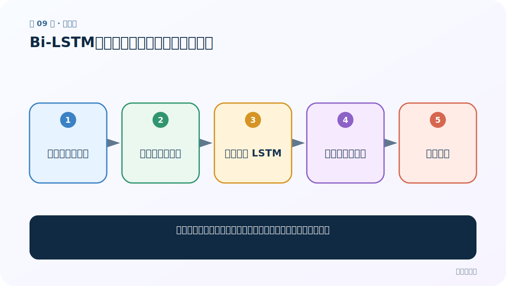
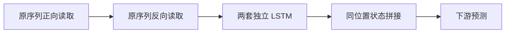
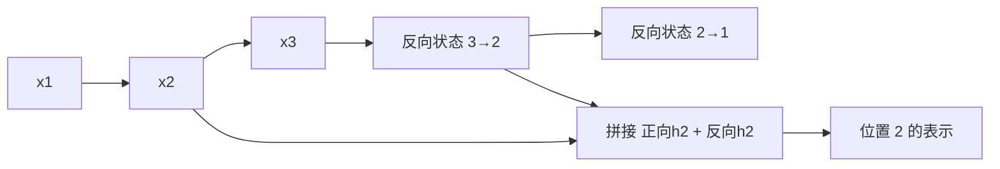

# 第 9 节：Bi-LSTM：从前后两个方向理解同一位置

> 笔记编号 9/28 · 对应原视频 P46 · [打开这一集](https://www.bilibili.com/video/BV14mdfBDE4Q?p=46)

[← 上一节：8 LSTM 图解（下）：输出门产生当前隐藏状态](./08-lstm-diagram-part2.md) · [返回总目录](./README.md) · [下一节：10 LSTM 代码：多一个细胞状态，接口如何变化 →](./10-lstm-code.md)

## 这节解决什么问题

只看左侧历史可能不够，怎样让每个位置同时利用右侧上下文？



图从左向右读。先跟着数据或推理过程走一遍，再学习下面的术语。

## 辅助流程图



### 双向 LSTM 的两条信息流



## 老师原声整理稿（按讲解顺序）

### 0:00–2:53　双向的直觉

老师用“我爱你 / 你爱我”的正反方向说明：正向网络读取过去，反向网络读取未来，两者参数彼此独立。

### 2:53–5:48　拼接而不是平均

每个位置得到正向 hidden 和反向 hidden，常沿最后一维拼接，因此输出宽度由 hidden_size 变成 2×hidden_size。最终分类层的输入维度必须同步翻倍。

### 5:48–8:11　什么时候不能用

双向模型更适合整句已经可见的分类、标注；流式语音、下一词生成等因果场景无法提前看到未来。代价还包括更多参数、计算和延迟。

## 完整原声逐段记录

[查看本节按时间戳整理的完整音轨转写](./transcripts/p046.md)

逐段记录用于核查老师讲解是否遗漏；正文会进一步纠正口误和语音识别中的技术术语。

## 零基础先记住

- 两个方向有独立参数
- 拼接后特征维通常翻倍
- 因果生成不能偷看未来

## 最小可运行代码

下面代码默认从项目根目录运行；专题配套实现见 [rnn_from_scratch 配套实现](../../rnn_from_scratch/README.md)。

```python
import torch
m = torch.nn.LSTM(5, 7, bidirectional=True, batch_first=True)
out, (hn, cn) = m(torch.randn(2, 4, 5))
print(out.shape, hn.shape)
```

### 输入和输出怎么看

output=[2,4,14]，h_n=[2,2,7]；第一维的 2 是两个方向。

## 最容易踩的坑

bidirectional=True 不等于把同一个结果简单倒序一次。

## 本节知识链

`原序列正向读取 → 原序列反向读取 → 两套独立 LSTM → 同位置状态拼接 → 下游预测`

## 自测

**问题：hidden_size=7 时双向 output 最后一维为何是 14？**

<details>
<summary>点开核对答案</summary>

同位置的正向 7 维与反向 7 维拼接。

</details>

## 学完检查

- [ ] 我能用自己的话复述老师的讲解顺序
- [ ] 我能在运行前预测关键输出或张量形状
- [ ] 我知道这节方法最容易用错的地方
- [ ] 我能独立回答自测题

[← 上一节：8 LSTM 图解（下）：输出门产生当前隐藏状态](./08-lstm-diagram-part2.md) · [返回总目录](./README.md) · [下一节：10 LSTM 代码：多一个细胞状态，接口如何变化 →](./10-lstm-code.md)
