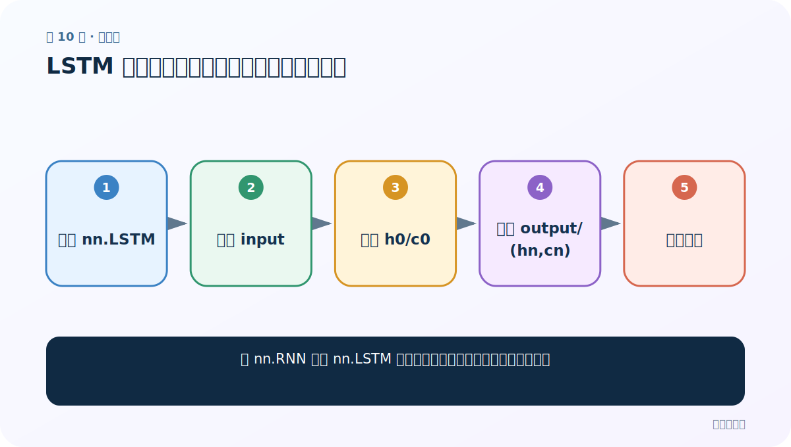
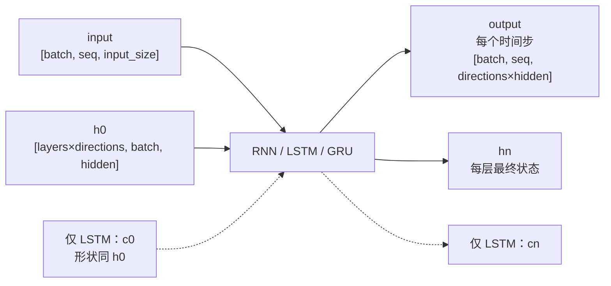

# 第 10 节：LSTM 代码：多一个细胞状态，接口如何变化

> 笔记编号 10/28 · 对应原视频 P47 · [打开这一集](https://www.bilibili.com/video/BV14mdfBDE4Q?p=47)

[← 上一节：9 Bi-LSTM：从前后两个方向理解同一位置](./09-bidirectional-lstm.md) · [返回总目录](./README.md) · [下一节：11 GRU 图解：两扇门合并记忆管理 →](./11-gru-diagram.md)

## 这节解决什么问题

把 nn.RNN 换成 nn.LSTM 时，输入输出和初始化需要改哪些地方？



图从左向右读。先跟着数据或推理过程走一遍，再学习下面的术语。

## 辅助流程图


### PyTorch 循环层的张量形状



## 老师原声整理稿（按讲解顺序）

### 0:00–4:36　API 参数大体相同

nn.LSTM 仍接收 input_size、hidden_size、num_layers 等，输入张量形状也与 RNN 相同。

### 4:36–9:29　状态从一个变成一对

初始状态是 (h0,c0)，返回值是 output,(h_n,c_n)。h 与 c 形状相同，但语义不同。漏写括号或只接两个普通张量是常见解包错误。

### 9:29–14:23　运行与形状验证

老师沿用随机输入，比较 RNN 和 LSTM 的 output 形状；只要配置相同，外部 output 形状一致，多出来的是 c_n。

### 14:23–18:00　代码迁移的真正原则

不是复制后只改类名就算完成：任何 forward、初始化、返回值、训练调用都要同步处理 c。若封装统一接口，可以在模型内部隐藏差异。

## 完整原声逐段记录

[查看本节按时间戳整理的完整音轨转写](./transcripts/p047.md)

逐段记录用于核查老师讲解是否遗漏；正文会进一步纠正口误和语音识别中的技术术语。

## 零基础先记住

- LSTM 状态是 (h,c)
- 外部 output 形状规则与 RNN 相同
- 调用处也必须同步修改解包

## 最小可运行代码

下面代码默认从项目根目录运行；专题配套实现见 [rnn_from_scratch 配套实现](../../rnn_from_scratch/README.md)。

```python
import torch
lstm = torch.nn.LSTM(5, 6)
x = torch.randn(4, 2, 5)
h0 = torch.zeros(1, 2, 6); c0 = torch.zeros(1, 2, 6)
out, (hn, cn) = lstm(x, (h0, c0))
print(out.shape, hn.shape, cn.shape)
```

### 输入和输出怎么看

output=[4,2,6]，h_n=c_n=[1,2,6]。

## 最容易踩的坑

不要写成 out, hn, cn = lstm(...): 第二个返回值本身是一个二元组。

## 本节知识链

`创建 nn.LSTM → 准备 input → 准备 h0/c0 → 解包 output/(hn,cn) → 核对形状`

## 自测

**问题：RNN 迁移成 LSTM 最明显多出的状态是什么？**

<details>
<summary>点开核对答案</summary>

细胞状态 c0/c_n。

</details>

## 学完检查

- [ ] 我能用自己的话复述老师的讲解顺序
- [ ] 我能在运行前预测关键输出或张量形状
- [ ] 我知道这节方法最容易用错的地方
- [ ] 我能独立回答自测题

[← 上一节：9 Bi-LSTM：从前后两个方向理解同一位置](./09-bidirectional-lstm.md) · [返回总目录](./README.md) · [下一节：11 GRU 图解：两扇门合并记忆管理 →](./11-gru-diagram.md)
