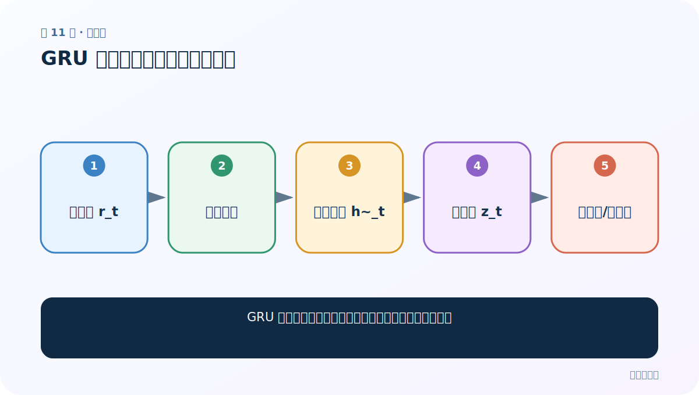
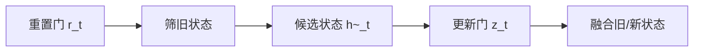
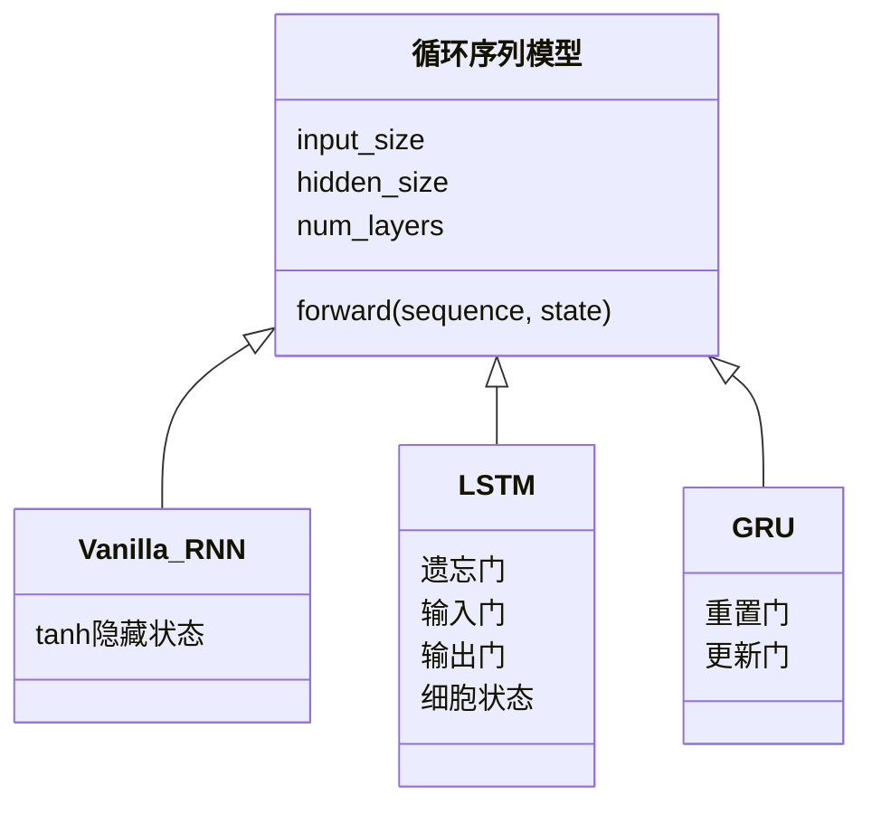

# 第 11 节：GRU 图解：两扇门合并记忆管理

> 笔记编号 11/28 · 对应原视频 P48 · [打开这一集](https://www.bilibili.com/video/BV14mdfBDE4Q?p=48)

[← 上一节：10 LSTM 代码：多一个细胞状态，接口如何变化](./10-lstm-code.md) · [返回总目录](./README.md) · [下一节：12 GRU 代码：替换循环层并验证接口 →](./12-gru-code.md)

## 这节解决什么问题

GRU 如何用重置门和更新门，在较少结构下保留长依赖？



图从左向右读。先跟着数据或推理过程走一遍，再学习下面的术语。

## 辅助流程图



### RNN 家族 UML 关系



## 老师原声整理稿（按讲解顺序）

### 0:00–5:51　为什么有 GRU

老师把 GRU 描述成 LSTM 的简化方案：不再单独维护细胞状态，主要用重置门和更新门控制隐藏状态。它通常比普通 RNN 更能处理长依赖，计算又比 LSTM 简洁。

### 5:51–12:47　重置门

r_t 根据 x_t 和 h_(t-1) 计算。它决定旧状态在生成候选新状态时参与多少；接近 0 时更倾向忽略过去，接近 1 时更多利用过去。

### 12:47–19:46　更新门

z_t 决定最终状态中旧记忆与候选新记忆的比例。不同资料的公式可能把 z 与 1-z 的命名方向写反，判断时要看公式而不是只背“接近 1 保留谁”。

### 19:46–29:45　候选状态与最终融合

候选状态把 r_t⊙h_(t-1) 与 x_t 组合后经 tanh；最终 h_t 在旧状态与候选状态之间做逐元素加权。老师用财务分配、旧记忆筛选等类比反复解释比例。

### 29:45–33:37　与 LSTM 的差别

GRU 没有独立 C_t，状态接口更像普通 RNN。参数通常更少、训练可能更快，但不能先验断言一定更准。三者仍然具有时间串行限制。

## 完整原声逐段记录

[查看本节按时间戳整理的完整音轨转写](./transcripts/p048.md)

逐段记录用于核查老师讲解是否遗漏；正文会进一步纠正口误和语音识别中的技术术语。

## 零基础先记住

- GRU 两门：reset 与 update
- 没有独立细胞状态 C
- 公式约定可能互换 z 与 1-z

## 最小可运行代码

下面代码默认从项目根目录运行；专题配套实现见 [rnn_from_scratch 配套实现](../../rnn_from_scratch/README.md)。

```python
import torch
gru = torch.nn.GRU(5, 7, batch_first=True)
out, hn = gru(torch.randn(2, 4, 5))
print(out.shape, hn.shape)
```

### 输入和输出怎么看

output=[2,4,7]，h_n=[1,2,7]；接口更接近普通 RNN。

## 最容易踩的坑

不要凭门数推断准确率；数据规模和超参数会改变结果。

## 本节知识链

`重置门 r_t → 筛旧状态 → 候选状态 h~_t → 更新门 z_t → 融合旧/新状态`

## 自测

**问题：GRU 与 LSTM 在状态接口上的关键差别？**

<details>
<summary>点开核对答案</summary>

GRU 只有隐藏状态 h；LSTM 还有独立细胞状态 c。

</details>

## 学完检查

- [ ] 我能用自己的话复述老师的讲解顺序
- [ ] 我能在运行前预测关键输出或张量形状
- [ ] 我知道这节方法最容易用错的地方
- [ ] 我能独立回答自测题

[← 上一节：10 LSTM 代码：多一个细胞状态，接口如何变化](./10-lstm-code.md) · [返回总目录](./README.md) · [下一节：12 GRU 代码：替换循环层并验证接口 →](./12-gru-code.md)
