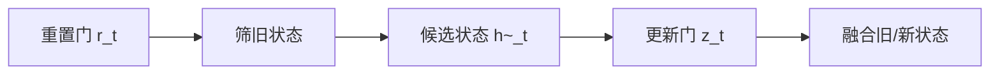
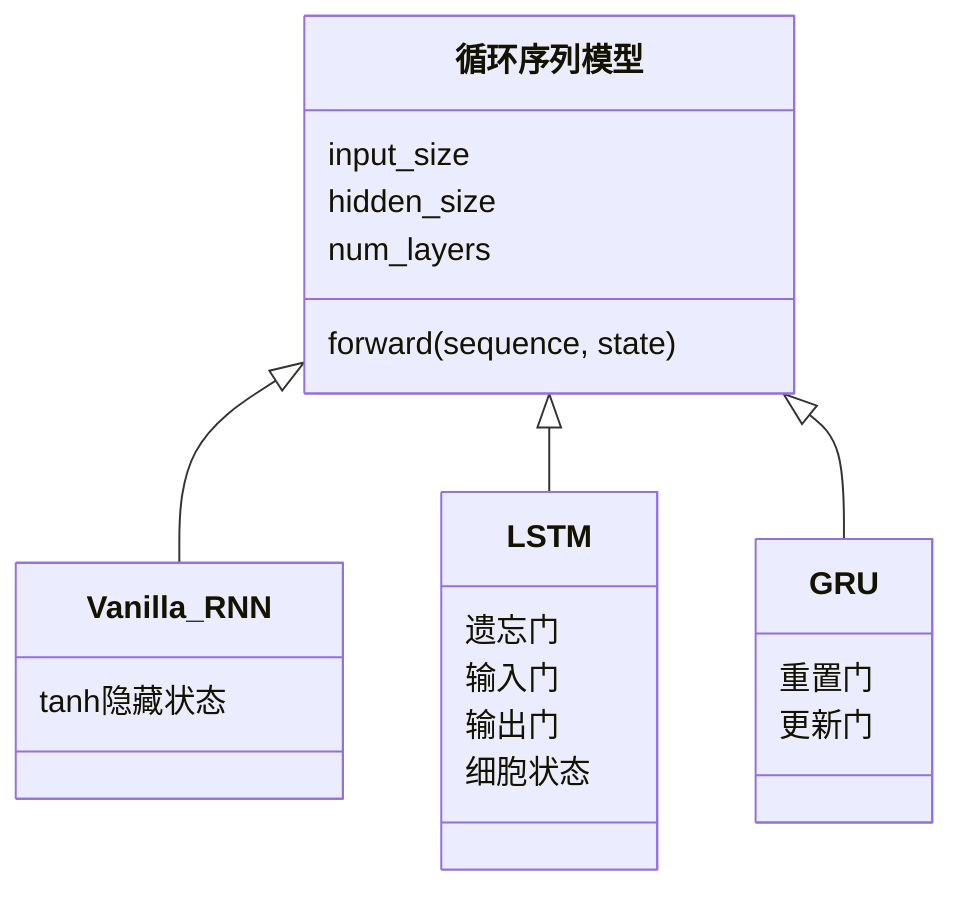

# 第 11 节：GRU 图解：两扇门合并记忆管理

> 笔记编号 11/28 · 对应原视频 P48 · [打开这一集](https://www.bilibili.com/video/BV14mdfBDE4Q?p=48)

[← 上一节：10 LSTM 代码：多一个细胞状态，接口如何变化](./10-lstm-code.md) · [返回总目录](./README.md) · [下一节：12 GRU 代码：替换循环层并验证接口 →](./12-gru-code.md)

## 这节解决什么问题

GRU 如何用重置门和更新门，在较少结构下保留长依赖？


图从左向右读。先跟着数据或推理过程走一遍，再学习下面的术语。

## 辅助流程图



### RNN 家族 UML 关系




## 零基础精讲：先把这一节真正弄懂

### 先用一个场景理解

GRU 也管理新旧记忆，但把 LSTM 的三扇门简化为更新门和重置门，并取消独立的 c。

### 沿数据流一步一步走

1. 重置门 r_t
2. 筛旧状态
3. 候选状态 h~_t
4. 更新门 z_t
5. 融合旧/新状态

上面每一步都对应流程图的一段。读图时不断问自己：“此刻张量里装的是什么，形状是什么，下一步为什么需要它？”

### 第一次看代码只盯住这里

先抓更新门的直觉：它决定新状态中保留多少旧 h、写入多少候选信息。

运行代码前先写出预期形状，运行后逐维核对。数值可以暂时算不出，但 B（批量）、L（长度）、D/H（特征或隐藏宽度）为什么出现，必须能说清。

### 本节边界

不要凭门数推断准确率；数据规模和超参数会改变结果。

本节过关不是背公式，而是能从第 1 步讲到最后一步，并指出哪一个状态把前文带到了后面。

## 老师原声整理稿（按讲解顺序）

### 0:00–2:56　为什么已经有 LSTM，还要再学 GRU

老师仍按“概念、内部结构、API、优缺点”的路线讲解。课程给出的出发点很直接：LSTM 能缓解普通 RNN 的长期依赖问题，但内部有遗忘门、输入门、输出门和独立细胞状态，结构与计算都更复杂。如果能合并一部分功能，同时保留选择性记忆能力，就能得到更轻量的循环单元，这就是本节介绍 GRU 的原因。

GRU 的全称是 **Gated Recurrent Unit（门控循环单元）**。它比普通 RNN 多了门控，比 LSTM 少了一条独立的细胞状态路径。老师特别提醒，“更简单”指状态和门的组织更精简，不等于它退化成普通 RNN，也不等于任何任务上都一定优于 LSTM。

从外部数据流看，每个时间步仍接收当前输入 `x_t` 和上一时刻隐藏状态 `h_(t-1)`，再产生新的隐藏状态。正因为接口相近，后面写 PyTorch 代码时，`nn.RNN` 换成 `nn.GRU` 后许多参数和张量形状都能沿用；但老师也强调，API 好换不代表内部原理可以跳过。

### 2:56–5:51　老师先用更新公式做了一次快速预览

正式画大图前，老师先展示重置门 `r_t`、更新门 `z_t` 以及最终隐藏状态的组合公式，目的是让大家先看到 GRU 只有一份需要向后传递的状态 `h_t`，没有 LSTM 那样单独的 `C_t`。

课堂采用的最终融合写法是：

**融合公式：** `h_t = (1-z_t) ⊙ h_(t-1) + z_t ⊙ h~_t`

按这个约定，`z_t=0` 表示这一次几乎不更新，主要沿用旧状态；`z_t=1` 表示主要采用新的候选状态。老师让同学直接把 0 和 1 代入式子检查，而不是死背一句“越大越保留什么”。这一招很重要，因为有些教材会交换两项，把 `z_t` 定义成“保留旧信息”的比例，文字说法就会反过来。

### 5:51–10:47　从代码积累到读懂结构图

这里老师插入了一段学习方法上的补充。他说，代码学习常常不是每一天都能立刻感到进步：前期写 `Hello World`、张量和简单网络会很慢，等练习量积累起来，某一天会突然发现不同代码之间大量结构都能对应上。GRU 的 API 看起来比前面的 LSTM 容易，正是因为 RNN 的输入、状态、输出和形状规则已经铺垫过了。

老师因此要求大家“多写、多练、一步一步来”，不要因为前期速度慢就判断自己不适合编程。这段不是 GRU 公式的一部分，却解释了课程为什么还要把结构图重新画一遍：复用旧知识不是省略理解，而是把已经掌握的 RNN/LSTM 框架迁移到新模型。

回到图中，老师先标出重置门、更新门、候选隐藏状态和最终隐藏状态，再按总—分顺序讲解。读图时应先认清符号：`r_t` 是 reset gate，`z_t` 是 update gate，`h~_t` 是候选隐藏状态，`h_t` 才是本时间步最终向后传递的状态。

### 10:47–18:47　GRU 怎样把 LSTM 的两份状态合成一份

老师把 LSTM 和 GRU 放在一起比较：LSTM 用 `C_t` 保存较长期的细胞记忆，同时用 `h_t` 作为当前对外状态；两者形状通常相同，但职责不同。GRU 取消独立的 `C_t`，把“保存、筛选和更新记忆”的职责都放进隐藏状态 `h_t` 及其门控计算中。因此，GRU 的核心可以概括成“两扇门加一份隐藏状态”。

为了说明“合并”不是“把能力随便删掉”，老师用了智能门锁的类比：传统方案可能是普通门锁再外接监控设备，新的方案把上锁、监控和报警整合到一个系统里。部件看起来少了，但关键功能仍被重新组织并保留下来。对应到 GRU，就是把 LSTM 部分门和状态路径合并成更轻量的记忆管理方式。

老师又用手写账本与记账 App 作比较。手写账本需要自己记录收入支出，再手工分类、汇总；记账 App 可以在同一套系统中自动识别消费类别并统计交通、餐饮、衣物等支出。这个类比想表达的是：GRU 不再把“长期记忆本”和“当前隐藏状态”分成两本账，而是在一份状态中完成选择性保留与更新。类比只帮助理解职责合并，并不表示门控值真由人工规则决定；它们仍是模型从数据中训练得到的连续向量。

### 18:47–21:45　第一扇门：重置门决定旧信息怎样参与候选状态

重置门的典型写法是：

**重置门：** `r_t = sigmoid(W_r[x_t, h_(t-1)] + b_r)`

`sigmoid` 把每个维度压到 0 到 1。随后 `r_t ⊙ h_(t-1)` 对旧隐藏状态逐元素筛选：某一维接近 1，该维旧信息较完整地参与候选状态计算；某一维接近 0，该维历史信息被大幅削弱，相当于在生成新候选时“重置”这部分过去。

老师在图上把它概括为“决定要不要擦除旧记忆”，并让大家比较两个端点。这里要补充一个容易误解的地方：重置门通常不是整句话共用一个 0/1 开关，而是与隐藏状态同宽的一组连续比例，所以模型可以忘掉某些特征，同时保留另一些特征。

### 21:45–24:45　第二扇门：更新门规划新旧记忆的比例

更新门同样由当前输入和旧状态共同计算：

**更新门：** `z_t = sigmoid(W_z[x_t, h_(t-1)] + b_z)`

老师用家庭资金规划帮助理解：一部分钱作为稳定储备，另一部分拿去投资；比例不能凭感觉混在一起，而要明确分配。对应到 GRU，旧隐藏状态像已经积累的储备，新候选状态像根据当前输入形成的新方案，更新门负责决定最终状态中两者各占多少。

按本节采用的 `h_t = (1-z_t) ⊙ h_(t-1) + z_t ⊙ h~_t`，`z_t` 越接近 1，写入的新候选越多；越接近 0，保留的旧状态越多。再次强调：看到其他资料时先看最终公式中 `z_t` 乘在哪一项，再判断“1”与“0”的含义。

### 24:45–29:45　候选隐藏状态：先筛过去，再和当前输入合成新方案

候选隐藏状态可写成：

**候选状态：** `h~_t = tanh(W_h[x_t, r_t ⊙ h_(t-1)] + b_h)`

老师把这个式子拆成三步：先用重置门筛一遍旧状态；再把筛过的历史与当前输入 `x_t` 合在一起；最后经过线性变换与 `tanh`，生成一份“准备写入但尚未定稿”的新记忆。`tanh` 把候选值压到 -1 到 1，也提供非线性表达能力。

“候选”两个字不能漏掉。`h~_t` 只是根据当前信息提出的新方案，并不会原封不动地成为最终状态；它还要接受更新门的比例控制。重置门管的是“做新方案时参考多少过去”，更新门管的是“最终采用多少新方案”，两扇门的作用因此不能互换。

### 29:47–31:47　最终隐藏状态：把旧状态与候选状态定稿融合

最后一步重新回到融合式：

**最终状态：** `h_t = (1-z_t) ⊙ h_(t-1) + z_t ⊙ h~_t`

老师逐项解释：第一项是按比例留下的旧隐藏状态，第二项是按比例写入的新候选，二者相加得到本时间步最终状态 `h_t`。这个 `h_t` 既交给下一个时间步，也可以作为当前时间步的输出参与后续任务。

把 `z_t` 看成向量还能得到更准确的直觉：同一时间步里，有些维度可以接近 0，长期保留；另一些维度可以接近 1，快速更新。GRU 能让信息跨很多步传递，靠的不是“永远不忘”，而是模型可以学出较平滑的保留路径。

### 31:47–33:37　老师最后要求：会画最小图，更要能用自己的话讲

课程最后把 GRU 放回技术演进中看：在 Transformer 和大模型成为主流之前，RNN、LSTM、GRU 曾是很多序列任务与面试中的重点；后来关注中心发生变化，但门控、状态传递和长期依赖仍是理解序列模型的重要基础。

老师不要求逐字符背公式，而是要求能画出最小结构并顺畅说明四句话：重置门怎样筛旧信息，候选状态怎样融合当前输入，更新门怎样分配新旧比例，最终 `h_t` 怎样向后传递。公式忘了某个下标可以查，若连数据流都要临场停很久才能想起来，说明还没有真正掌握。

因此本节最合适的复习方法不是重复看答案，而是合上文章，自己画出 `h_(t-1)`、`x_t`、`r_t`、`z_t`、`h~_t`、`h_t`，再像老师课堂要求的那样，用大白话从头讲一遍。

## 完整原声逐段记录

[查看本节按时间戳整理的完整音轨转写](./transcripts/p048.md)

逐段记录用于核查老师讲解是否遗漏；正文会进一步纠正口误和语音识别中的技术术语。

## 零基础先记住

- GRU 两门：reset 与 update
- 没有独立细胞状态 C
- 公式约定可能互换 z 与 1-z

## 最小可运行代码

下面代码默认从项目根目录运行；专题配套实现见 [rnn_from_scratch 配套实现](../../rnn_from_scratch/README.md)。

```python
import torch
gru = torch.nn.GRU(5, 7, batch_first=True)
out, hn = gru(torch.randn(2, 4, 5))
print(out.shape, hn.shape)
```

### 输入和输出怎么看

output=[2,4,7]，h_n=[1,2,7]；接口更接近普通 RNN。

## 最容易踩的坑

不要凭门数推断准确率；数据规模和超参数会改变结果。

## 本节知识链

`重置门 r_t → 筛旧状态 → 候选状态 h~_t → 更新门 z_t → 融合旧/新状态`

## 自测

**问题：GRU 与 LSTM 在状态接口上的关键差别？**

<details>
<summary>点开核对答案</summary>

GRU 只有隐藏状态 h；LSTM 还有独立细胞状态 c。

</details>

## 学完检查

- [ ] 我能用自己的话复述老师的讲解顺序
- [ ] 我能在运行前预测关键输出或张量形状
- [ ] 我知道这节方法最容易用错的地方
- [ ] 我能独立回答自测题

[← 上一节：10 LSTM 代码：多一个细胞状态，接口如何变化](./10-lstm-code.md) · [返回总目录](./README.md) · [下一节：12 GRU 代码：替换循环层并验证接口 →](./12-gru-code.md)
