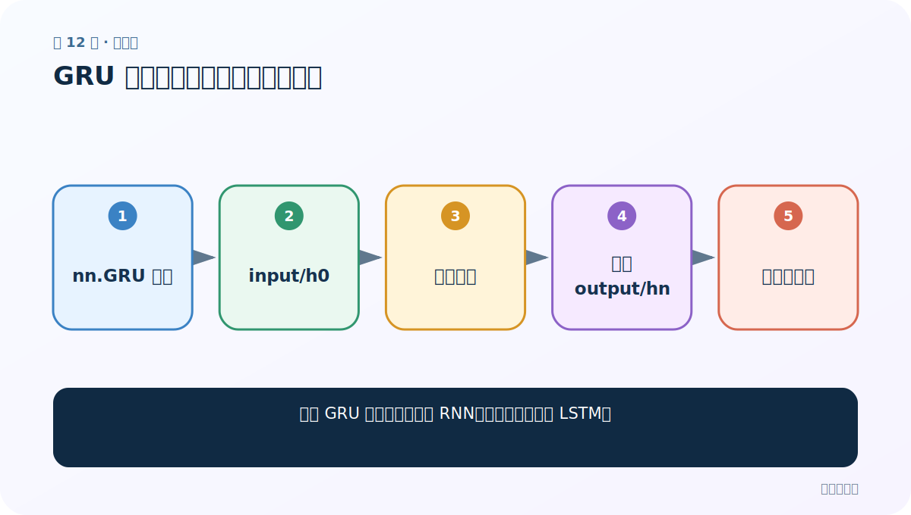
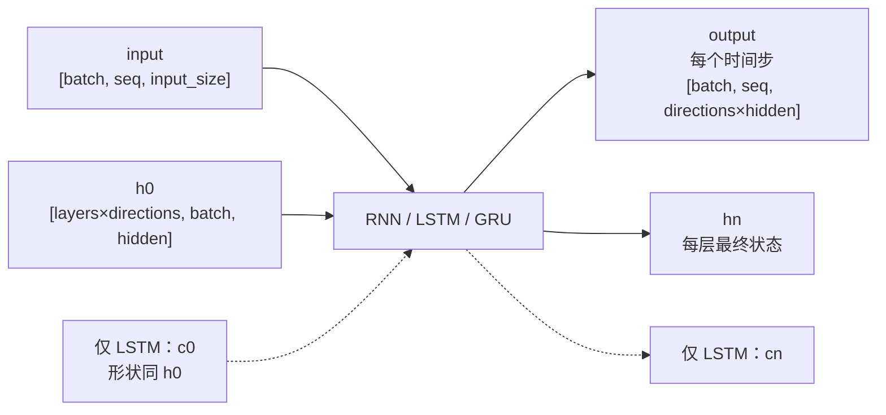

# 第 12 节：GRU 代码：替换循环层并验证接口

> 笔记编号 12/28 · 对应原视频 P49 · [打开这一集](https://www.bilibili.com/video/BV14mdfBDE4Q?p=49)

[← 上一节：11 GRU 图解：两扇门合并记忆管理](./11-gru-diagram.md) · [返回总目录](./README.md) · [下一节：13 姓名分类需求：从名字预测 18 个国家类别 →](./13-name-classification-requirement.md)

## 这节解决什么问题

为何 GRU 代码几乎能沿用 RNN，而不能完全照搬 LSTM？



图从左向右读。先跟着数据或推理过程走一遍，再学习下面的术语。

## 辅助流程图


### PyTorch 循环层的张量形状



## 老师原声整理稿（按讲解顺序）

### 0:00–5:44　概念与优缺点复盘

老师先写 GRU 全称、两扇门和长序列优势，再指出它仍无法跨时间步并行。课堂对“GRU 一定弱于 LSTM”的绝对说法过强：不同任务可能各有胜负，应实测。

### 5:44–10:38　五步 API 演示

创建 nn.GRU、创建输入、创建 h0、运行、打印。参数 input_size/hidden_size/num_layers 与 RNN 一致。

### 10:38–13:37　输出形状

output 含所有时间步，h_n 含每层最终状态；因为没有 c_n，解包与普通 RNN 相同。老师再次用形状表提醒不要混淆时间维、批量维和隐藏维。

### 13:37–16:49　选择题与纠错

LSTM 是三门一状态，不存在“记忆门”；GRU 和 LSTM 都有门控。真正写项目时，可把公共分类头封装，让三种循环主干可切换。

## 完整原声逐段记录

[查看本节按时间戳整理的完整音轨转写](./transcripts/p049.md)

逐段记录用于核查老师讲解是否遗漏；正文会进一步纠正口误和语音识别中的技术术语。

## 零基础先记住

- GRU 调用接口与 RNN 接近
- LSTM 才返回 c_n
- 同形状不代表内部计算相同

## 最小可运行代码

下面代码默认从项目根目录运行；专题配套实现见 [rnn_from_scratch 配套实现](../../rnn_from_scratch/README.md)。

```python
import torch
for cls in (torch.nn.RNN, torch.nn.GRU):
    m = cls(5, 6, batch_first=True)
    out, hn = m(torch.randn(2, 3, 5))
    print(cls.__name__, out.shape, hn.shape)
```

### 输入和输出怎么看

两者外部形状相同，但内部更新方程不同。

## 最容易踩的坑

只改 nn.RNN 为 nn.GRU 后，变量名、注释和保存路径也要同步，避免训练/加载错模型。

## 本节知识链

`nn.GRU 配置 → input/h0 → 运行前向 → 得到 output/hn → 比较三模型`

## 自测

**问题：GRU forward 默认返回几个顶层结果？**

<details>
<summary>点开核对答案</summary>

两个：output 和 h_n。

</details>

## 学完检查

- [ ] 我能用自己的话复述老师的讲解顺序
- [ ] 我能在运行前预测关键输出或张量形状
- [ ] 我知道这节方法最容易用错的地方
- [ ] 我能独立回答自测题

[← 上一节：11 GRU 图解：两扇门合并记忆管理](./11-gru-diagram.md) · [返回总目录](./README.md) · [下一节：13 姓名分类需求：从名字预测 18 个国家类别 →](./13-name-classification-requirement.md)
