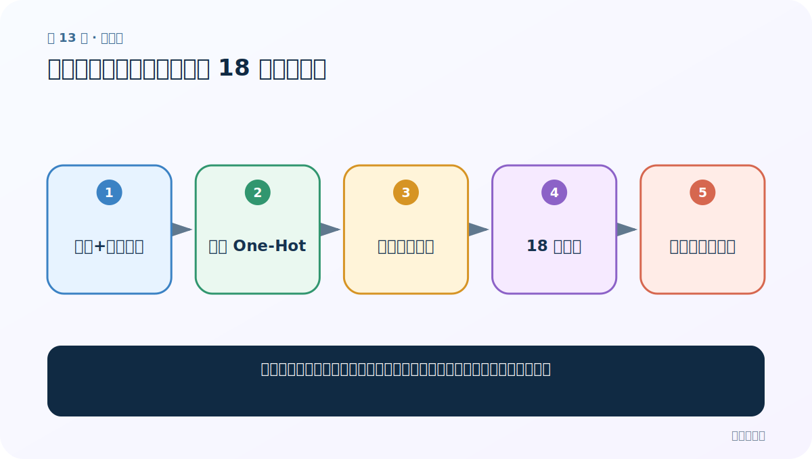

# 第 13 节：姓名分类需求：从名字预测 18 个国家类别

> 笔记编号 13/28 · 对应原视频 P50 · [打开这一集](https://www.bilibili.com/video/BV14mdfBDE4Q?p=50)

[← 上一节：12 GRU 代码：替换循环层并验证接口](./12-gru-code.md) · [返回总目录](./README.md) · [下一节：14 全局字母表与国家名：固定输入列和输出列 →](./14-alphabet-and-countries.md)

## 这节解决什么问题

怎样把一个现实需求拆成数据、编码、模型、训练、评估和预测六个部分？



图从左向右读。先跟着数据或推理过程走一遍，再学习下面的术语。

## 辅助流程图


### 姓名分类项目完整流水线


## 老师原声整理稿（按讲解顺序）

### 0:00–4:54　需求与数据

老师提出注册场景：用户输入姓名，系统估计国家/地区，可作为后续流程的弱提示。数据约 20,074 条，两列分别是姓名和国家，共 18 类。预测国籍具有偏见和误判风险，不能作为身份事实或限制用户权益的依据。

### 4:54–7:52　为什么用字符 One-Hot

项目刻意以字符为单位：52 个大小写英文字母加 5 个常用符号，共 57 维。一个长度 L 的姓名表示为 [L,57]。这是理解型案例，不是现代生产方案的唯一选择。

### 7:52–10:49　三模型对比

同一数据分别训练 RNN、LSTM、GRU，对比损失、准确率和耗时。老师展示的 GRU 结果仅属于本次配置，不能推广为所有任务的固定排名。

### 10:49–12:36　形状自测

每个字符是 57 维 One-Hot；5 字符姓名是 [5,57]，批量为 1 时模型内部是 [1,5,57]（若 batch_first=True）。

## 完整原声逐段记录

[查看本节按时间戳整理的完整音轨转写](./transcripts/p050.md)

逐段记录用于核查老师讲解是否遗漏；正文会进一步纠正口误和语音识别中的技术术语。

## 零基础先记住

- 18 类多分类
- 每字符 57 维 One-Hot
- 模型选择必须在同一数据和评估协议下比较

## 最小可运行代码

下面代码默认从项目根目录运行；专题配套实现见 [rnn_from_scratch 配套实现](../../rnn_from_scratch/README.md)。

```python
name_length = 5
alphabet_size = 57
print((name_length, alphabet_size))
```

### 输入和输出怎么看

单个 5 字符姓名的字符矩阵形状是 [5,57]。

## 最容易踩的坑

姓名只能提供弱统计线索，不能可靠决定真实国籍、民族或身份。

## 本节知识链

`姓名+国家数据 → 字符 One-Hot → 三类循环模型 → 18 类训练 → 曲线比较与预测`

## 自测

**问题：为什么 5 个字符不是一个 5×1 的整数就直接送入线性层？**

<details>
<summary>点开核对答案</summary>

整数只是类别 ID；本案例用每字符 57 维 One-Hot 防止把 ID 大小误当连续数值。

</details>

## 学完检查

- [ ] 我能用自己的话复述老师的讲解顺序
- [ ] 我能在运行前预测关键输出或张量形状
- [ ] 我知道这节方法最容易用错的地方
- [ ] 我能独立回答自测题

[← 上一节：12 GRU 代码：替换循环层并验证接口](./12-gru-code.md) · [返回总目录](./README.md) · [下一节：14 全局字母表与国家名：固定输入列和输出列 →](./14-alphabet-and-countries.md)
