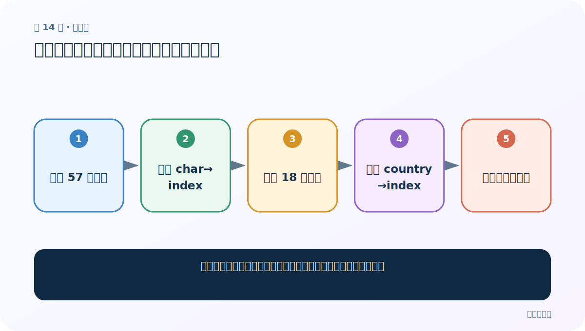
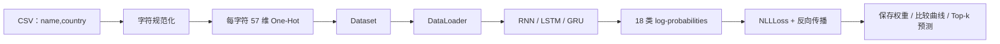

# 第 14 节：全局字母表与国家名：固定输入列和输出列

> 笔记编号 14/28 · 对应原视频 P51 · [打开这一集](https://www.bilibili.com/video/BV14mdfBDE4Q?p=51)

[← 上一节：13 姓名分类需求：从名字预测 18 个国家类别](./13-name-classification-requirement.md) · [返回总目录](./README.md) · [下一节：15 读取数据：把姓名与国家分别保存并处理异常行 →](./15-read-name-data.md)

## 这节解决什么问题

如何让训练、验证和预测阶段始终使用同一字符编号和类别编号？



图从左向右读。先跟着数据或推理过程走一遍，再学习下面的术语。

## 辅助流程图


### 姓名分类项目完整流水线



## 老师原声整理稿（按讲解顺序）

### 0:00–5:54　先搭项目骨架

老师回顾导包、数据处理、模型、训练、可视化和预测，并强调本案例同时比较三种循环模型。

### 6:00–10:57　字符表

使用 ascii_letters 得 52 个大小写字母，再追加空格、句点、逗号、分号、单引号等 5 个符号，长度为 57。课堂逐字符打印核对。

### 11:59–16:19　国家类别表

18 个国家名按固定顺序保存，列表位置就是标签 ID。老师也提到可从数据中去重生成；工程上应排序或保存映射，否则不同运行顺序可能改变标签含义。

## 完整原声逐段记录

[查看本节按时间戳整理的完整音轨转写](./transcripts/p051.md)

逐段记录用于核查老师讲解是否遗漏；正文会进一步纠正口误和语音识别中的技术术语。

## 零基础先记住

- 字符表决定 One-Hot 列
- 国家表决定分类输出列
- 映射必须随模型一起保存

## 最小可运行代码

下面代码默认从项目根目录运行；专题配套实现见 [rnn_from_scratch 配套实现](../../rnn_from_scratch/README.md)。

```python
import string
letters = string.ascii_letters + " .,;'"
char_to_id = {c:i for i,c in enumerate(letters)}
print(len(letters), char_to_id["A"])
```

### 输入和输出怎么看

字符表长度为 57；每个字符获得稳定索引。

## 最容易踩的坑

从 set 直接生成类别列表会造成顺序不稳定。

## 本节知识链

`定义 57 字符表 → 建立 char→index → 定义 18 国家表 → 建立 country→index → 全阶段冻结映射`

## 自测

**问题：模型权重相同但国家列表顺序变了，会怎样？**

<details>
<summary>点开核对答案</summary>

同一个输出下标会被解释成另一个国家，预测语义完全错误。

</details>

## 学完检查

- [ ] 我能用自己的话复述老师的讲解顺序
- [ ] 我能在运行前预测关键输出或张量形状
- [ ] 我知道这节方法最容易用错的地方
- [ ] 我能独立回答自测题

[← 上一节：13 姓名分类需求：从名字预测 18 个国家类别](./13-name-classification-requirement.md) · [返回总目录](./README.md) · [下一节：15 读取数据：把姓名与国家分别保存并处理异常行 →](./15-read-name-data.md)
