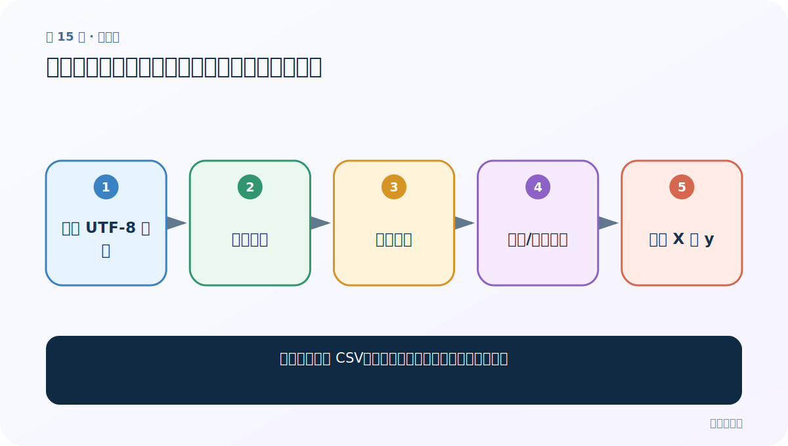
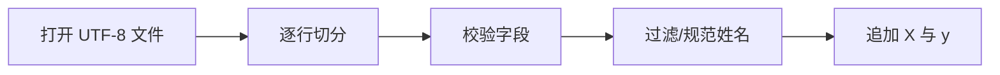
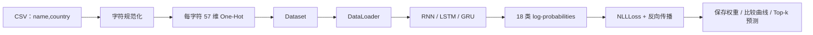

# 第 15 节：读取数据：把姓名与国家分别保存并处理异常行

> 笔记编号 15/28 · 对应原视频 P52 · [打开这一集](https://www.bilibili.com/video/BV14mdfBDE4Q?p=52)

[← 上一节：14 全局字母表与国家名：固定输入列和输出列](./14-alphabet-and-countries.md) · [返回总目录](./README.md) · [下一节：16 Dataset：把变长姓名转成字符 One-Hot 张量 →](./16-dataset.md)

## 这节解决什么问题

怎样逐行读取 CSV，同时保证特征和标签永远一一对应？



图从左向右读。先跟着数据或推理过程走一遍，再学习下面的术语。

## 辅助流程图



### 姓名分类项目完整流水线



## 老师原声整理稿（按讲解顺序）

### 0:00–2:58　函数输入输出

老师定义 read_data(path)，返回姓名列表 X 与国家列表 y。左列是特征，右列是标签。还提出过滤过短姓名的想法，因为单个字母几乎无从判断。

### 2:58–6:21　逐行读取

使用 with open 自动关闭文件，逐行 strip，再按分隔符切开。真实 CSV 若字段可能含逗号，应使用 csv 模块而不是简单 split。

### 6:22–11:20　清洗与核对

合法行才同时 append X 和 y；打印数量和样例，确认两列表长度一致。过滤规则必须只依赖输入本身，且训练与预测一致。

## 完整原声逐段记录

[查看本节按时间戳整理的完整音轨转写](./transcripts/p052.md)

逐段记录用于核查老师讲解是否遗漏；正文会进一步纠正口误和语音识别中的技术术语。

## 零基础先记住

- X/y 必须同步追加
- 异常行应记录而非悄悄吞掉
- 生产 CSV 优先用 csv.reader

## 最小可运行代码

下面代码默认从项目根目录运行；专题配套实现见 [rnn_from_scratch 配套实现](../../rnn_from_scratch/README.md)。

```python
import csv
rows = ["Smith,English", "Zhang,Chinese"]
parsed = list(csv.reader(rows))
X = [r[0] for r in parsed]; y = [r[1] for r in parsed]
print(X, y)
```

### 输入和输出怎么看

得到两个等长列表，索引 i 的姓名与国家仍对应。

## 最容易踩的坑

单纯 line.split(',') 遇到带逗号字段会错列。

## 本节知识链

`打开 UTF-8 文件 → 逐行切分 → 校验字段 → 过滤/规范姓名 → 追加 X 与 y`

## 自测

**问题：过滤一条姓名时为什么标签也必须一起过滤？**

<details>
<summary>点开核对答案</summary>

否则 X 与 y 从该位置起错位，模型学到错误监督。

</details>

## 学完检查

- [ ] 我能用自己的话复述老师的讲解顺序
- [ ] 我能在运行前预测关键输出或张量形状
- [ ] 我知道这节方法最容易用错的地方
- [ ] 我能独立回答自测题

[← 上一节：14 全局字母表与国家名：固定输入列和输出列](./14-alphabet-and-countries.md) · [返回总目录](./README.md) · [下一节：16 Dataset：把变长姓名转成字符 One-Hot 张量 →](./16-dataset.md)
