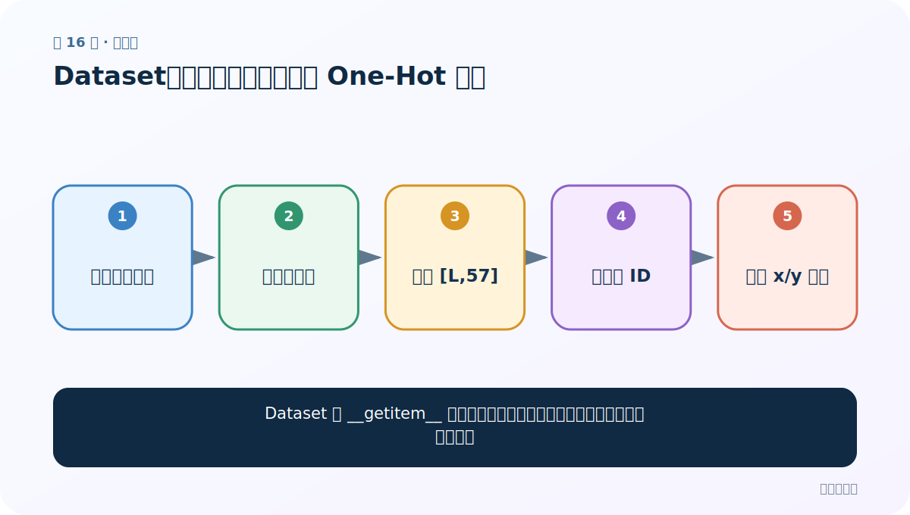
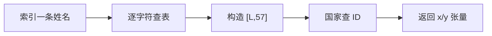
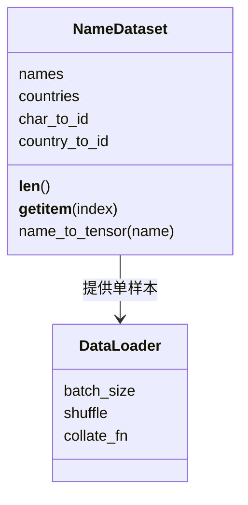

# 第 16 节：Dataset：把变长姓名转成字符 One-Hot 张量

> 笔记编号 16/28 · 对应原视频 P53 · [打开这一集](https://www.bilibili.com/video/BV14mdfBDE4Q?p=53)

[← 上一节：15 读取数据：把姓名与国家分别保存并处理异常行](./15-read-name-data.md) · [返回总目录](./README.md) · [下一节：17 DataLoader：为变长姓名组织训练迭代 →](./17-dataloader.md)

## 这节解决什么问题

Dataset 的 __getitem__ 怎样把一条字符串即时转换成模型可用的张量和标签？



图从左向右读。先跟着数据或推理过程走一遍，再学习下面的术语。

## 辅助流程图



### Dataset 类职责 UML




## 零基础精讲：先把这一节真正弄懂

### 先用一个场景理解

名字“Li”可以看成长度 2、每个字符 57 维的表，所以单样本张量形状是 [2,57]。

### 沿数据流一步一步走

1. 索引一条姓名
2. 逐字符查表
3. 构造 [L,57]
4. 国家查 ID
5. 返回 x/y 张量

上面每一步都对应流程图的一段。读图时不断问自己：“此刻张量里装的是什么，形状是什么，下一步为什么需要它？”

### 第一次看代码只盯住这里

在 __getitem__ 中按顺序检查原字符串→字符 ID→One-Hot→标签 ID，每一步都打印一个真实样本。

运行代码前先写出预期形状，运行后逐维核对。数值可以暂时算不出，但 B（批量）、L（长度）、D/H（特征或隐藏宽度）为什么出现，必须能说清。

### 本节边界

Python 的 list[-1] 合法；未找到字符若返回 -1，会静默污染最后一列。

本节过关不是背公式，而是能从第 1 步讲到最后一步，并指出哪一个状态把前文带到了后面。

## 老师原声整理稿（按讲解顺序）

### 0:00–4:59　继承 Dataset 的三个核心部分

老师定义构造函数保存 X/y，__len__ 返回样本数，__getitem__ 按索引返回一条特征和标签。

### 4:59–10:54　字符 One-Hot

创建 [姓名长度,57] 全零张量，遍历字符，查字符索引并把对应位置置 1。未知字符需要明确策略：规范化、UNK 列或丢弃；直接 find 返回 -1 会误把最后一列置 1。

### 10:56–16:56　标签转 ID

国家名在固定类别列表中的位置作为整数标签。NLLLoss/CrossEntropyLoss 要求标签是 long 类型类别索引，不是 One-Hot。

### 16:56–21:02　变长样本的批处理难题

不同姓名长度不同。课堂选择 batch_size=1，从而避免默认 collate 无法堆叠。更一般方案是 padding+mask、pack_padded_sequence 或自定义 collate_fn。

## 完整原声逐段记录

[查看本节按时间戳整理的完整音轨转写](./transcripts/p053.md)

逐段记录用于核查老师讲解是否遗漏；正文会进一步纠正口误和语音识别中的技术术语。

## 零基础先记住

- 特征是浮点 One-Hot，标签是 long 类别 ID
- 未知字符不能误映射到 -1
- 变长序列需要专门的 batch 策略

## 最小可运行代码

下面代码默认从项目根目录运行；专题配套实现见 [rnn_from_scratch 配套实现](../../rnn_from_scratch/README.md)。

```python
import torch
alphabet = "abc"
def encode(name):
    x = torch.zeros(len(name), len(alphabet))
    for i, ch in enumerate(name): x[i, alphabet.index(ch)] = 1
    return x
print(encode("cab"))
```

### 输入和输出怎么看

输出 [3,3] 矩阵，每行恰有一个 1。

## 最容易踩的坑

Python 的 list[-1] 合法；未找到字符若返回 -1，会静默污染最后一列。

## 本节知识链

`索引一条姓名 → 逐字符查表 → 构造 [L,57] → 国家查 ID → 返回 x/y 张量`

## 自测

**问题：为什么标签不需要 18 维 One-Hot？**

<details>
<summary>点开核对答案</summary>

交叉熵类损失通常直接接收类别索引。

</details>

## 学完检查

- [ ] 我能用自己的话复述老师的讲解顺序
- [ ] 我能在运行前预测关键输出或张量形状
- [ ] 我知道这节方法最容易用错的地方
- [ ] 我能独立回答自测题

[← 上一节：15 读取数据：把姓名与国家分别保存并处理异常行](./15-read-name-data.md) · [返回总目录](./README.md) · [下一节：17 DataLoader：为变长姓名组织训练迭代 →](./17-dataloader.md)
