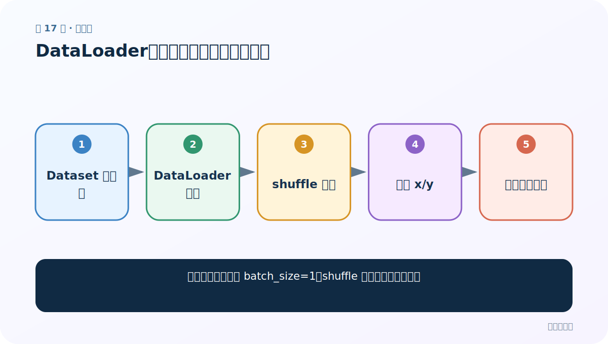
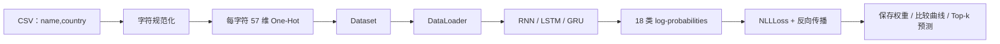

# 第 17 节：DataLoader：为变长姓名组织训练迭代

> 笔记编号 17/28 · 对应原视频 P54 · [打开这一集](https://www.bilibili.com/video/BV14mdfBDE4Q?p=54)

[← 上一节：16 Dataset：把变长姓名转成字符 One-Hot 张量](./16-dataset.md) · [返回总目录](./README.md) · [下一节：18 LogSoftmax：旧式 NLLLoss 与现代 CrossEntropyLoss 的关系 →](./18-log-softmax.md)

## 这节解决什么问题

为什么本案例先用 batch_size=1，shuffle 又在什么时候生效？



图从左向右读。先跟着数据或推理过程走一遍，再学习下面的术语。

## 辅助流程图


### 姓名分类项目完整流水线




## 零基础精讲：先把这一节真正弄懂

### 先用一个场景理解

不同姓名长度不一，不能直接堆成普通 [B,L,D]；最简单的教学方案是 batch_size=1，正式批量则需 padding 或 pack。

### 沿数据流一步一步走

1. Dataset 单样本
2. DataLoader 配置
3. shuffle 索引
4. 产生 x/y
5. 训练循环消费

上面每一步都对应流程图的一段。读图时不断问自己：“此刻张量里装的是什么，形状是什么，下一步为什么需要它？”

### 第一次看代码只盯住这里

先理解 DataLoader 只负责取样、打乱和组批，不会自动替你设计变长序列策略。

运行代码前先写出预期形状，运行后逐维核对。数值可以暂时算不出，但 B（批量）、L（长度）、D/H（特征或隐藏宽度）为什么出现，必须能说清。

### 本节边界

验证/测试集通常不要 shuffle，以便复现实例顺序。

本节过关不是背公式，而是能从第 1 步讲到最后一步，并指出哪一个状态把前文带到了后面。

## 老师原声整理稿（按讲解顺序）

### 0:00–3:51　从 Dataset 到 DataLoader

老师用 DataLoader(dataset,batch_size=1,shuffle=True) 包装。每轮遍历由加载器产生姓名张量和标签。

### 3:51–7:48　为何批量只能先写 1

默认 collate 用 stack 合并样本，姓名长度不一会报错；batch_size=1 时每批只有一种长度。课堂这是降低复杂度，不代表 RNN 只能单样本训练。

### 7:48–11:37　打印形状做抽查

遍历几条数据，确认 x 形如 [1,L,57]、y 形如 [1]。shuffle=True 每轮顺序可能不同，因此不能把打印的第一条当固定样例。

## 完整原声逐段记录

[查看本节按时间戳整理的完整音轨转写](./transcripts/p054.md)

逐段记录用于核查老师讲解是否遗漏；正文会进一步纠正口误和语音识别中的技术术语。

## 零基础先记住

- DataLoader 不负责文本编码本身
- batch_size=1 是变长序列的简化方案
- shuffle 只应作用训练集

## 最小可运行代码

下面代码默认从项目根目录运行；专题配套实现见 [rnn_from_scratch 配套实现](../../rnn_from_scratch/README.md)。

```python
from torch.utils.data import DataLoader
# loader = DataLoader(dataset, batch_size=1, shuffle=True)
print("变长序列若批量>1，需要 padding 或自定义 collate_fn")
```

### 输入和输出怎么看

提示本节的设计约束。

## 最容易踩的坑

验证/测试集通常不要 shuffle，以便复现实例顺序。

## 本节知识链

`Dataset 单样本 → DataLoader 配置 → shuffle 索引 → 产生 x/y → 训练循环消费`

## 自测

**问题：batch_size=8 为什么可能报 stack 大小不一致？**

<details>
<summary>点开核对答案</summary>

8 个姓名的 L 不同，原始 [L,57] 张量无法直接堆叠。

</details>

## 学完检查

- [ ] 我能用自己的话复述老师的讲解顺序
- [ ] 我能在运行前预测关键输出或张量形状
- [ ] 我知道这节方法最容易用错的地方
- [ ] 我能独立回答自测题

[← 上一节：16 Dataset：把变长姓名转成字符 One-Hot 张量](./16-dataset.md) · [返回总目录](./README.md) · [下一节：18 LogSoftmax：旧式 NLLLoss 与现代 CrossEntropyLoss 的关系 →](./18-log-softmax.md)
