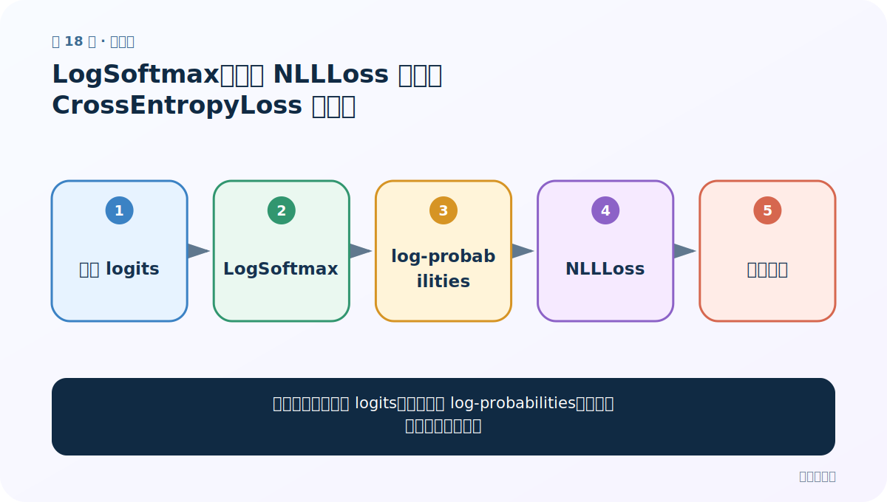
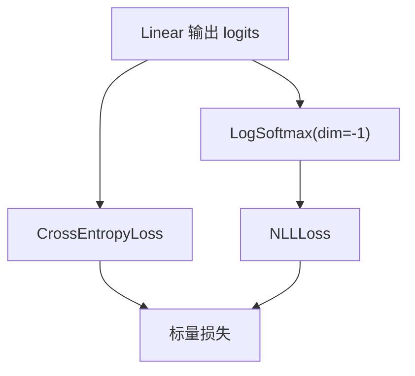

# 第 18 节：LogSoftmax：旧式 NLLLoss 与现代 CrossEntropyLoss 的关系

> 笔记编号 18/28 · 对应原视频 P55 · [打开这一集](https://www.bilibili.com/video/BV14mdfBDE4Q?p=55)

[← 上一节：17 DataLoader：为变长姓名组织训练迭代](./17-dataloader.md) · [返回总目录](./README.md) · [下一节：19 RNN 分类模型：取最后时间步映射到 18 类 →](./19-rnn-model.md)

## 这节解决什么问题

模型最后到底输出 logits、概率还是 log-probabilities，损失函数必须怎样配套？



图从左向右读。先跟着数据或推理过程走一遍，再学习下面的术语。

## 辅助流程图


### 输出层与损失的两种合法组合



## 老师原声整理稿（按讲解顺序）

### 0:00–4:44　Softmax 与 LogSoftmax

老师先回顾 Softmax 把 18 个分数归一化成概率；LogSoftmax 返回概率的对数，数值通常非正，但 exp 后和为 1。

### 4:44–9:42　旧式组合

课程模型末尾使用 LogSoftmax(dim=-1)，训练使用 NLLLoss。dim=-1 表示沿最后的类别维处理。

### 9:42–13:24　现代组合与重复计算坑

更常见写法是模型直接返回 logits，损失用 CrossEntropyLoss，它内部已经包含 LogSoftmax+NLLLoss。两种组合都对，但不能模型先 Softmax 再 CrossEntropyLoss，也不能重复 LogSoftmax。

## 完整原声逐段记录

[查看本节按时间戳整理的完整音轨转写](./transcripts/p055.md)

逐段记录用于核查老师讲解是否遗漏；正文会进一步纠正口误和语音识别中的技术术语。

## 零基础先记住

- NLLLoss 要 log-probabilities
- CrossEntropyLoss 要原始 logits
- 预测概率可对 logits 做 softmax

## 最小可运行代码

下面代码默认从项目根目录运行；专题配套实现见 [rnn_from_scratch 配套实现](../../rnn_from_scratch/README.md)。

```python
import torch
logits = torch.tensor([[1.0, 2.0, 0.0]])
logp = torch.log_softmax(logits, dim=-1)
print(logp, logp.exp().sum(-1))
```

### 输入和输出怎么看

logp 是对数概率；取 exp 后每行和为 1。

## 最容易踩的坑

负的 log-probability 不是负概率。

## 本节知识链

`分类 logits → LogSoftmax → log-probabilities → NLLLoss → 标量损失`

## 自测

**问题：使用 CrossEntropyLoss 时模型 forward 还要 LogSoftmax 吗？**

<details>
<summary>点开核对答案</summary>

不要；直接返回 logits。

</details>

## 学完检查

- [ ] 我能用自己的话复述老师的讲解顺序
- [ ] 我能在运行前预测关键输出或张量形状
- [ ] 我知道这节方法最容易用错的地方
- [ ] 我能独立回答自测题

[← 上一节：17 DataLoader：为变长姓名组织训练迭代](./17-dataloader.md) · [返回总目录](./README.md) · [下一节：19 RNN 分类模型：取最后时间步映射到 18 类 →](./19-rnn-model.md)
