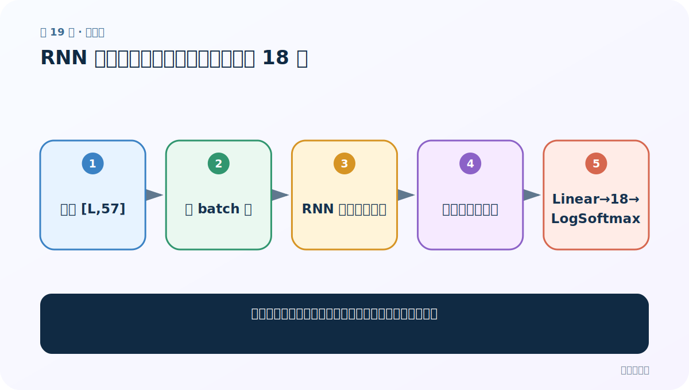
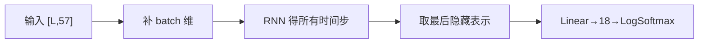
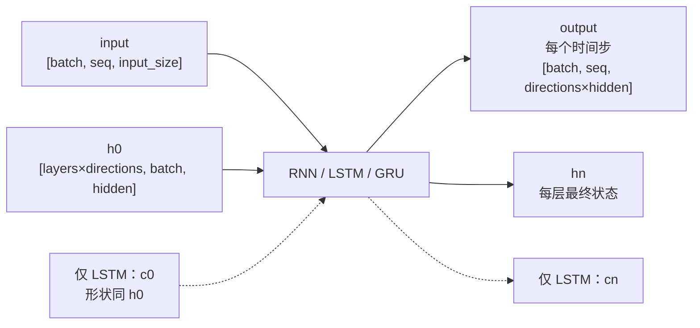
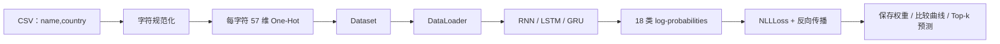

# 第 19 节：RNN 分类模型：取最后时间步映射到 18 类

> 笔记编号 19/28 · 对应原视频 P56 · [打开这一集](https://www.bilibili.com/video/BV14mdfBDE4Q?p=56)

[← 上一节：18 LogSoftmax：旧式 NLLLoss 与现代 CrossEntropyLoss 的关系](./18-log-softmax.md) · [返回总目录](./README.md) · [下一节：20 测试 RNN：用随机输入把形状链走通 →](./20-test-rnn.md)

## 这节解决什么问题

怎样把变长字符序列的循环输出变成一个国家分类结果？



图从左向右读。先跟着数据或推理过程走一遍，再学习下面的术语。

## 辅助流程图



### PyTorch 循环层的张量形状



### 姓名分类项目完整流水线



## 老师原声整理稿（按讲解顺序）

### 0:00–5:33　模型类的组成

老师定义 RNN 层、Linear 分类层和 LogSoftmax。input_size=57，hidden_size 是可调容量，output_size=18。

### 5:34–10:48　旧式损失配套

模型保留 LogSoftmax，因此训练要配 NLLLoss；若换 CrossEntropyLoss，应删除 LogSoftmax。

### 11:42–16:11　输入加 batch 维

Dataset 单条姓名原本 [L,57]，进入模型前用 unsqueeze 增加 batch 维。要先确定 batch_first；课程代码把单条序列放到循环层要求的顺序。

### 16:14–19:54　最后一步做整句分类

RNN 返回所有时间步 output 和 h_n。老师取最后时间步表示，送入 Linear 从 hidden_size 映射到 18 类，再 LogSoftmax。对有 padding 的批量，不能盲取 output[:,-1]，应按真实长度取最终有效状态或用 h_n/packing。

### 20:23–21:37　初始化隐藏状态

用全零张量初始化 h0，形状由层数、batch 和 hidden_size 决定。更稳妥是在输入同一 device/dtype 上创建。

## 完整原声逐段记录

[查看本节按时间戳整理的完整音轨转写](./transcripts/p056.md)

逐段记录用于核查老师讲解是否遗漏；正文会进一步纠正口误和语音识别中的技术术语。

## 零基础先记住

- Linear 把隐藏维映射到类别维
- 取最后有效时间步，不是 padding 最后一步
- 初始化状态应匹配 device

## 最小可运行代码

下面代码默认从项目根目录运行；专题配套实现见 [rnn_from_scratch 配套实现](../../rnn_from_scratch/README.md)。

```python
import torch
from rnn_from_scratch.model import NameClassifier
model = NameClassifier(57, 128, 18, kind="rnn")
print(model(torch.randn(1, 6, 57)).shape)
```

### 输入和输出怎么看

1 个 6 字符姓名，输出 [1,18] 对数概率。

## 最容易踩的坑

padding 后直接取序列最后位置可能取到 PAD 状态。

## 本节知识链

`输入 [L,57] → 补 batch 维 → RNN 得所有时间步 → 取最后隐藏表示 → Linear→18→LogSoftmax`

## 自测

**问题：为什么 Linear 的 out_features 是 18？**

<details>
<summary>点开核对答案</summary>

每一列对应一个国家类别。

</details>

## 学完检查

- [ ] 我能用自己的话复述老师的讲解顺序
- [ ] 我能在运行前预测关键输出或张量形状
- [ ] 我知道这节方法最容易用错的地方
- [ ] 我能独立回答自测题

[← 上一节：18 LogSoftmax：旧式 NLLLoss 与现代 CrossEntropyLoss 的关系](./18-log-softmax.md) · [返回总目录](./README.md) · [下一节：20 测试 RNN：用随机输入把形状链走通 →](./20-test-rnn.md)
