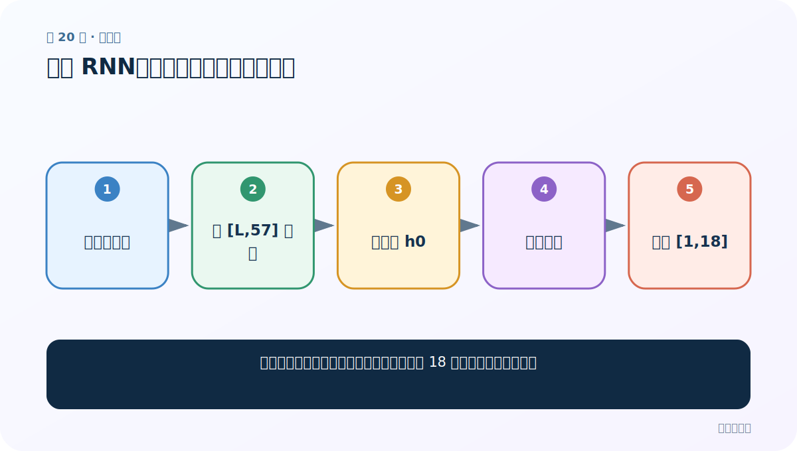
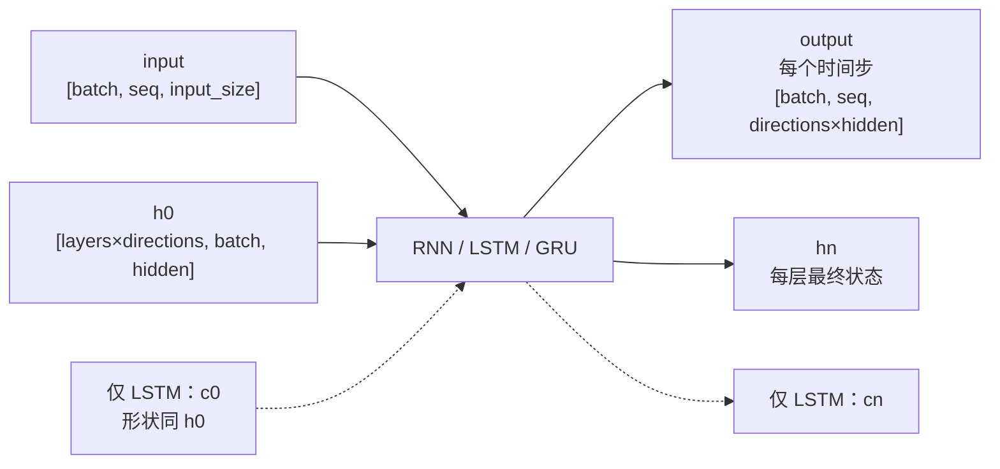

# 第 20 节：测试 RNN：用随机输入把形状链走通

> 笔记编号 20/28 · 对应原视频 P57 · [打开这一集](https://www.bilibili.com/video/BV14mdfBDE4Q?p=57)

[← 上一节：19 RNN 分类模型：取最后时间步映射到 18 类](./19-rnn-model.md) · [返回总目录](./README.md) · [下一节：21 搭建 LSTM 与 GRU 模型：复用分类头，隔离状态差异 →](./21-lstm-gru-models.md)

## 这节解决什么问题

训练前怎样证明模型前向传播、隐藏状态和 18 类输出没有维度错误？



图从左向右读。先跟着数据或推理过程走一遍，再学习下面的术语。

## 辅助流程图


### PyTorch 循环层的张量形状



## 老师原声整理稿（按讲解顺序）

### 0:00–5:58　测试配置

老师用 57 输入维、128 隐藏维、18 输出维实例化模型。随机 [L,57] 只用于形状冒烟测试，L 可用某个姓名长度举例。

### 5:58–10:56　模型结构与测试张量

打印模型确认 RNN、Linear、LogSoftmax 层；创建随机输入并核对每个字符 57 维。

### 10:57–16:52　为什么最终是 18 维

所有时间步原本产生 hidden_size=128 的表示，取最后一步后通过 Linear(128,18)，所以分类输出是 18，不再是 128。

### 17:05–20:07　从分数到类别

模型给出 18 个 log-probabilities；可用 argmax 得最高类别。若需要普通概率，用 exp（对于 log-softmax 输出）而不是再错误套一次任意归一化。

## 完整原声逐段记录

[查看本节按时间戳整理的完整音轨转写](./transcripts/p057.md)

逐段记录用于核查老师讲解是否遗漏；正文会进一步纠正口误和语音识别中的技术术语。

## 零基础先记住

- 先跑形状测试再训练
- Linear 负责 128→18
- argmax 返回类别索引

## 最小可运行代码

下面代码默认从项目根目录运行；专题配套实现见 [rnn_from_scratch 配套实现](../../rnn_from_scratch/README.md)。

```python
import torch
from rnn_from_scratch.model import NameClassifier
m = NameClassifier(57,128,18,kind="rnn")
logp = m(torch.randn(1,6,57))
print(logp.shape, int(logp.argmax(-1)))
```

### 输入和输出怎么看

形状 [1,18]，并打印当前随机模型猜出的类别索引。

## 最容易踩的坑

随机未训练模型的类别没有业务意义，只能检查接口。

## 本节知识链

`实例化模型 → 造 [L,57] 输入 → 初始化 h0 → 前向运行 → 检查 [1,18]`

## 自测

**问题：隐藏维 128 为什么不会让最终输出也是 128？**

<details>
<summary>点开核对答案</summary>

分类 Linear 把 128 维映射为 18 类。

</details>

## 学完检查

- [ ] 我能用自己的话复述老师的讲解顺序
- [ ] 我能在运行前预测关键输出或张量形状
- [ ] 我知道这节方法最容易用错的地方
- [ ] 我能独立回答自测题

[← 上一节：19 RNN 分类模型：取最后时间步映射到 18 类](./19-rnn-model.md) · [返回总目录](./README.md) · [下一节：21 搭建 LSTM 与 GRU 模型：复用分类头，隔离状态差异 →](./21-lstm-gru-models.md)
