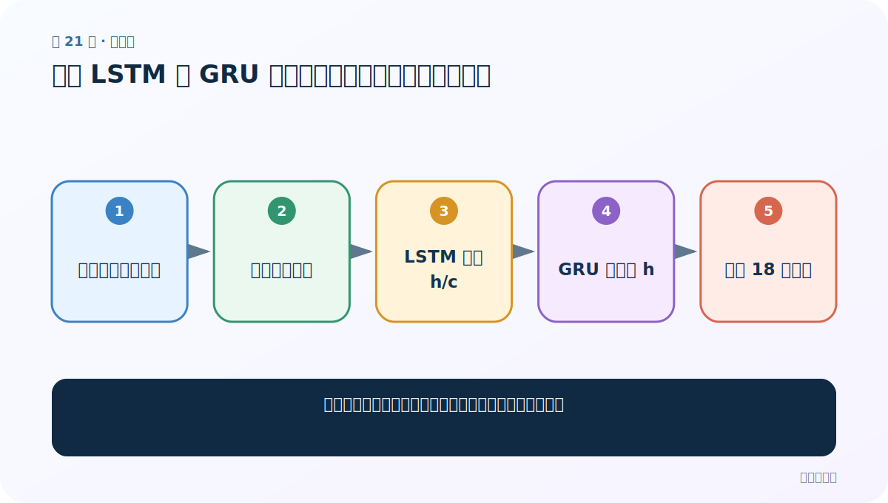
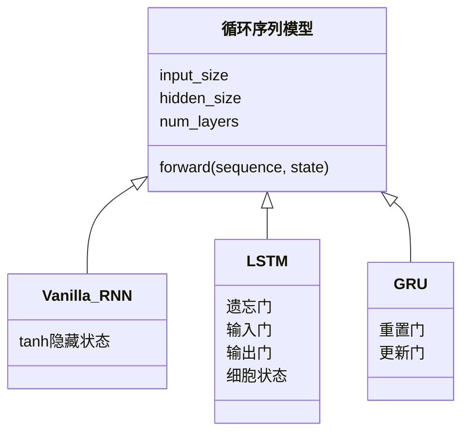
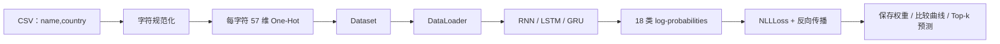

# 第 21 节：搭建 LSTM 与 GRU 模型：复用分类头，隔离状态差异

> 笔记编号 21/28 · 对应原视频 P58 · [打开这一集](https://www.bilibili.com/video/BV14mdfBDE4Q?p=58)

[← 上一节：20 测试 RNN：用随机输入把形状链走通](./20-test-rnn.md) · [返回总目录](./README.md) · [下一节：22 测试三种模型：用同一数据管道公平验形状 →](./22-test-three-models.md)

## 这节解决什么问题

三模型哪些代码可以共用，哪些状态差异必须单独处理？



图从左向右读。先跟着数据或推理过程走一遍，再学习下面的术语。

## 辅助流程图


### RNN 家族 UML 关系



### 姓名分类项目完整流水线




## 零基础精讲：先把这一节真正弄懂

### 先用一个场景理解

RNN、LSTM、GRU 可以共用同一个分类头，但它们返回的状态结构不同，尤其 LSTM 多一个 c。

### 沿数据流一步一步走

1. 复制公共分类骨架
2. 替换循环主干
3. LSTM 解包 h/c
4. GRU 只解包 h
5. 统一 18 类输出

上面每一步都对应流程图的一段。读图时不断问自己：“此刻张量里装的是什么，形状是什么，下一步为什么需要它？”

### 第一次看代码只盯住这里

把差异封装在模型内部，让外部统一只拿 [B,18] 分类结果。

运行代码前先写出预期形状，运行后逐维核对。数值可以暂时算不出，但 B（批量）、L（长度）、D/H（特征或隐藏宽度）为什么出现，必须能说清。

### 本节边界

复制三份模型后很容易只修一份 bug；统一参数化更安全。

本节过关不是背公式，而是能从第 1 步讲到最后一步，并指出哪一个状态把前文带到了后面。

## 老师原声整理稿（按讲解顺序）

### 0:00–3:55　从 RNN 模型迁移到 LSTM

构造参数、Linear 和输出层可复用；循环层换成 nn.LSTM，forward 返回 state=(h,c)，初始化也要一对状态。

### 3:55–6:54　LSTM 返回值

最终分类仍可使用 h_n 的最后一层，c_n 不直接送分类头，但必须正确接收。

### 6:54–9:52　GRU 迁移更接近 RNN

循环层换为 nn.GRU，其余状态接口仍是单个 h；课堂指出主要改动很少。

### 9:52–10:23　复用与维护

复制能快速教学，但生产代码更适合用一个 kind 参数选择循环类，公共前向和分类头只写一次，降低三份代码漂移风险。

## 完整原声逐段记录

[查看本节按时间戳整理的完整音轨转写](./transcripts/p058.md)

逐段记录用于核查老师讲解是否遗漏；正文会进一步纠正口误和语音识别中的技术术语。

## 零基础先记住

- LSTM 独有 c 状态
- 三模型可共享分类 Linear
- 统一封装便于公平比较

## 最小可运行代码

下面代码默认从项目根目录运行；专题配套实现见 [rnn_from_scratch 配套实现](../../rnn_from_scratch/README.md)。

```python
import torch
from rnn_from_scratch.model import NameClassifier
x=torch.randn(2,5,57)
for kind in ("rnn","lstm","gru"):
    print(kind, NameClassifier(57,32,18,kind=kind)(x).shape)
```

### 输入和输出怎么看

三种模型都输出 [2,18]，内部状态实现不同。

## 最容易踩的坑

复制三份模型后很容易只修一份 bug；统一参数化更安全。

## 本节知识链

`复制公共分类骨架 → 替换循环主干 → LSTM 解包 h/c → GRU 只解包 h → 统一 18 类输出`

## 自测

**问题：哪种模型的 state 是二元组？**

<details>
<summary>点开核对答案</summary>

LSTM，包含 h_n 和 c_n。

</details>

## 学完检查

- [ ] 我能用自己的话复述老师的讲解顺序
- [ ] 我能在运行前预测关键输出或张量形状
- [ ] 我知道这节方法最容易用错的地方
- [ ] 我能独立回答自测题

[← 上一节：20 测试 RNN：用随机输入把形状链走通](./20-test-rnn.md) · [返回总目录](./README.md) · [下一节：22 测试三种模型：用同一数据管道公平验形状 →](./22-test-three-models.md)
