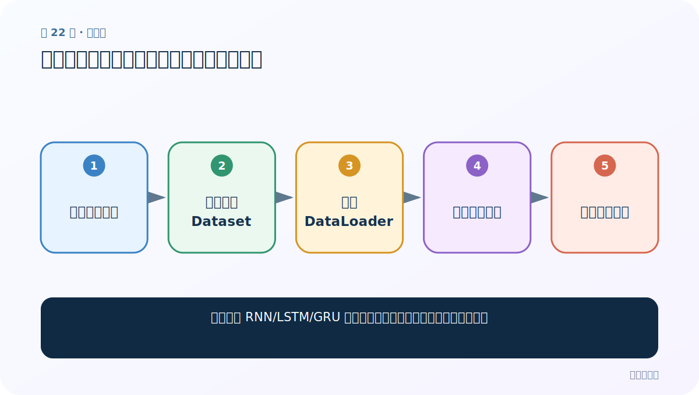
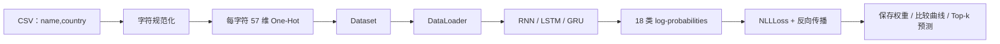

# 第 22 节：测试三种模型：用同一数据管道公平验形状

> 笔记编号 22/28 · 对应原视频 P59 · [打开这一集](https://www.bilibili.com/video/BV14mdfBDE4Q?p=59)

[← 上一节：21 搭建 LSTM 与 GRU 模型：复用分类头，隔离状态差异](./21-lstm-gru-models.md) · [返回总目录](./README.md) · [下一节：23 训练 RNN：外层 epoch、内层 batch 与五步反向传播 →](./23-train-rnn.md)

## 这节解决什么问题

怎样确保 RNN/LSTM/GRU 的差异来自模型，而不是数据和参数接错？



图从左向右读。先跟着数据或推理过程走一遍，再学习下面的术语。

## 辅助流程图


### 姓名分类项目完整流水线




## 零基础精讲：先把这一节真正弄懂

### 先用一个场景理解

公平比较三种模型像让三名选手跑同一条赛道：数据划分、字符表、隐藏维和评价方式都要一致。

### 沿数据流一步一步走

1. 读取同一数据
2. 构建同一 Dataset
3. 同一 DataLoader
4. 实例化三模型
5. 逐一前向对比

上面每一步都对应流程图的一段。读图时不断问自己：“此刻张量里装的是什么，形状是什么，下一步为什么需要它？”

### 第一次看代码只盯住这里

先用同一批随机张量验证三者输出都是 [B,18]，再谈谁训练得更好。

运行代码前先写出预期形状，运行后逐维核对。数值可以暂时算不出，但 B（批量）、L（长度）、D/H（特征或隐藏宽度）为什么出现，必须能说清。

### 本节边界

只比较一次随机初始化的输出没有意义；正式比较要训练多次并报告波动。

本节过关不是背公式，而是能从第 1 步讲到最后一步，并指出哪一个状态把前文带到了后面。

## 老师原声整理稿（按讲解顺序）

### 0:00–4:03　实例化与真实数据

老师不再只用随机张量，而是读取姓名数据、构建 Dataset 和 DataLoader。三模型共享 57/128/18 配置。

### 4:03–8:06　加载器与变长限制

batch_size=1 继续避免姓名长度不同的堆叠问题；shuffle 可打乱训练顺序。

### 8:06–13:08　三模型对象

分别创建 RNN、LSTM、GRU，打印结构核对输入、隐藏和输出维度完全一致。

### 13:08–20:51　抽一条样本看形状

x 是 [1,L,57]，y 是 [1]。老师逐维解释 1 是批量、L 是姓名字符数、57 是字符特征。

### 20:52–34:27　逐模型前向与状态处理

送入模型时应避免重复增加/删除 batch 维。RNN/GRU 接 h，LSTM 接 (h,c)。最终都得到 18 类输出。公平比较还应固定随机种子、数据划分、训练轮数和优化器配置。

## 完整原声逐段记录

[查看本节按时间戳整理的完整音轨转写](./transcripts/p059.md)

逐段记录用于核查老师讲解是否遗漏；正文会进一步纠正口误和语音识别中的技术术语。

## 零基础先记住

- 三模型必须用同一数据划分
- 先验证每个 x/y 形状
- 控制随机性才能比较

## 最小可运行代码

下面代码默认从项目根目录运行；专题配套实现见 [rnn_from_scratch 配套实现](../../rnn_from_scratch/README.md)。

```python
import torch
from rnn_from_scratch.model import NameClassifier
torch.manual_seed(1)
x=torch.randn(1,8,57)
for kind in ("rnn","lstm","gru"):
    print(kind, NameClassifier(57,128,18,kind=kind)(x).shape)
```

### 输入和输出怎么看

每个模型都产生 [1,18]。

## 最容易踩的坑

只比较一次随机初始化的输出没有意义；正式比较要训练多次并报告波动。

## 本节知识链

`读取同一数据 → 构建同一 Dataset → 同一 DataLoader → 实例化三模型 → 逐一前向对比`

## 自测

**问题：模型对比至少应固定哪些条件？**

<details>
<summary>点开核对答案</summary>

数据划分、编码、隐藏维、训练轮数、优化器等，并控制/记录随机种子。

</details>

## 学完检查

- [ ] 我能用自己的话复述老师的讲解顺序
- [ ] 我能在运行前预测关键输出或张量形状
- [ ] 我知道这节方法最容易用错的地方
- [ ] 我能独立回答自测题

[← 上一节：21 搭建 LSTM 与 GRU 模型：复用分类头，隔离状态差异](./21-lstm-gru-models.md) · [返回总目录](./README.md) · [下一节：23 训练 RNN：外层 epoch、内层 batch 与五步反向传播 →](./23-train-rnn.md)
