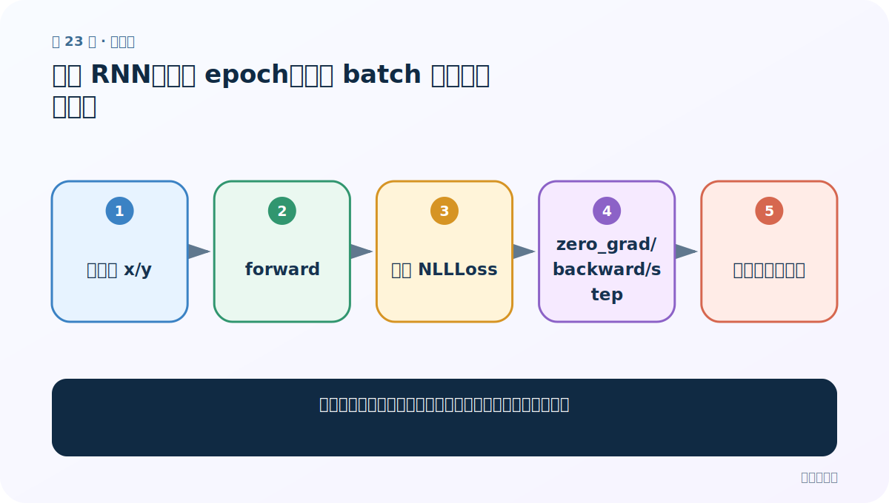
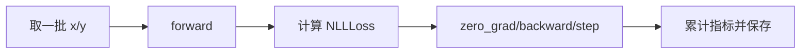
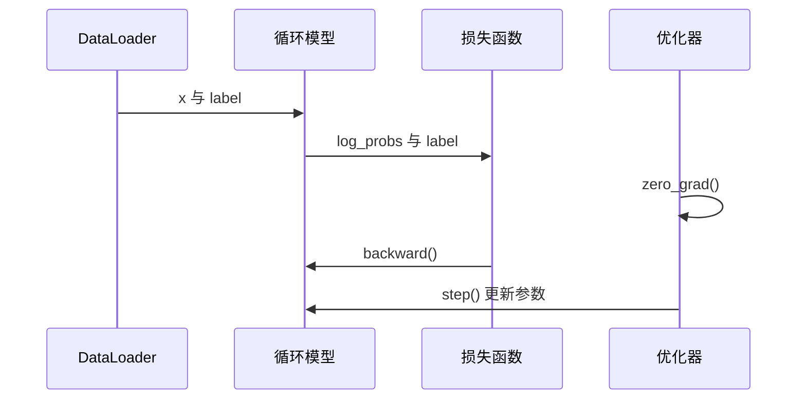

# 第 23 节：训练 RNN：外层 epoch、内层 batch 与五步反向传播

> 笔记编号 23/28 · 对应原视频 P60 · [打开这一集](https://www.bilibili.com/video/BV14mdfBDE4Q?p=60)

[← 上一节：22 测试三种模型：用同一数据管道公平验形状](./22-test-three-models.md) · [返回总目录](./README.md) · [下一节：24 训练 LSTM：复用训练循环，正确管理 h 与 c →](./24-train-lstm.md)

## 这节解决什么问题

一轮训练中数据、损失、梯度和参数到底按什么顺序流动？



图从左向右读。先跟着数据或推理过程走一遍，再学习下面的术语。

## 辅助流程图



### 一批数据的训练时序




## 零基础精讲：先把这一节真正弄懂

### 先用一个场景理解

一次训练像批改一叠练习：清旧梯度、做预测、算错误、反向找责任、更新参数，然后处理下一批。

### 沿数据流一步一步走

1. 取一批 x/y
2. forward
3. 计算 NLLLoss
4. zero_grad/backward/step
5. 累计指标并保存

上面每一步都对应流程图的一段。读图时不断问自己：“此刻张量里装的是什么，形状是什么，下一步为什么需要它？”

### 第一次看代码只盯住这里

把 zero_grad→forward→loss→backward→step 写成固定五步，并在第一批打印 loss 与形状。

运行代码前先写出预期形状，运行后逐维核对。数值可以暂时算不出，但 B（批量）、L（长度）、D/H（特征或隐藏宽度）为什么出现，必须能说清。

### 本节边界

不要在 forward 前忘记 model.train()，评估时要 model.eval()。

本节过关不是背公式，而是能从第 1 步讲到最后一步，并指出哪一个状态把前文带到了后面。

## 老师原声整理稿（按讲解顺序）

### 0:00–7:19　训练函数输入与准备

老师定义训练轮数、模型、损失函数、优化器，并准备记录损失、准确率和耗时。模型末尾为 LogSoftmax，因此使用 NLLLoss。

### 7:51–15:59　双重循环

外层控制 epoch，内层遍历 DataLoader。每批取 x/y，初始化状态或由模型内部处理，然后前向得到 18 类 log-probabilities。

### 16:11–27:14　反向传播固定顺序

先 optimizer.zero_grad() 清掉上批梯度；loss.backward() 计算梯度；optimizer.step() 更新参数。若漏清零，PyTorch 默认会累积梯度。

### 27:14–37:14　损失与准确率统计

每批损失累加；argmax 预测与标签比较得到正确数。epoch 平均损失应按样本或批次口径明确，不能混算。进度条只负责显示。

### 37:14–44:38　保存模型与返回曲线数据

训练结束保存 state_dict，并返回损失、准确率、耗时等用于对比。保存目录要存在，模型结构配置也应一并记录。

## 完整原声逐段记录

[查看本节按时间戳整理的完整音轨转写](./transcripts/p060.md)

逐段记录用于核查老师讲解是否遗漏；正文会进一步纠正口误和语音识别中的技术术语。

## 零基础先记住

- zero_grad→backward→step 顺序固定
- 训练指标口径要明确
- 保存 state_dict 还需保存模型配置

## 最小可运行代码

下面代码默认从项目根目录运行；专题配套实现见 [rnn_from_scratch 配套实现](../../rnn_from_scratch/README.md)。

```python
# 训练核心顺序
optimizer.zero_grad()
logp = model(x)
loss = criterion(logp, y)
loss.backward()
optimizer.step()
```

### 输入和输出怎么看

每批先算预测和损失，再反传并更新一次参数。

## 最容易踩的坑

不要在 forward 前忘记 model.train()，评估时要 model.eval()。

## 本节知识链

`取一批 x/y → forward → 计算 NLLLoss → zero_grad/backward/step → 累计指标并保存`

## 自测

**问题：为什么每批都要 zero_grad？**

<details>
<summary>点开核对答案</summary>

PyTorch 梯度默认累积，不清零会把多批梯度叠在一起。

</details>

## 学完检查

- [ ] 我能用自己的话复述老师的讲解顺序
- [ ] 我能在运行前预测关键输出或张量形状
- [ ] 我知道这节方法最容易用错的地方
- [ ] 我能独立回答自测题

[← 上一节：22 测试三种模型：用同一数据管道公平验形状](./22-test-three-models.md) · [返回总目录](./README.md) · [下一节：24 训练 LSTM：复用训练循环，正确管理 h 与 c →](./24-train-lstm.md)
