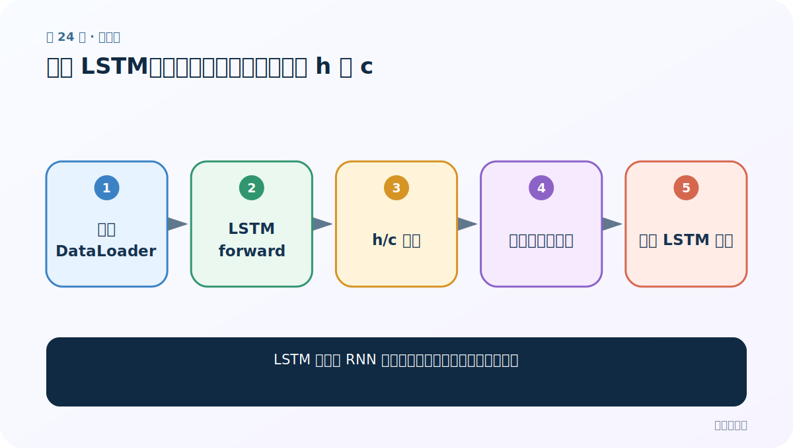
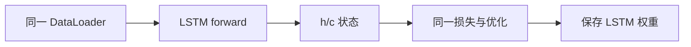
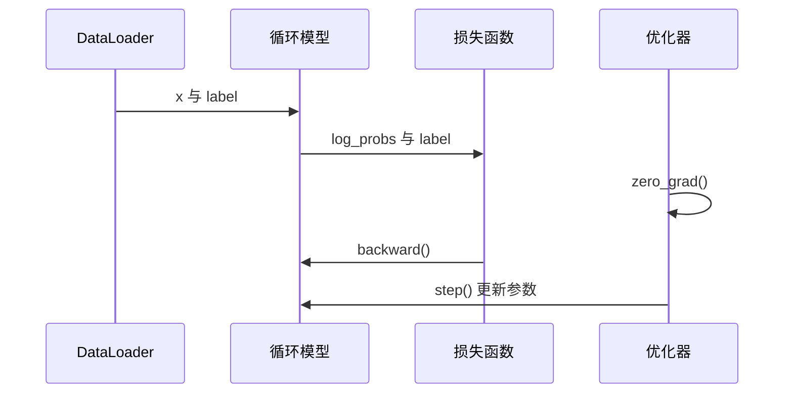

# 第 24 节：训练 LSTM：复用训练循环，正确管理 h 与 c

> 笔记编号 24/28 · 对应原视频 P61 · [打开这一集](https://www.bilibili.com/video/BV14mdfBDE4Q?p=61)

[← 上一节：23 训练 RNN：外层 epoch、内层 batch 与五步反向传播](./23-train-rnn.md) · [返回总目录](./README.md) · [下一节：25 训练 GRU：同一协议下比较速度与效果 →](./25-train-gru.md)

## 这节解决什么问题

LSTM 训练与 RNN 训练相比，真正需要改变的是什么？



图从左向右读。先跟着数据或推理过程走一遍，再学习下面的术语。

## 辅助流程图



### 一批数据的训练时序




## 零基础精讲：先把这一节真正弄懂

### 先用一个场景理解

训练 LSTM 的总体五步不变，只是内部前向会同时维护 h 和 c；若模型内部初始化状态，外部循环不必到处处理它们。

### 沿数据流一步一步走

1. 同一 DataLoader
2. LSTM forward
3. h/c 状态
4. 同一损失与优化
5. 保存 LSTM 权重

上面每一步都对应流程图的一段。读图时不断问自己：“此刻张量里装的是什么，形状是什么，下一步为什么需要它？”

### 第一次看代码只盯住这里

先复用已验证的训练协议，只替换模型，防止同时改数据、损失和优化器导致无法定位差异。

运行代码前先写出预期形状，运行后逐维核对。数值可以暂时算不出，但 B（批量）、L（长度）、D/H（特征或隐藏宽度）为什么出现，必须能说清。

### 本节边界

把前一个姓名的状态传给下一个姓名会制造不存在的序列关系。

本节过关不是背公式，而是能从第 1 步讲到最后一步，并指出哪一个状态把前文带到了后面。

## 老师原声整理稿（按讲解顺序）

### 0:00–2:49　训练骨架完全相同

读取批次、前向、算损失、清梯度、反传、更新、统计指标的顺序不变。

### 2:58–5:57　状态差异藏进模型

若模型 forward 已在内部正确处理 (h,c)，外部训练函数几乎只需换模型对象。状态跨样本复用时必须 detach 并处理边界；本案例每个姓名独立，通常每条重新初始化。

### 5:57–8:03　保存与命名

LSTM 权重应使用独立路径，不能覆盖 RNN；加载时也必须先创建完全相同配置的 LSTM 结构。

## 完整原声逐段记录

[查看本节按时间戳整理的完整音轨转写](./transcripts/p061.md)

逐段记录用于核查老师讲解是否遗漏；正文会进一步纠正口误和语音识别中的技术术语。

## 零基础先记住

- 优化步骤不因循环单元改变
- 独立姓名不应串联隐藏状态
- 保存路径和模型类型要匹配

## 最小可运行代码

下面代码默认从项目根目录运行；专题配套实现见 [rnn_from_scratch 配套实现](../../rnn_from_scratch/README.md)。

```python
from rnn_from_scratch.model import NameClassifier
model = NameClassifier(57,128,18,kind="lstm")
print(model.kind)
```

### 输入和输出怎么看

模型主干明确为 LSTM，训练循环可复用。

## 最容易踩的坑

把前一个姓名的状态传给下一个姓名会制造不存在的序列关系。

## 本节知识链

`同一 DataLoader → LSTM forward → h/c 状态 → 同一损失与优化 → 保存 LSTM 权重`

## 自测

**问题：本项目为什么每个姓名重新初始化状态？**

<details>
<summary>点开核对答案</summary>

不同姓名是独立样本，不是同一长序列的连续片段。

</details>

## 学完检查

- [ ] 我能用自己的话复述老师的讲解顺序
- [ ] 我能在运行前预测关键输出或张量形状
- [ ] 我知道这节方法最容易用错的地方
- [ ] 我能独立回答自测题

[← 上一节：23 训练 RNN：外层 epoch、内层 batch 与五步反向传播](./23-train-rnn.md) · [返回总目录](./README.md) · [下一节：25 训练 GRU：同一协议下比较速度与效果 →](./25-train-gru.md)
