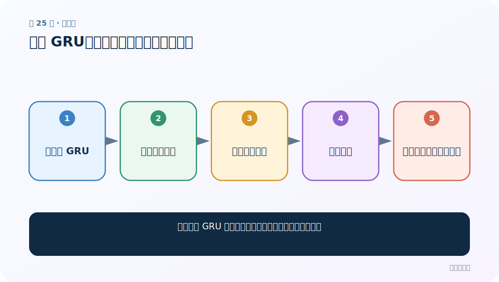
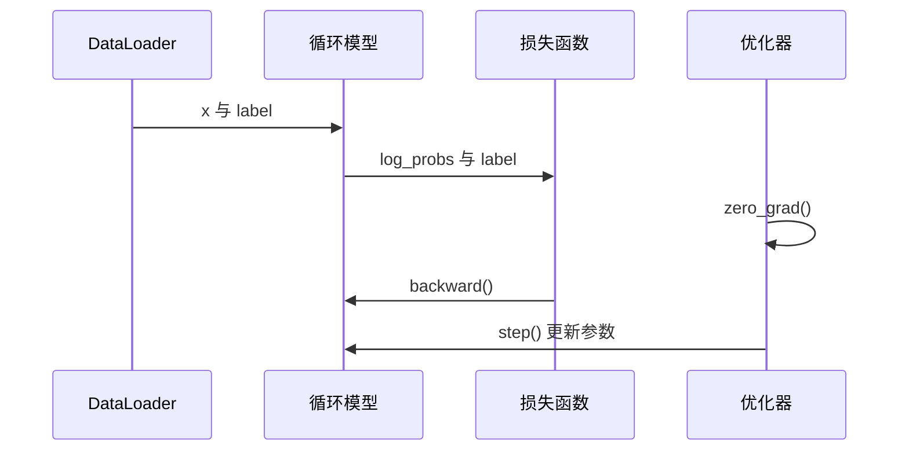

# 第 25 节：训练 GRU：同一协议下比较速度与效果

> 笔记编号 25/28 · 对应原视频 P62 · [打开这一集](https://www.bilibili.com/video/BV14mdfBDE4Q?p=62)

[← 上一节：24 训练 LSTM：复用训练循环，正确管理 h 与 c](./24-train-lstm.md) · [返回总目录](./README.md) · [下一节：26 可视化三模型：损失、时间和准确率要一起看 →](./26-visualize-comparison.md)

## 这节解决什么问题

怎样训练 GRU 并避免把一次实验结果误当成模型定律？



图从左向右读。先跟着数据或推理过程走一遍，再学习下面的术语。

## 辅助流程图


### 一批数据的训练时序



## 老师原声整理稿（按讲解顺序）

### 0:00–2:52　把模型对象换成 GRU

训练函数的输入输出和优化步骤保持不变，GRU 内部只有 h 状态。

### 2:53–5:44　记录耗时、损失和准确率

老师为后续三张对比图保存数据。耗时会受硬件、首次初始化、后台负载影响，至少应多次运行取统计量。

### 5:44–7:27　结果解释

课程这次实验中 GRU 收敛较快、准确率较高，但这只是一个数据集和超参数组合。公平比较最好为每种模型单独调参，并报告均值与方差。

## 完整原声逐段记录

[查看本节按时间戳整理的完整音轨转写](./transcripts/p062.md)

逐段记录用于核查老师讲解是否遗漏；正文会进一步纠正口误和语音识别中的技术术语。

## 零基础先记住

- GRU 可复用统一训练函数
- 训练时间要多次测量
- 单次曲线不能推出普遍优劣

## 最小可运行代码

下面代码默认从项目根目录运行；专题配套实现见 [rnn_from_scratch 配套实现](../../rnn_from_scratch/README.md)。

```python
from rnn_from_scratch.model import NameClassifier
model = NameClassifier(57,128,18,kind="gru")
print(model.kind)
```

### 输入和输出怎么看

输出 gru，表明公共分类器已切换循环主干。

## 最容易踩的坑

不同模型若学习率等超参数不合适，固定配置比较只能说明“该配置下”的结果。

## 本节知识链

`实例化 GRU → 复用训练循环 → 记录每轮指标 → 保存权重 → 与另两模型同协议比较`

## 自测

**问题：课程中 GRU 最好，能否断言所有任务都选 GRU？**

<details>
<summary>点开核对答案</summary>

不能；需按数据、预算和验证结果重新比较。

</details>

## 学完检查

- [ ] 我能用自己的话复述老师的讲解顺序
- [ ] 我能在运行前预测关键输出或张量形状
- [ ] 我知道这节方法最容易用错的地方
- [ ] 我能独立回答自测题

[← 上一节：24 训练 LSTM：复用训练循环，正确管理 h 与 c](./24-train-lstm.md) · [返回总目录](./README.md) · [下一节：26 可视化三模型：损失、时间和准确率要一起看 →](./26-visualize-comparison.md)
