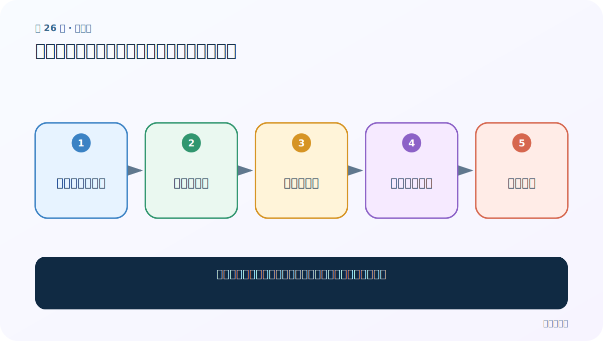
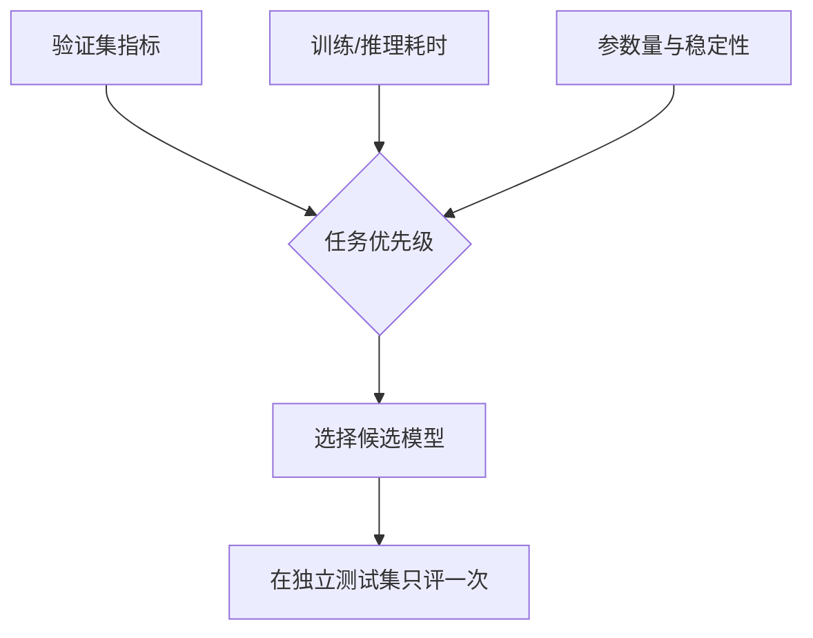

# 第 26 节：可视化三模型：损失、时间和准确率要一起看

> 笔记编号 26/28 · 对应原视频 P63 · [打开这一集](https://www.bilibili.com/video/BV14mdfBDE4Q?p=63)

[← 上一节：25 训练 GRU：同一协议下比较速度与效果](./25-train-gru.md) · [返回总目录](./README.md) · [下一节：27 RNN 预测：姓名转张量、加载权重并取 Top-k →](./27-rnn-prediction.md)

## 这节解决什么问题

一条曲线不能决定模型，怎样从三类指标做有边界的结论？



图从左向右读。先跟着数据或推理过程走一遍，再学习下面的术语。

## 辅助流程图


### 模型选择决策图




## 零基础精讲：先把这一节真正弄懂

### 先用一个场景理解

损失下降说明训练集上的错误在减小，验证准确率说明能否泛化，耗时说明成本；三条信息回答不同问题。

### 沿数据流一步一步走

1. 收集同口径记录
2. 绘损失曲线
3. 绘训练耗时
4. 绘准确率曲线
5. 综合选择

上面每一步都对应流程图的一段。读图时不断问自己：“此刻张量里装的是什么，形状是什么，下一步为什么需要它？”

### 第一次看代码只盯住这里

绘图前先把每个 epoch 的原始数值保存下来，检查横轴是否对齐、三模型是否使用同一尺度。

运行代码前先写出预期形状，运行后逐维核对。数值可以暂时算不出，但 B（批量）、L（长度）、D/H（特征或隐藏宽度）为什么出现，必须能说清。

### 本节边界

不能在测试集上反复挑模型，否则测试集也被用来调参。

本节过关不是背公式，而是能从第 1 步讲到最后一步，并指出哪一个状态把前文带到了后面。

## 老师原声整理稿（按讲解顺序）

### 0:00–5:40　准备绘图数据

老师将三模型的 epoch 损失、准确率和总耗时组织为列表，配置中文字体并分别绘图。曲线的横轴、平滑方式和数据划分必须一致。

### 5:40–11:48　损失曲线

损失下降代表优化目标改善；收敛快不等于最终泛化最好。若只画训练损失，无法判断过拟合，应同时记录验证损失。

### 11:49–15:17　训练时间

课程运行中 RNN、LSTM、GRU 耗时不同。老师指出不同电脑结果会变，因此时间图属于特定硬件环境。

### 15:18–18:17　准确率与综合结论

本次 GRU 准确率更高，但多分类还应看混淆矩阵、宏平均 F1 和各国家样本数。作业要求保存三张图；学习重点是能解释图，而非只交截图。

## 完整原声逐段记录

[查看本节按时间戳整理的完整音轨转写](./transcripts/p063.md)

逐段记录用于核查老师讲解是否遗漏；正文会进一步纠正口误和语音识别中的技术术语。

## 零基础先记住

- 训练与验证指标要分开
- 时间结论绑定硬件和实现
- 类别不平衡时准确率不够

## 最小可运行代码

下面代码默认从项目根目录运行；专题配套实现见 [rnn_from_scratch 配套实现](../../rnn_from_scratch/README.md)。

```python
records = {"rnn":{"acc":.70,"sec":20}, "lstm":{"acc":.73,"sec":48}, "gru":{"acc":.75,"sec":17}}
print(max(records, key=lambda k: records[k]["acc"]))
```

### 输入和输出怎么看

示例按准确率选 gru；真实选择还要加入速度、稳定性等约束。

## 最容易踩的坑

不能在测试集上反复挑模型，否则测试集也被用来调参。

## 本节知识链

`收集同口径记录 → 绘损失曲线 → 绘训练耗时 → 绘准确率曲线 → 综合选择`

## 自测

**问题：为什么还要看验证损失？**

<details>
<summary>点开核对答案</summary>

训练损失下降时验证损失可能上升，提示过拟合。

</details>

## 学完检查

- [ ] 我能用自己的话复述老师的讲解顺序
- [ ] 我能在运行前预测关键输出或张量形状
- [ ] 我知道这节方法最容易用错的地方
- [ ] 我能独立回答自测题

[← 上一节：25 训练 GRU：同一协议下比较速度与效果](./25-train-gru.md) · [返回总目录](./README.md) · [下一节：27 RNN 预测：姓名转张量、加载权重并取 Top-k →](./27-rnn-prediction.md)
