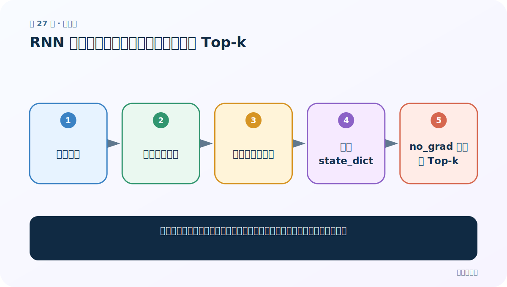
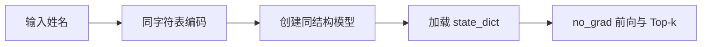
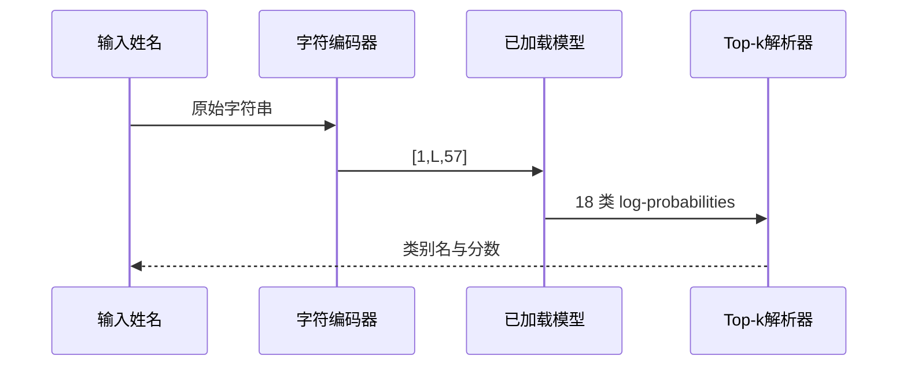

# 第 27 节：RNN 预测：姓名转张量、加载权重并取 Top-k

> 笔记编号 27/28 · 对应原视频 P64 · [打开这一集](https://www.bilibili.com/video/BV14mdfBDE4Q?p=64)

[← 上一节：26 可视化三模型：损失、时间和准确率要一起看](./26-visualize-comparison.md) · [返回总目录](./README.md) · [下一节：28 姓名分类总结：按单模型跑通，再统一重构 →](./28-name-classifier-summary.md)

## 这节解决什么问题

上线预测怎样复用训练时字符表、模型结构和类别表，输出可解释的前三名？



图从左向右读。先跟着数据或推理过程走一遍，再学习下面的术语。

## 辅助流程图



### 推理调用序列




## 零基础精讲：先把这一节真正弄懂

### 先用一个场景理解

预测一个新姓名仍要经过训练时完全相同的字符规范化和编码，然后加载同结构权重，最后把类别索引翻译回国家名。

### 沿数据流一步一步走

1. 输入姓名
2. 同字符表编码
3. 创建同结构模型
4. 加载 state_dict
5. no_grad 前向与 Top-k

上面每一步都对应流程图的一段。读图时不断问自己：“此刻张量里装的是什么，形状是什么，下一步为什么需要它？”

### 第一次看代码只盯住这里

按顺序检查 eval、no_grad、Top-k 索引和 exp；LogSoftmax 的负数不能直接当百分比。

运行代码前先写出预期形状，运行后逐维核对。数值可以暂时算不出，但 B（批量）、L（长度）、D/H（特征或隐藏宽度）为什么出现，必须能说清。

### 本节边界

只保存权重、不保存字符表和国家表，模型无法被正确解释。

本节过关不是背公式，而是能从第 1 步讲到最后一步，并指出哪一个状态把前文带到了后面。

## 老师原声整理稿（按讲解顺序）

### 0:00–2:58　先总结训练再进入预测

老师回顾数据读取、Dataset、DataLoader、模型、双层循环、反向传播、保存和三模型曲线，随后根据本次实验偏向 GRU。

### 2:58–5:56　预测必须走同一编码

直接把字符串扔给模型不行。定义 line_to_tensor，把每个字符在同一 57 字符表中的列置 1。大小写、未知字符和规范化规则必须与训练一致。

### 5:56–10:56　实现字符矩阵

创建 [L,57] 零张量，enumerate 遍历字符，查索引并置 1，返回结果。课堂写法依赖全局字符表；更易测试的设计是把编码器对象显式传入。

### 10:56–14:06　重建模型与加载权重

先用 57/128/18 创建同结构模型，再 load_state_dict(torch.load(path,...))，切到 eval，并放在 torch.no_grad() 中推理。

### 14:06–20:05　Top-k 与类别解析

topk(3,dim=-1) 返回前三个值和索引；逐项用 country 列表把索引翻译成类别名。课程模型输出 LogSoftmax，所以值是对数概率；要显示普通概率需 exp。

### 20:05–23:11　结果受训练程度限制

老师尝试多个姓名并指出只训练一轮时预测不可靠。训练轮数增加也不保证公平可靠，仍需独立测试集和伦理边界。LSTM/GRU 预测代码可复用同一流程。

## 完整原声逐段记录

[查看本节按时间戳整理的完整音轨转写](./transcripts/p064.md)

逐段记录用于核查老师讲解是否遗漏；正文会进一步纠正口误和语音识别中的技术术语。

## 零基础先记住

- 编码映射必须与训练一致
- 推理要 eval + no_grad
- LogSoftmax 输出需 exp 才是普通概率

## 最小可运行代码

下面代码默认从项目根目录运行；专题配套实现见 [rnn_from_scratch 配套实现](../../rnn_from_scratch/README.md)。

```python
import torch
from rnn_from_scratch.model import NameClassifier
m=NameClassifier(57,128,18,kind="rnn").eval()
with torch.no_grad():
    values, ids = m(torch.randn(1,5,57)).topk(3, dim=-1)
print(ids.shape, values.exp())
```

### 输入和输出怎么看

得到 3 个类别索引与对应概率形式的分数。

## 最容易踩的坑

只保存权重、不保存字符表和国家表，模型无法被正确解释。

## 本节知识链

`输入姓名 → 同字符表编码 → 创建同结构模型 → 加载 state_dict → no_grad 前向与 Top-k`

## 自测

**问题：为什么 topk 的 log 值不能直接写成 80%？**

<details>
<summary>点开核对答案</summary>

它是对数概率；要先 exp，再按百分比显示。

</details>

## 学完检查

- [ ] 我能用自己的话复述老师的讲解顺序
- [ ] 我能在运行前预测关键输出或张量形状
- [ ] 我知道这节方法最容易用错的地方
- [ ] 我能独立回答自测题

[← 上一节：26 可视化三模型：损失、时间和准确率要一起看](./26-visualize-comparison.md) · [返回总目录](./README.md) · [下一节：28 姓名分类总结：按单模型跑通，再统一重构 →](./28-name-classifier-summary.md)
