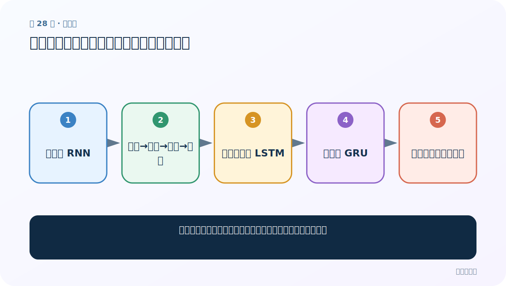
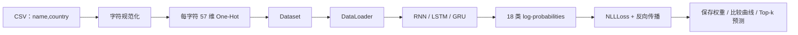

# 第 28 节：姓名分类总结：按单模型跑通，再统一重构

> 笔记编号 28/28 · 对应原视频 P65 · [打开这一集](https://www.bilibili.com/video/BV14mdfBDE4Q?p=65)

[← 上一节：27 RNN 预测：姓名转张量、加载权重并取 Top-k](./27-rnn-prediction.md) · [返回总目录](./README.md) · 已是最后一节 →

## 这节解决什么问题

面对数百行项目代码，零基础应按什么顺序练习才不会迷失？



图从左向右读。先跟着数据或推理过程走一遍，再学习下面的术语。

## 辅助流程图


### 姓名分类项目完整流水线



## 老师原声整理稿（按讲解顺序）

### 0:00–1:52　不要三模型同时抄

老师建议先忽略 LSTM/GRU，只用 RNN 从数据处理、建模、训练到预测完整跑一遍。先建立一条能闭环的主线。

### 1:52–3:47　再分别迁移

RNN 熟练后，单独建立 LSTM 版本，再建立 GRU 版本；最后才把三者合并成课堂的统一对比版本。这样每次只改变一个模型因素，错误更好定位。

### 3:48–4:59　优化清单

老师要求把可优化点真正落地：使用 CrossEntropyLoss 简化输出、直接返回 DataLoader、把损失/准确率/耗时持久化后再绘图，并改进其他重复代码。绘图函数可复用，但数据、模型、训练和预测应自己写。

## 完整原声逐段记录

[查看本节按时间戳整理的完整音轨转写](./transcripts/p065.md)

逐段记录用于核查老师讲解是否遗漏；正文会进一步纠正口误和语音识别中的技术术语。

## 零基础先记住

- 先单模型闭环，再做抽象
- 每次迁移只改必要部分
- 优化应伴随测试而不是只改写法

## 最小可运行代码

下面代码默认从项目根目录运行；专题配套实现见 [rnn_from_scratch 配套实现](../../rnn_from_scratch/README.md)。

```python
stages = ["RNN 闭环", "LSTM 迁移", "GRU 迁移", "统一接口", "测试与持久化"]
for i,s in enumerate(stages,1): print(i,s)
```

### 输入和输出怎么看

按难度递增打印五个练习阶段。

## 最容易踩的坑

一开始把三模型、绘图、优化全部混在一起，会让任何错误都难以定位。

## 本节知识链

`先只跑 RNN → 数据→模型→训练→预测 → 再独立迁移 LSTM → 再迁移 GRU → 最后统一重构与优化`

## 自测

**问题：最适合零基础的第一步是什么？**

<details>
<summary>点开核对答案</summary>

只用 RNN 完整跑通数据处理→模型→训练→预测。

</details>

## 学完检查

- [ ] 我能用自己的话复述老师的讲解顺序
- [ ] 我能在运行前预测关键输出或张量形状
- [ ] 我知道这节方法最容易用错的地方
- [ ] 我能独立回答自测题

[← 上一节：27 RNN 预测：姓名转张量、加载权重并取 Top-k](./27-rnn-prediction.md) · [返回总目录](./README.md) · 已是最后一节 →
