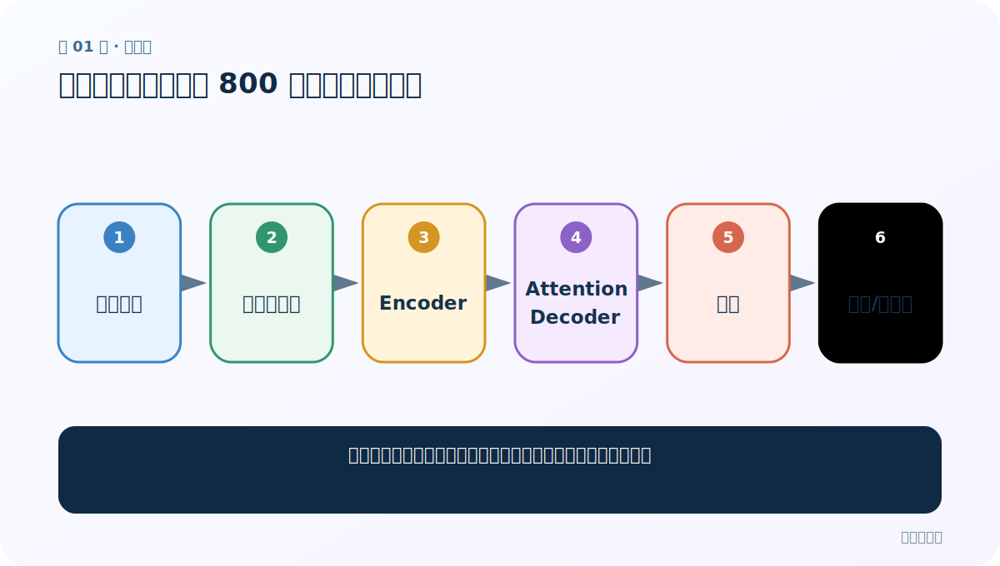
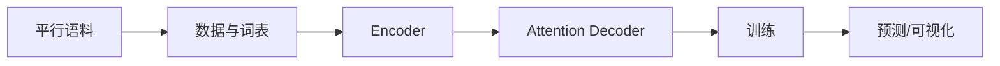
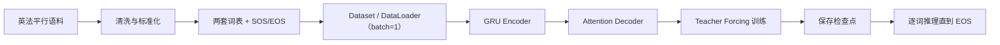
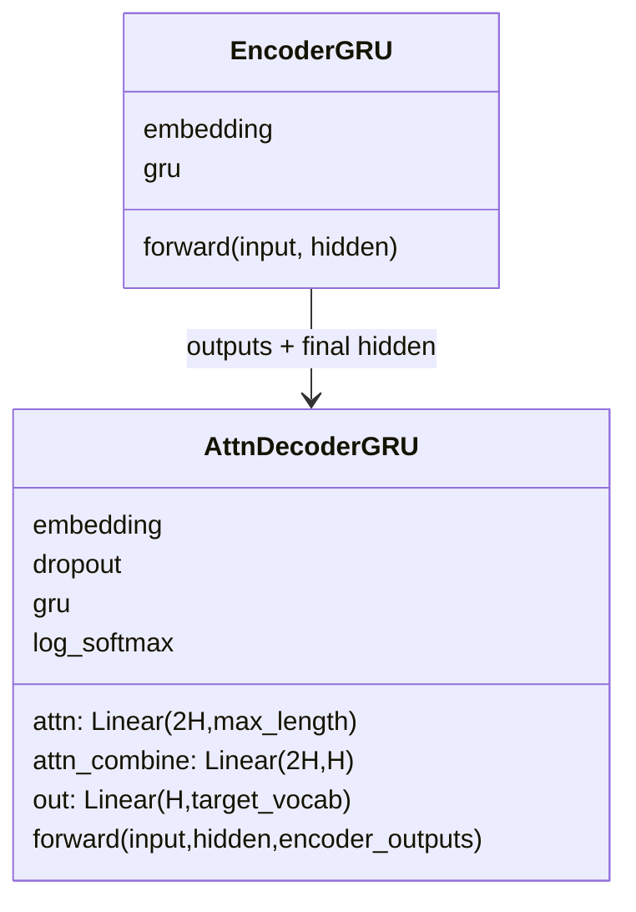

# 第 1 节：英译法需求：先看懂 800 行项目的六个模块

> 笔记编号 1/26 · 对应原视频 P80 · [打开这一集](https://www.bilibili.com/video/BV14mdfBDE4Q?p=80)

← 已是第一节 · [返回总目录](./README.md) · [下一节：2 CUDA 环境（上）：GPU、驱动、工具包与 PyTorch 不是同一层 →](./02-cuda-concepts.md)

## 这节解决什么问题

英译法项目代码很多，怎样先建立全景，不被某一个函数带跑？



图从左向右读。先跟着数据或推理过程走一遍，再学习下面的术语。

## 辅助流程图



### 英法翻译从数据到预测的总流程



### Seq2Seq 模块 UML



## 老师原声整理稿（按讲解顺序）

### 0:00–4:54　任务与章节路线

老师说明输入英文句子、输出法文句子，是 N→M 的 Seq2Seq。项目会覆盖 CUDA、清洗、Dataset/DataLoader、GRU Encoder、无/有注意力 Decoder、Teacher Forcing、训练、预测与注意力热力图。

### 4:54–9:52　为什么代码量大

算法主体并非 800 个新知识点，代码量来自数据管道、三类模型组件、训练日志、保存加载和测试。先按模块理解接口，再串成主流程。

### 9:52–14:53　模型本质是反复做法语词分类

老师把英文经 Encoder 压成中间表示，再由 Decoder 逐时间步生成法语。每一步都会对约 4345 个法语词给出概率，概率最高的候选作为预测，因此从输出层角度看是重复进行多分类。课程后续词表会加入 SOS 与 EOS；本案例没有定义 PAD 或 UNK。

## 完整原声逐段记录

[查看本节按时间戳整理的完整音轨转写](./transcripts/p080.md)

逐段记录用于核查老师讲解是否遗漏；正文会进一步纠正口误和语音识别中的技术术语。

## 零基础先记住

- 翻译是输入输出可变长的 N→M
- 源/目标需要独立词表
- 先学模块接口，再学整条训练线

## 配套现代化实现示例（注意力公式与课堂版不同）

下面代码默认从项目根目录运行；专题配套实现见 [seq2seq_from_scratch 配套实现](../../seq2seq_from_scratch/README.md)。

```python
import torch
from seq2seq_from_scratch.model import EncoderGRU, AttentionDecoderGRU, Seq2Seq
encoder=EncoderGRU(100,16,32)
decoder=AttentionDecoderGRU(120,16,32)
model=Seq2Seq(encoder,decoder,start_id=1,end_id=2)
print(type(model).__name__)
```

### 输入和输出怎么看

创建一个包含 Encoder 和 Attention Decoder 的 Seq2Seq 对象。

## 最容易踩的坑

不要一开始从第一行照抄到最后；先画清数据和模块边界。

## 本节知识链

`平行语料 → 数据与词表 → Encoder → Attention Decoder → 训练 → 预测/可视化`

## 自测

**问题：为什么英语和法语通常不用同一词表？**

<details>
<summary>点开核对答案</summary>

字符、词形和频率不同，独立映射更清楚；共享词表是另一种可选设计。

</details>

## 学完检查

- [ ] 我能用自己的话复述老师的讲解顺序
- [ ] 我能在运行前预测关键输出或张量形状
- [ ] 我知道这节方法最容易用错的地方
- [ ] 我能独立回答自测题

← 已是第一节 · [返回总目录](./README.md) · [下一节：2 CUDA 环境（上）：GPU、驱动、工具包与 PyTorch 不是同一层 →](./02-cuda-concepts.md)
