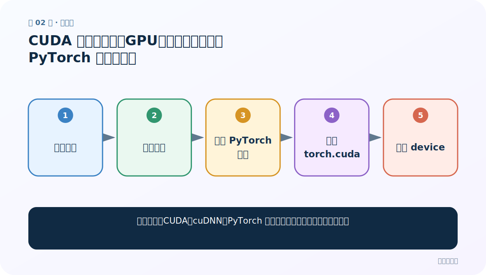
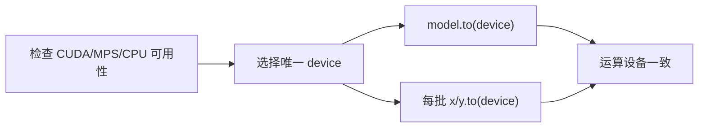

# 第 2 节：CUDA 环境（上）：GPU、驱动、工具包与 PyTorch 不是同一层

> 笔记编号 2/26 · 对应原视频 P81 · [打开这一集](https://www.bilibili.com/video/BV14mdfBDE4Q?p=81)

[← 上一节：1 英译法需求：先看懂 800 行项目的六个模块](./01-translation-requirements.md) · [返回总目录](./README.md) · [下一节：3 CUDA 环境实操：创建环境、安装、验证与排错 →](./03-cuda-practice.md)

## 这节解决什么问题

看到显卡、CUDA、cuDNN、PyTorch 版本时，怎样知道它们各负责什么？



图从左向右读。先跟着数据或推理过程走一遍，再学习下面的术语。

## 辅助流程图


### 设备选择与张量迁移



## 老师原声整理稿（按讲解顺序）

### 0:00–6:55　四层概念

老师区分 NVIDIA GPU、显卡驱动、CUDA 工具链和 PyTorch。训练程序最终通过框架调用 GPU；安装某个 CUDA 工具包不等于当前 PyTorch 一定能使用。

### 6:55–13:44　先查再装

先确认机器是否有受支持 GPU，再看 PyTorch 能否识别。课程展示命令与版本只对应当时环境；今天安装应以 PyTorch 官方选择器为准，不能盲抄旧版本号。

### 13:44–20:20　最小验证

核心检查是 torch.cuda.is_available()、device_count、当前设备名，并做一个小张量运算。模型与数据必须在同一 device。没有 CUDA 也可先用 CPU 跑通小样例。

## 完整原声逐段记录

[查看本节按时间戳整理的完整音轨转写](./transcripts/p081.md)

逐段记录用于核查老师讲解是否遗漏；正文会进一步纠正口误和语音识别中的技术术语。

## 零基础先记住

- 硬件、驱动、CUDA、框架是不同层
- 旧安装命令可能过时
- 先跑最小张量验证

## 最小可运行代码

下面代码默认从项目根目录运行；专题配套实现见 [seq2seq_from_scratch 配套实现](../../seq2seq_from_scratch/README.md)。

```python
import torch
print("cuda",torch.cuda.is_available())
device=torch.device("cuda" if torch.cuda.is_available() else "cpu")
print(device)
```

### 输入和输出怎么看

打印当前环境是否可用 CUDA，并安全回退 CPU。

## 最容易踩的坑

不要只看 nvidia-smi 就认定 PyTorch 已正确安装 CUDA 构建。

## 本节知识链

`确认硬件 → 确认驱动 → 确认 PyTorch 构建 → 检查 torch.cuda → 选择 device`

## 自测

**问题：模型在 GPU、数据在 CPU 会怎样？**

<details>
<summary>点开核对答案</summary>

运算会报设备不一致错误；两者必须迁移到同一 device。

</details>

## 学完检查

- [ ] 我能用自己的话复述老师的讲解顺序
- [ ] 我能在运行前预测关键输出或张量形状
- [ ] 我知道这节方法最容易用错的地方
- [ ] 我能独立回答自测题

[← 上一节：1 英译法需求：先看懂 800 行项目的六个模块](./01-translation-requirements.md) · [返回总目录](./README.md) · [下一节：3 CUDA 环境实操：创建环境、安装、验证与排错 →](./03-cuda-practice.md)
