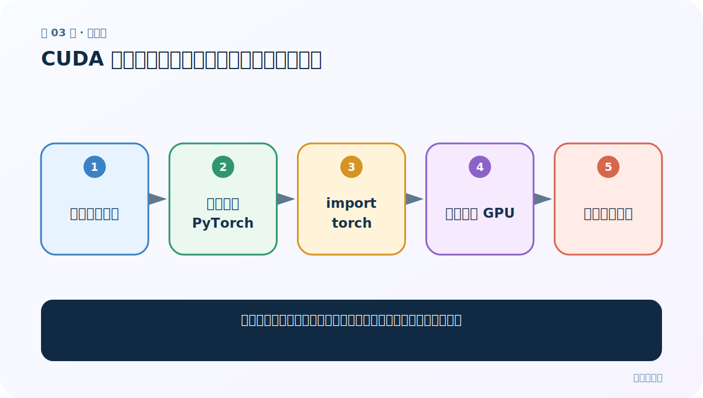
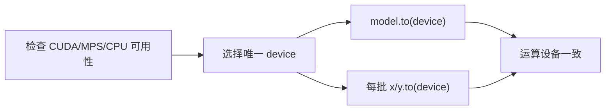

# 第 3 节：CUDA 环境实操：创建环境、安装、验证与排错

> 笔记编号 3/26 · 对应原视频 P82 · [打开这一集](https://www.bilibili.com/video/BV14mdfBDE4Q?p=82)

[← 上一节：2 CUDA 环境（上）：GPU、驱动、工具包与 PyTorch 不是同一层](./02-cuda-concepts.md) · [返回总目录](./README.md) · [下一节：4 CUDA 配置总结：把可复现信息写进项目 →](./04-cuda-summary.md)

## 这节解决什么问题

怎样用最少步骤验证环境，而不是一次装很多包后不知道哪里错？



图从左向右读。先跟着数据或推理过程走一遍，再学习下面的术语。

## 辅助流程图


### 设备选择与张量迁移



## 老师原声整理稿（按讲解顺序）

### 0:00–4:51　隔离环境

老师现场创建独立环境，避免 NLP 项目与其他依赖冲突。先只安装 PyTorch，再做验证。

### 4:51–8:53　三层测试

第一层能 import；第二层 is_available 为真；第三层把张量放到 cuda 并完成加法/乘法。任何一步失败都在该层排错，不急着装全部依赖。

### 8:53–10:58　常见失败

包括驱动太旧、装到另一个 Python、CPU 版 torch、环境没激活。用当前解释器的 `python -m pip` 比裸 pip 更不易装错环境。

## 完整原声逐段记录

[查看本节按时间戳整理的完整音轨转写](./transcripts/p082.md)

逐段记录用于核查老师讲解是否遗漏；正文会进一步纠正口误和语音识别中的技术术语。

## 零基础先记住

- 先装核心框架并最小验证
- 确认 pip 与 python 属于同一环境
- 逐层排错

## 最小可运行代码

下面代码默认从项目根目录运行；专题配套实现见 [seq2seq_from_scratch 配套实现](../../seq2seq_from_scratch/README.md)。

```python
import torch
if torch.cuda.is_available():
    x=torch.tensor([1.,2.],device="cuda")
    print((x*x).device,(x*x).tolist())
else:
    print("CPU 模式仍可学习流程")
```

### 输入和输出怎么看

CUDA 可用时在 GPU 完成运算，否则清楚显示 CPU 回退。

## 最容易踩的坑

安装成功日志不等于运行时真的使用了目标解释器。

## 本节知识链

`新建隔离环境 → 安装匹配 PyTorch → import torch → 小张量上 GPU → 再装项目依赖`

## 自测

**问题：为什么先不装项目全部包？**

<details>
<summary>点开核对答案</summary>

减少变量，能更快定位是 PyTorch/GPU 还是其他依赖问题。

</details>

## 学完检查

- [ ] 我能用自己的话复述老师的讲解顺序
- [ ] 我能在运行前预测关键输出或张量形状
- [ ] 我知道这节方法最容易用错的地方
- [ ] 我能独立回答自测题

[← 上一节：2 CUDA 环境（上）：GPU、驱动、工具包与 PyTorch 不是同一层](./02-cuda-concepts.md) · [返回总目录](./README.md) · [下一节：4 CUDA 配置总结：把可复现信息写进项目 →](./04-cuda-summary.md)
