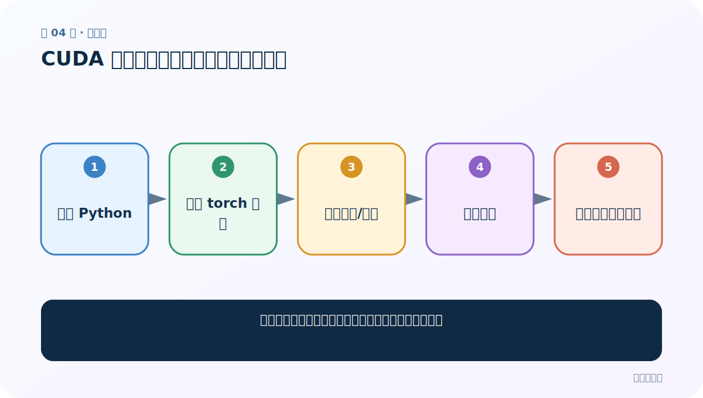
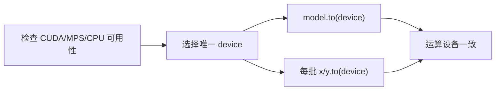

# 第 4 节：CUDA 配置总结：把可复现信息写进项目

> 笔记编号 4/26 · 对应原视频 P83 · [打开这一集](https://www.bilibili.com/video/BV14mdfBDE4Q?p=83)

[← 上一节：3 CUDA 环境实操：创建环境、安装、验证与排错](./03-cuda-practice.md) · [返回总目录](./README.md) · [下一节：5 数据清洗：规范文本，但不要改坏翻译含义 →](./05-data-cleaning.md)

## 这节解决什么问题

环境能跑以后，还要记录什么才能让下次或别人复现？



图从左向右读。先跟着数据或推理过程走一遍，再学习下面的术语。

## 辅助流程图


### 设备选择与张量迁移



## 老师原声整理稿（按讲解顺序）

### 0:00–1:59　复盘配置顺序

老师把硬件、驱动、环境、PyTorch 安装和测试压缩为一条排错路径。

### 1:59–2:50　工程化补充

保存 Python/torch 版本、设备名、依赖清单和随机种子。不要把某台机器的绝对路径或驱动安装包写死在训练代码里。

## 完整原声逐段记录

[查看本节按时间戳整理的完整音轨转写](./transcripts/p083.md)

逐段记录用于核查老师讲解是否遗漏；正文会进一步纠正口误和语音识别中的技术术语。

## 零基础先记住

- 环境信息也是实验结果的一部分
- CPU 跑通逻辑后再优化 GPU
- 安装命令应从官方当前页面获取

## 最小可运行代码

下面代码默认从项目根目录运行；专题配套实现见 [seq2seq_from_scratch 配套实现](../../seq2seq_from_scratch/README.md)。

```python
import platform,torch
print(platform.python_version())
print(torch.__version__)
print(torch.cuda.is_available())
```

### 输入和输出怎么看

打印最关键的可复现环境信息。

## 最容易踩的坑

只保存模型权重，不记录代码与词表版本，未来仍可能无法复现。

## 本节知识链

`记录 Python → 记录 torch 构建 → 记录驱动/设备 → 锁定依赖 → 保存最小诊断脚本`

## 自测

**问题：随机种子能保证所有 GPU 环境完全一致吗？**

<details>
<summary>点开核对答案</summary>

不一定；某些算子和硬件仍可能非确定，但记录种子是必要基础。

</details>

## 学完检查

- [ ] 我能用自己的话复述老师的讲解顺序
- [ ] 我能在运行前预测关键输出或张量形状
- [ ] 我知道这节方法最容易用错的地方
- [ ] 我能独立回答自测题

[← 上一节：3 CUDA 环境实操：创建环境、安装、验证与排错](./03-cuda-practice.md) · [返回总目录](./README.md) · [下一节：5 数据清洗：规范文本，但不要改坏翻译含义 →](./05-data-cleaning.md)
