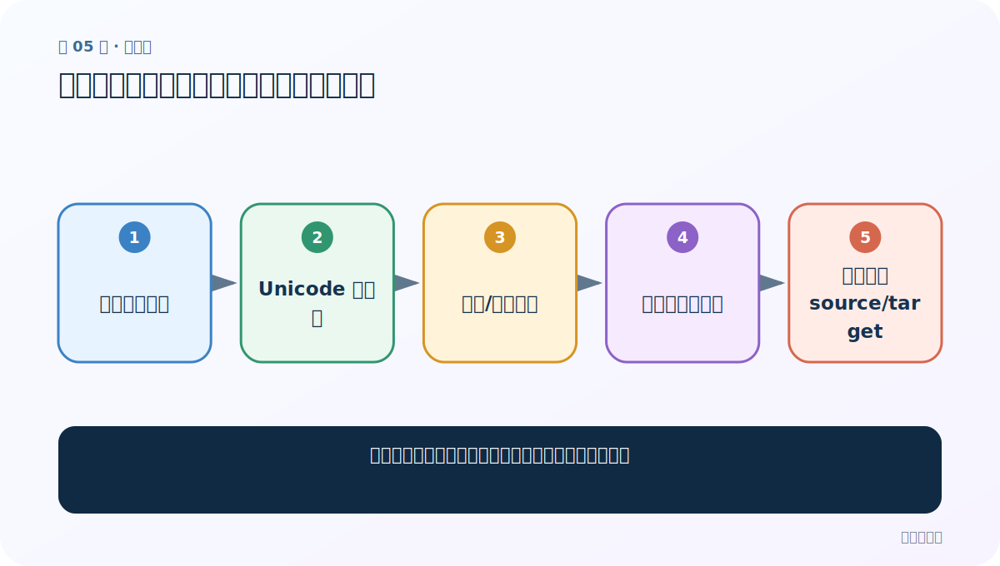
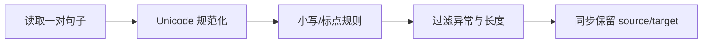
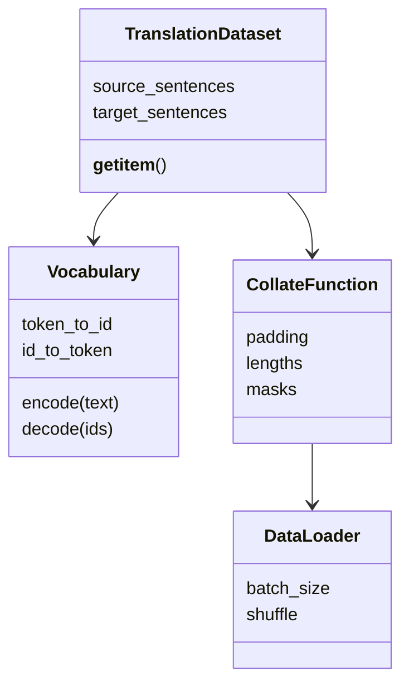

# 第 5 节：数据清洗：规范文本，但不要改坏翻译含义

> 笔记编号 5/26 · 对应原视频 P84 · [打开这一集](https://www.bilibili.com/video/BV14mdfBDE4Q?p=84)

[← 上一节：4 CUDA 配置总结：把可复现信息写进项目](./04-cuda-summary.md) · [返回总目录](./README.md) · [下一节：6 数据预处理：建两套词表并加入 SOS/EOS →](./06-preprocessing.md)

## 这节解决什么问题

平行语料怎样同时清洗，确保英文与法文仍一一对应？



图从左向右读。先跟着数据或推理过程走一遍，再学习下面的术语。

## 辅助流程图



### 语料与加载类的职责



## 老师原声整理稿（按讲解顺序）

### 0:00–5:58　清洗函数的职责

老师对文本做 Unicode 到 ASCII 的规范、小写、标点分隔和非法字符过滤，让词表更稳定。英文和法文要用与语言匹配的规则。

### 5:58–11:53　成对清洗

每行是英文与法文一对；任何过滤都必须同时作用到整对，不能只删一边。空行、列数错误和无法解析字符应记录数量。

### 11:53–15:40　别把信息洗掉

法语重音、撇号可能承载真实词形；课程简化规则服务教学。生产任务应保留原文列，抽样比较清洗前后，并用 tokenizer 代替过度正则。

## 完整原声逐段记录

[查看本节按时间戳整理的完整音轨转写](./transcripts/p084.md)

逐段记录用于核查老师讲解是否遗漏；正文会进一步纠正口误和语音识别中的技术术语。

## 零基础先记住

- 平行语料必须成对保留/删除
- 清洗规则与语言相关
- 保留原始文本便于回溯

## 最小可运行代码

下面代码默认从项目根目录运行；专题配套实现见 [seq2seq_from_scratch 配套实现](../../seq2seq_from_scratch/README.md)。

```python
import re,unicodedata
def clean(s):
    s=unicodedata.normalize("NFKC",s.strip().lower())
    return re.sub(r"\s+"," ",s)
print(clean("  Hello   world! "))
```

### 输入和输出怎么看

得到 `hello world!`，仅规范大小写和空白。

## 最容易踩的坑

把所有非 ASCII 字符删除可能破坏法语重音与专名。

## 本节知识链

`读取一对句子 → Unicode 规范化 → 小写/标点规则 → 过滤异常与长度 → 同步保留 source/target`

## 自测

**问题：一对句子中目标为空，能只保留源句吗？**

<details>
<summary>点开核对答案</summary>

不能用于有监督翻译；输入与目标会失去配对。

</details>

## 学完检查

- [ ] 我能用自己的话复述老师的讲解顺序
- [ ] 我能在运行前预测关键输出或张量形状
- [ ] 我知道这节方法最容易用错的地方
- [ ] 我能独立回答自测题

[← 上一节：4 CUDA 配置总结：把可复现信息写进项目](./04-cuda-summary.md) · [返回总目录](./README.md) · [下一节：6 数据预处理：建两套词表并加入 SOS/EOS →](./06-preprocessing.md)
