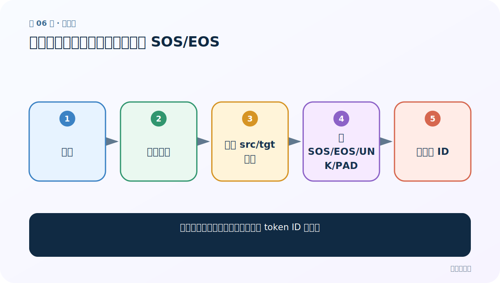
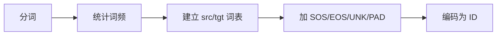
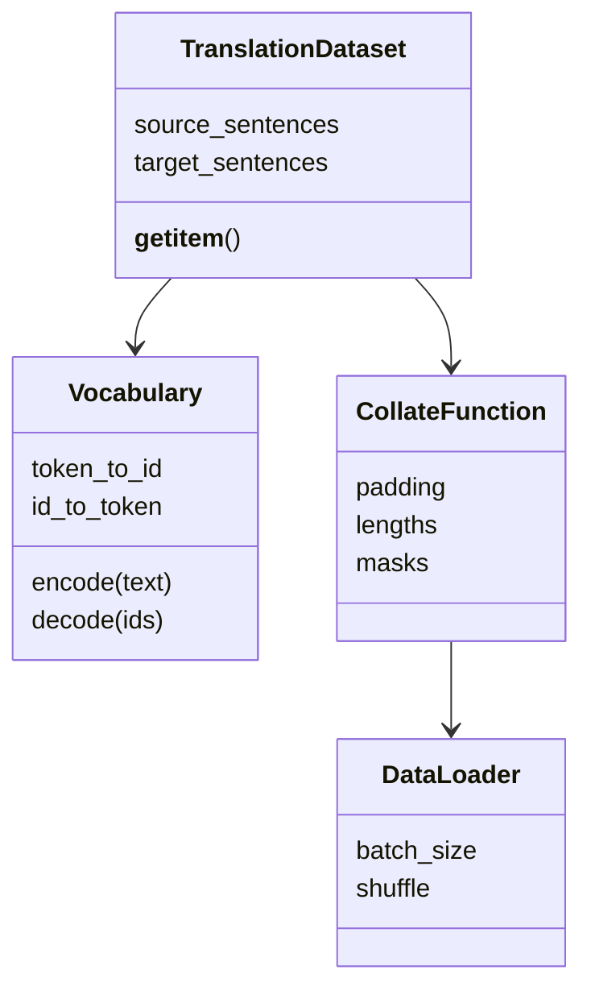
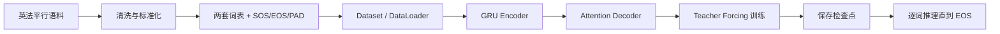

# 第 6 节：数据预处理：建两套词表并加入 SOS/EOS

> 笔记编号 6/26 · 对应原视频 P85 · [打开这一集](https://www.bilibili.com/video/BV14mdfBDE4Q?p=85)

[← 上一节：5 数据清洗：规范文本，但不要改坏翻译含义](./05-data-cleaning.md) · [返回总目录](./README.md) · [下一节：7 构建 Dataset：一条样本同时返回源 ID 与目标 ID →](./07-dataset.md)

## 这节解决什么问题

干净字符串怎样变成模型训练用的 token ID 序列？



图从左向右读。先跟着数据或推理过程走一遍，再学习下面的术语。

## 辅助流程图



### 语料与加载类的职责



### 英法翻译从数据到预测的总流程



## 老师原声整理稿（按讲解顺序）

### 0:00–7:52　词表对象

老师建立词→索引、索引→词、词频三个结构。add_sentence 遍历词，add_word 分配新 ID 并累计次数。

### 7:52–15:54　特殊 token

SOS 作为解码起点，EOS 标识结束，PAD 用于批量补齐，UNK 接住未登录词。每个 ID 必须固定并持久化。

### 15:54–23:52　编码一对句子

源句通常追加 EOS；目标训练序列可组织为 `[SOS, y1, ..., EOS]`。模型输入目标的前 T-1 个位置，标签是后移一位的 T-1 个位置。

### 23:52–31:46　过滤与统计

课程按前缀/长度筛选部分英法句对降低难度。过滤规则会改变任务分布，应记录保留率，并只用训练集建词表避免泄漏。

## 完整原声逐段记录

[查看本节按时间戳整理的完整音轨转写](./transcripts/p085.md)

逐段记录用于核查老师讲解是否遗漏；正文会进一步纠正口误和语音识别中的技术术语。

## 零基础先记住

- src/tgt 词表独立
- 目标输入与标签相差一位
- 词表只由训练集建立

## 最小可运行代码

下面代码默认从项目根目录运行；专题配套实现见 [seq2seq_from_scratch 配套实现](../../seq2seq_from_scratch/README.md)。

```python
target=["<SOS>","je","suis","ici","<EOS>"]
print("input",target[:-1])
print("label",target[1:])
```

### 输入和输出怎么看

模型每一步输入前一个 token，预测下一个 token。

## 最容易踩的坑

忘记 EOS 会让模型不知道何时停止。

## 本节知识链

`分词 → 统计词频 → 建立 src/tgt 词表 → 加 SOS/EOS/UNK/PAD → 编码为 ID`

## 自测

**问题：为什么标签从 target[1:] 开始？**

<details>
<summary>点开核对答案</summary>

输入 SOS 时应预测第一个真实词，输入最后真实词时应预测 EOS。

</details>

## 学完检查

- [ ] 我能用自己的话复述老师的讲解顺序
- [ ] 我能在运行前预测关键输出或张量形状
- [ ] 我知道这节方法最容易用错的地方
- [ ] 我能独立回答自测题

[← 上一节：5 数据清洗：规范文本，但不要改坏翻译含义](./05-data-cleaning.md) · [返回总目录](./README.md) · [下一节：7 构建 Dataset：一条样本同时返回源 ID 与目标 ID →](./07-dataset.md)
