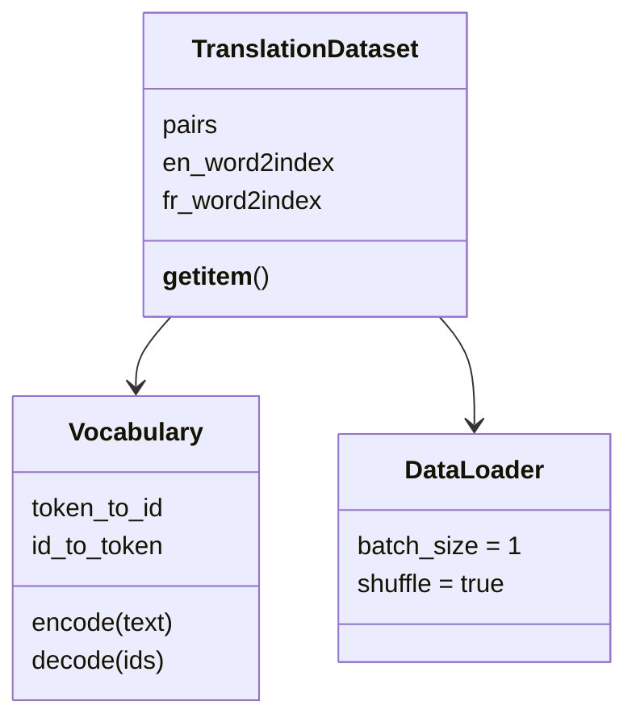

# 第 6 节：数据预处理：读取双语句对并建立两套词表

> 笔记编号 6/26 · 对应原视频 P85 · [打开这一集](https://www.bilibili.com/video/BV14mdfBDE4Q?p=85)

[← 上一节：5 数据清洗：规范文本，但不要改坏翻译含义](./05-data-cleaning.md) · [返回总目录](./README.md) · [下一节：7 构建 Dataset：逐词查表、追加 EOS 并转成张量 →](./07-dataset.md)

## 这节解决什么问题

清洗函数写好后，怎样把六万多行英法语料读进内存并建立可双向查询的词表？


图从左向右读。先跟着数据或推理过程走一遍，再学习下面的术语。

## 辅助流程图


### 语料与加载类的职责



### 英法翻译从数据到预测的总流程


## 老师原声整理稿（按讲解顺序）

### 0:00–4:46　从文件读取全部行，但先确认读进来的数据长什么样

老师先把本节定位成“加载数据到内存”，因为后面封装 Dataset 和 DataLoader 都依赖这里返回的结构。函数用 UTF-8 打开英法平行语料，通过 `readlines()` 一次取得全部行。课程数据有六万多行，直接打印会把终端淹没，因此老师只截取前五行检查。

这一步看似只是文件 I/O，却承担了第一道验收：文件路径是否正确、编码是否能解析、行数是否符合预期，以及每一行是否仍保留英法两部分。老师反复打印不是为了凑代码，而是示范“在做下一层抽象前先看真实数据”。如果读取阶段已经出现乱码或空行，后面再漂亮的词表也没有意义。

### 4:46–11:28　按制表符拆开英法句子，并对两边分别调用清洗函数

原始语料的一行由英文、制表符和法文组成。老师用两层列表推导式处理：外层遍历每一行，内层用制表符切分，再把切出的每个句子交给前一节编写的规范化函数。最终 `pairs` 是一个列表，列表里的每个元素长度为 2，索引 0 是英文，索引 1 是法文。

课堂没有把整行当成一个字符串继续处理，因为翻译监督关系必须明确保留。切分后老师用前五组样本逐项说明嵌套结构：外层决定第几条句对，内层两个元素决定源语言和目标语言。这个结构约定会贯穿 Dataset 的 `__getitem__`，如果在这里把两列顺序弄反，后面编码器和解码器的词表也会跟着反。

清洗必须对句对两端都执行，但不能打乱配对。某行列数异常或清洗后为空时，应整对处理并记录；本节课堂主要演示正常路径，生产数据还需要额外校验。

### 11:28–15:12　抽查不同位置，而不是看完前五行就假设全体正常

得到 `pairs` 后，老师专门安排“数据探查”：先看前几条，再选择第 7000 条一类中间位置，分别打印英文 `pairs[i][0]` 和法文 `pairs[i][1]`。7000 没有特殊业务含义，它只是提醒读者不要只观察文件开头。

这个动作隔离了两类问题：一是结构问题，例如某一行没有被正确切成两列；二是内容问题，例如英文和法文看起来不再互为翻译。抽样不能替代完整统计，但能在写词表前快速发现明显错误。老师的做法也说明调试输出应当少而有目的，六万行全部打印反而不利于判断。

### 15:12–19:07　分别初始化英文和法文词表，先固定 SOS 与 EOS

课程为两种语言分别建立“单词到索引”的字典。英文和法文的词集合不同，不能共用一张映射表。老师先放入两个特殊符号：SOS 表示句子开始，索引为 0；EOS 表示句子结束，索引为 1，因此两个词表的计数器都从 2 开始。

老师同时演示了“直接写 0/1”和“引用 `SOS_token`、`EOS_token` 常量”两种写法，并推荐实际开发使用常量，避免同一个语义数字散落在代码里。这里还没有实现 PAD 或 UNK，不能把后续可能需要的特殊符号提前说成本节已经完成；本节真正落地的是 SOS、EOS 和两套独立词表。

### 19:07–25:55　遍历所有句对，只给第一次出现的词分配新索引

构建词表时，外层遍历全部双语句对；对英文句子按空格切成词，再逐词检查是否已在英文字典中。前一节的清洗函数已把标点两侧留出空格，因此 `you !` 会稳定拆成两个 token，而不会一会儿得到 `you!`、一会儿得到 `you`。

若单词不存在，就用当前字典长度或计数器作为新索引，然后把计数器加一；若已经存在，则保持原索引不变。老师专门解释为什么必须先判断：同一个词会在语料中反复出现，若每次都重新编号，先前编码的句子就会失效。法语词表重复相同流程，但读取句对的索引 1。

完成后课堂打印出英文约 2803 个词、法文约 4345 个词。数字属于当前清洗和语料版本，不应当背诵；真正需要记住的是，两边独立统计且索引一经分配必须稳定。

### 25:55–31:46　建立索引到单词的反向表，并一次返回后续需要的全部结构

模型训练使用数字 ID，但调试预测结果时还要把 ID 还原成单词，所以老师用字典推导式把“词 → ID”反转为“ID → 词”。英文和法文各有正向、反向两张表，再加上各自词表大小，组成后续 Dataset、模型输出层和预测解码都会使用的返回值。

老师最后把函数调用结果一次解包，并重新打印词表大小做收口检查。到这里完成的是“文件 → 清洗句对 → 两套双向词表”的内存准备，还没有把每句话真正编码成张量，也没有进行 padding。下一节封装 Dataset 时才会消费这些结构，因此本节的完成标准是：句对方向正确、特殊符号索引固定、正反向映射互相一致、词表大小能复现。

## 完整原声逐段记录

[查看本节按时间戳整理的完整音轨转写](./transcripts/p085.md)

逐段记录用于核查老师讲解是否遗漏；正文会进一步纠正口误和语音识别中的技术术语。

## 零基础先记住

- 每条样本始终保持英文与法文配对
- src/tgt 词表独立且 SOS/EOS 索引固定
- 正向表用于编码，反向表用于还原预测

## 最小可运行代码

下面代码默认从项目根目录运行；专题配套实现见 [seq2seq_from_scratch 配套实现](../../seq2seq_from_scratch/README.md)。

```python
pairs = [["i am here .", "je suis ici ."]]
en_word2index = {"SOS": 0, "EOS": 1}
for word in pairs[0][0].split():
    if word not in en_word2index:
        en_word2index[word] = len(en_word2index)
en_index2word = {index: word for word, index in en_word2index.items()}
print(en_word2index)
print(en_index2word)
```

### 输入和输出怎么看

同一个英文词只分配一次索引，并能通过反向表还原。

## 最容易踩的坑

不要把本节说成已经完成 PAD、UNK、张量编码或过滤；课堂此处只建立双语句对和 SOS/EOS 词表。

## 本节知识链

`读取 UTF-8 文件 → 按制表符拆句对 → 抽查样本 → 建立英法词到索引 → 生成反向词表`

## 自测

**问题：为什么英文和法文必须分别建立词表？**

<details>
<summary>点开核对答案</summary>

两种语言的词集合和词表大小不同；共用索引会混淆编码器输入与解码器输出空间。

</details>

## 学完检查

- [ ] 我能用自己的话复述老师的讲解顺序
- [ ] 我能在运行前预测关键输出或张量形状
- [ ] 我知道这节方法最容易用错的地方
- [ ] 我能独立回答自测题

[← 上一节：5 数据清洗：规范文本，但不要改坏翻译含义](./05-data-cleaning.md) · [返回总目录](./README.md) · [下一节：7 构建 Dataset：逐词查表、追加 EOS 并转成张量 →](./07-dataset.md)
