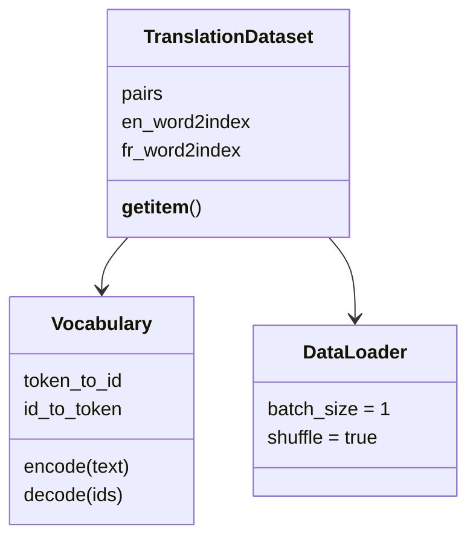

# 第 7 节：构建 Dataset：逐词查表、追加 EOS 并转成张量

> 笔记编号 7/26 · 对应原视频 P86 · [打开这一集](https://www.bilibili.com/video/BV14mdfBDE4Q?p=86)

[← 上一节：6 数据预处理：读取双语句对并建立两套词表](./06-preprocessing.md) · [返回总目录](./README.md) · [下一节：8 构建 DataLoader：用 batch_size=1 检查英法 ID 序列 →](./08-dataloader.md)

## 这节解决什么问题

前一节已经得到句对和双向词表，Dataset 的 __getitem__ 怎样把其中一对英文、法文转换成模型可用的 ID 张量？


图从左向右读。先跟着数据或推理过程走一遍，再学习下面的术语。

## 辅助流程图


### 语料与加载类的职责



## 老师原声整理稿（按讲解顺序）

### 0:00–4:12　先把数据处理链条接起来，而不是重新读一遍文件

老师先回顾前几节的顺序：定义设备和 SOS/EOS 常量，编写清洗函数，再由数据预处理函数读取句对并建立英文、法文词表。Dataset 的初始化方法直接调用这套预处理并保存返回结果，因此后面的取样逻辑始终使用同一份句对和同一套索引。

这里的关键不是 TensorDataset 这个名字，而是让 Dataset 成为“按编号提供一对训练样本”的统一入口。英文和法文必须共用同一个样本索引，不能各自随机抽取，否则监督关系会被破坏。

### 4:12–8:36　__len__ 返回句对数量，__getitem__ 先取出同一对文本

`__len__` 返回双语句对列表的长度，让 DataLoader 知道数据集共有多少条。`__getitem__(index)` 用同一个 index 取得英文句子和法文句子，再分别按空格切词。

老师在这里沿用前一节约定：句对索引 0 是英文，索引 1 是法文。这个方向一旦交换，英文词就会去法语字典里查，轻则 KeyError，重则在错误词表上得到没有语义的编号。

### 8:36–12:43　英文查英文表、法文查法文表，得到两串 token ID

取出的每个英文词通过英文 `word2index` 查编号，每个法文词通过法文 `word2index` 查编号。老师把列表推导式拆开解释，是为了让同学看清“词 → 字典 → 整数”的路径，而不是把字符串直接交给神经网络。

本课程词表由同一批语料预先建立，所以课堂代码直接索引字典；它此处没有定义 UNK 的回退策略。若扩展到语料外输入，需要另行增加未知词方案，不能假装本节已经实现。

### 12:43–16:37　在两句话末尾追加 EOS，再按当前设备创建 long 张量

英文 ID 列表和法文 ID 列表都要追加 EOS。老师强调不能把字符串“EOS”混进整数列表，而应追加前面定义的 `EOS_token`（课堂中值为 1）。这样模型以后能够知道一句话在什么位置结束。

最后用 `torch.tensor(..., dtype=torch.long, device=device)` 创建张量并成对返回。long 类型是 Embedding 索引的要求，device 参数则保证样本与模型位于同一计算设备。此时每个样本仍可有不同长度；课堂下一节使用 batch_size=1，因此没有在这里做 padding。

## 完整原声逐段记录

[查看本节按时间戳整理的完整音轨转写](./transcripts/p086.md)

逐段记录用于核查老师讲解是否遗漏；正文会进一步纠正口误和语音识别中的技术术语。

## 零基础先记住

- 同一个 index 必须返回一对互译句子
- 英文和法文分别查各自词表
- 两端都在末尾追加 EOS
- Embedding 的索引张量使用 torch.long

## 最小可运行代码

下面代码默认从项目根目录运行；专题配套实现见 [seq2seq_from_scratch 配套实现](../../seq2seq_from_scratch/README.md)。

```python
import torch
EOS_token = 1
en_word2index = {"i": 2, "am": 3}
fr_word2index = {"je": 2, "suis": 3}
x = [en_word2index[word] for word in "i am".split()] + [EOS_token]
y = [fr_word2index[word] for word in "je suis".split()] + [EOS_token]
print(torch.tensor(x, dtype=torch.long), torch.tensor(y, dtype=torch.long))
```

### 输入和输出怎么看

英文和法文分别得到整数 ID 序列，末尾的 1 是 EOS。

## 最容易踩的坑

不要把字符串 EOS 直接追加到整数列表；也不要用法语词表编码英文。

## 本节知识链

`初始化时取得句对与词表 → __len__ 返回句对数 → 按 i 取同一对句子 → 逐词查各自词表 → 追加 EOS 并转 long 张量`

## 自测

**问题：为什么本节的英文、法文列表末尾都要追加 EOS？**

<details>
<summary>点开核对答案</summary>

让后续编码和解码过程都能识别各自句子的结束位置。

</details>

## 学完检查

- [ ] 我能用自己的话复述老师的讲解顺序
- [ ] 我能在运行前预测关键输出或张量形状
- [ ] 我知道这节方法最容易用错的地方
- [ ] 我能独立回答自测题

[← 上一节：6 数据预处理：读取双语句对并建立两套词表](./06-preprocessing.md) · [返回总目录](./README.md) · [下一节：8 构建 DataLoader：用 batch_size=1 检查英法 ID 序列 →](./08-dataloader.md)
