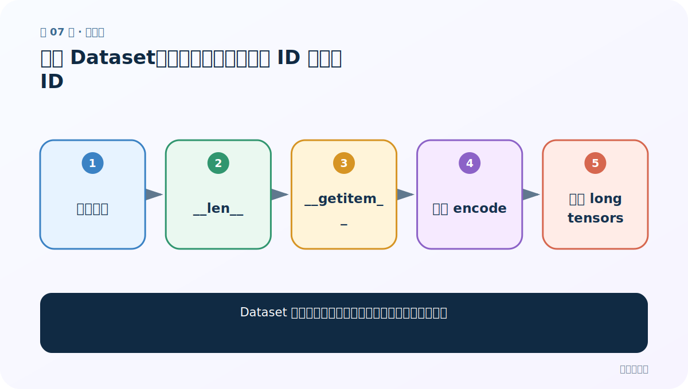
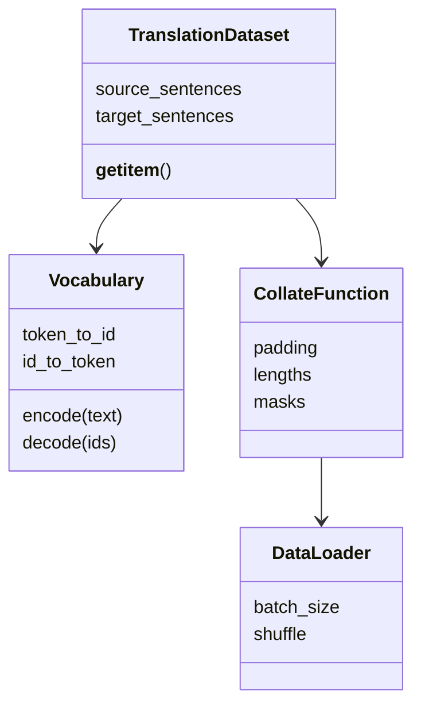

# 第 7 节：构建 Dataset：一条样本同时返回源 ID 与目标 ID

> 笔记编号 7/26 · 对应原视频 P86 · [打开这一集](https://www.bilibili.com/video/BV14mdfBDE4Q?p=86)

[← 上一节：6 数据预处理：建两套词表并加入 SOS/EOS](./06-preprocessing.md) · [返回总目录](./README.md) · [下一节：8 获取 DataLoader：补齐、长度和 mask 一起产出 →](./08-dataloader.md)

## 这节解决什么问题

Dataset 怎样保持句对对应，并在何处做张量化最清晰？



图从左向右读。先跟着数据或推理过程走一遍，再学习下面的术语。

## 辅助流程图


### 语料与加载类的职责



## 老师原声整理稿（按讲解顺序）

### 0:00–5:59　Dataset 骨架

构造函数保存 pairs 和两套词表，__len__ 返回句对数，__getitem__(i) 读取同一对源/目标文本。

### 5:59–11:56　文本转 ID

源句、目标句各自调用对应词表编码，得到 torch.long 张量。Embedding 接受整数 ID，不接受 float。

### 11:56–16:37　职责边界

单样本可保持变长；padding 更适合放进 collate_fn，由一个 batch 的最大长度决定，避免整个数据集统一补到全局最大值。

## 完整原声逐段记录

[查看本节按时间戳整理的完整音轨转写](./transcripts/p086.md)

逐段记录用于核查老师讲解是否遗漏；正文会进一步纠正口误和语音识别中的技术术语。

## 零基础先记住

- __getitem__ 返回成对张量
- Embedding 输入 dtype 是 long
- padding 可延迟到 collate

## 最小可运行代码

下面代码默认从项目根目录运行；专题配套实现见 [seq2seq_from_scratch 配套实现](../../seq2seq_from_scratch/README.md)。

```python
import torch
sample={"source":torch.tensor([4,7,2]),"target":torch.tensor([1,9,5,2])}
print(sample["source"].dtype)
```

### 输入和输出怎么看

ID 张量类型是 torch.int64/long。

## 最容易踩的坑

把 token ID 转 float 会让 Embedding 报类型错误。

## 本节知识链

`保存句对 → __len__ → __getitem__ → 词表 encode → 返回 long tensors`

## 自测

**问题：为什么不在 Dataset 初始化时一次性补到全局最长？**

<details>
<summary>点开核对答案</summary>

会浪费大量内存和计算；按 batch 补齐通常更省。

</details>

## 学完检查

- [ ] 我能用自己的话复述老师的讲解顺序
- [ ] 我能在运行前预测关键输出或张量形状
- [ ] 我知道这节方法最容易用错的地方
- [ ] 我能独立回答自测题

[← 上一节：6 数据预处理：建两套词表并加入 SOS/EOS](./06-preprocessing.md) · [返回总目录](./README.md) · [下一节：8 获取 DataLoader：补齐、长度和 mask 一起产出 →](./08-dataloader.md)
