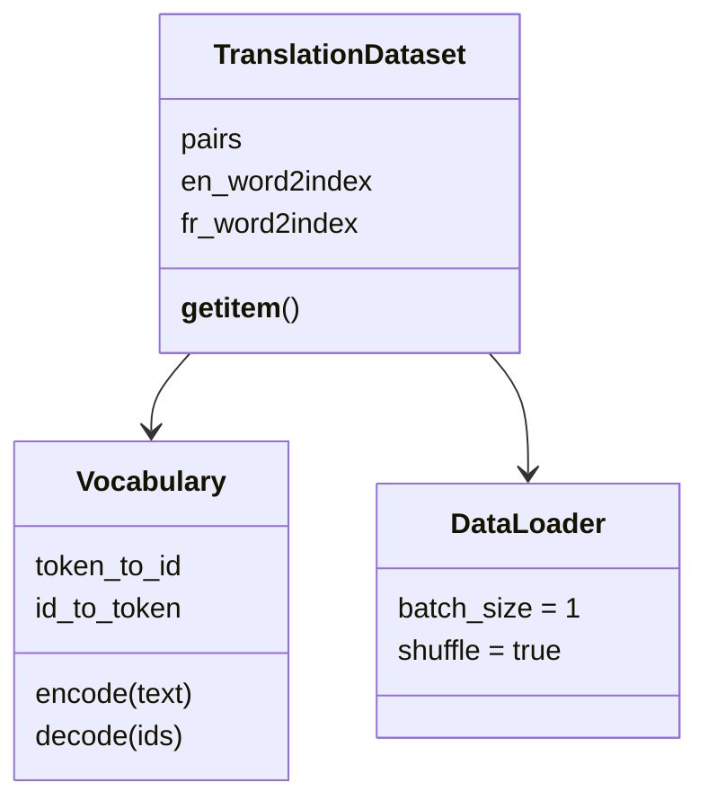

# 第 8 节：构建 DataLoader：用 batch_size=1 检查英法 ID 序列

> 笔记编号 8/26 · 对应原视频 P87 · [打开这一集](https://www.bilibili.com/video/BV14mdfBDE4Q?p=87)

[← 上一节：7 构建 Dataset：逐词查表、追加 EOS 并转成张量](./07-dataset.md) · [返回总目录](./README.md) · [下一节：9 GRU Encoder：Embedding 后保留每个时间步输出 →](./09-gru-encoder.md)

## 这节解决什么问题

Dataset 写好后，课堂怎样用最小配置随机取一条句对，并确认英文、法文张量的形状与内容？


图从左向右读。先跟着数据或推理过程走一遍，再学习下面的术语。

## 辅助流程图


### 语料与加载类的职责



## 老师原声整理稿（按讲解顺序）

### 0:00–2:33　用 Dataset 创建 DataLoader，课堂把一批固定为一条句对

老师先实例化上一节的自定义 Dataset，再交给 PyTorch DataLoader。课堂把 `batch_size` 设为 1，因为英法句子长度不同，而当前案例没有编写批量补齐函数；一批只有一条时，默认 collate 不会遇到多条变长张量无法堆叠的问题。

`shuffle=True` 让每次遍历取得的第一条样本不一定相同，所以老师提醒“第一批”不等于数据文件中的第一行。这里只是在训练数据上演示随机取样，并未讨论验证集的 shuffle 策略。

### 2:33–5:54　遍历得到 X 和 Y：外层 batch 维为 1，内层长度随句子变化

遍历 DataLoader 时，每次得到英文张量 X 和法文张量 Y。Dataset 已经把词换成索引并追加 EOS，因此打印出的不是原始单词，而是一串整数。

例如 X 的形状可能是 `[1, 6]`，Y 可能是 `[1, 7]`：第一个 1 是 batch_size，后面的 6、7 是两句话各自的 token 数。源语言与目标语言长度不必相同，这正是 Seq2Seq 要处理的情况。

### 5:54–8:43　只看一批完成验收，然后返回 DataLoader 给后续模型复用

老师同时打印形状和实际 ID，确认取样方向、EOS 以及设备都没有问题。为了避免把六万多条样本全部刷到控制台，测试循环末尾立即 `break`。

函数最后返回 DataLoader，后续 Encoder、Decoder 测试和训练都会调用它。需要明确的是：本节课堂没有实现 PAD、mask 或自定义 collate_fn；若要把 batch_size 提高到 2 以上，才需要另加变长批处理方案。这是扩展要求，不应写成老师本节已经完成的步骤。

## 完整原声逐段记录

[查看本节按时间戳整理的完整音轨转写](./transcripts/p087.md)

逐段记录用于核查老师讲解是否遗漏；正文会进一步纠正口误和语音识别中的技术术语。

## 零基础先记住

- 课堂 batch_size=1
- shuffle 后第一批不等于文件第一行
- X/Y 第一维都是 batch，第二维可以不同
- break 只用于本节检查

## 课堂调用骨架（需配合上一节 Dataset）

下面代码默认从项目根目录运行；专题配套实现见 [seq2seq_from_scratch 配套实现](../../seq2seq_from_scratch/README.md)。

```python
from torch.utils.data import DataLoader
loader = DataLoader(dataset, batch_size=1, shuffle=True)
for x, y in loader:
    print("English", x.shape, x)
    print("French ", y.shape, y)
    break
```

### 输入和输出怎么看

打印一对经过索引化的英法张量；两边序列长度可以不同。

## 最容易踩的坑

当前默认组批只因 batch_size=1 才能直接处理变长样本；把 batch_size 调大却不写 collate_fn 会报堆叠尺寸不一致。

## 本节知识链

`实例化 Dataset → DataLoader 设 batch_size=1 → 开启 shuffle → 遍历 X/Y → 打印形状和 ID 后 break`

## 自测

**问题：为什么老师只遍历一批就 break？**

<details>
<summary>点开核对答案</summary>

这里只验收 DataLoader 返回的形状和内容，继续打印全部语料没有调试价值。

</details>

## 学完检查

- [ ] 我能用自己的话复述老师的讲解顺序
- [ ] 我能在运行前预测关键输出或张量形状
- [ ] 我知道这节方法最容易用错的地方
- [ ] 我能独立回答自测题

[← 上一节：7 构建 Dataset：逐词查表、追加 EOS 并转成张量](./07-dataset.md) · [返回总目录](./README.md) · [下一节：9 GRU Encoder：Embedding 后保留每个时间步输出 →](./09-gru-encoder.md)
