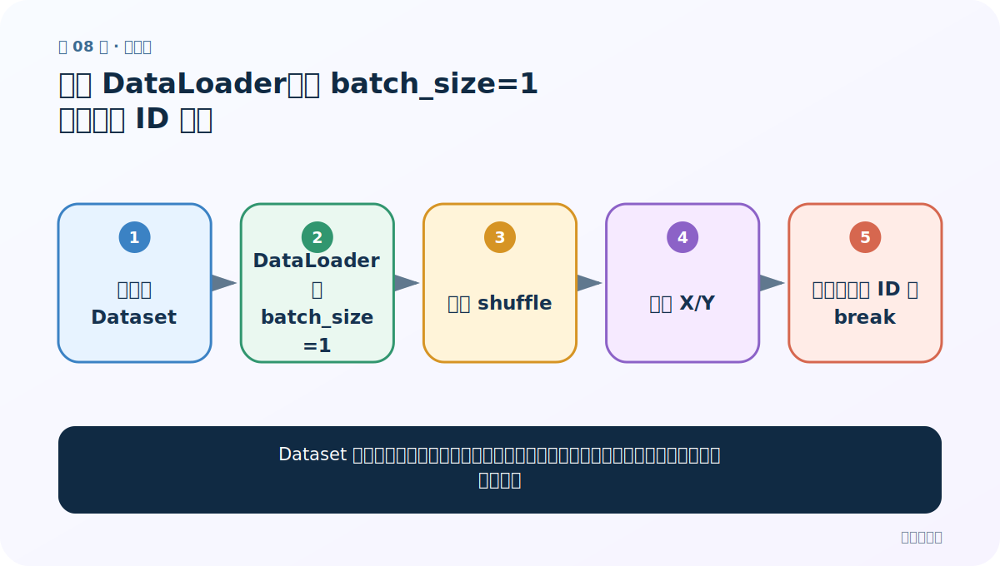
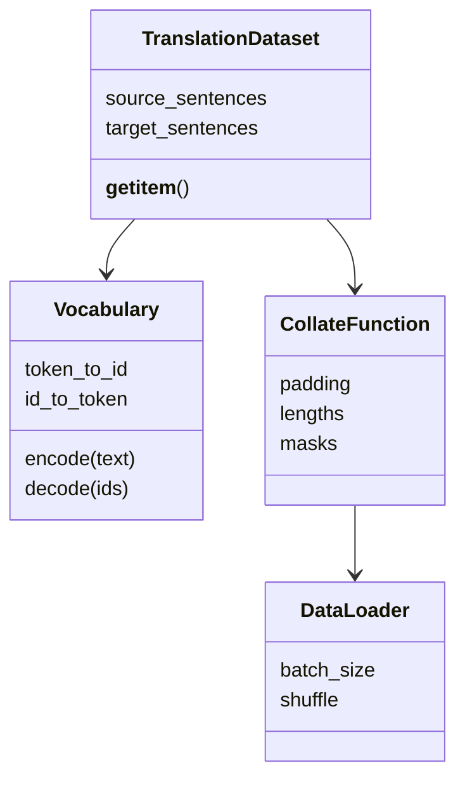

# 第 8 节：获取 DataLoader：补齐、长度和 mask 一起产出

> 笔记编号 8/26 · 对应原视频 P87 · [打开这一集](https://www.bilibili.com/video/BV14mdfBDE4Q?p=87)

[← 上一节：7 构建 Dataset：一条样本同时返回源 ID 与目标 ID](./07-dataset.md) · [返回总目录](./README.md) · [下一节：9 GRU Encoder：Embedding 后保留每个时间步输出 →](./09-gru-encoder.md)

## 这节解决什么问题

不同长度句子怎样组成一个 batch，又不让 PAD 干扰注意力？



图从左向右读。先跟着数据或推理过程走一遍，再学习下面的术语。

## 辅助流程图


### 语料与加载类的职责



## 老师原声整理稿（按讲解顺序）

### 0:00–3:50　加载器参数

老师创建 Dataset 后用 DataLoader 设置 batch_size、shuffle 等。训练集可打乱，验证/测试保持稳定。

### 3:50–6:49　课程简化与批量现实

若示例 batch_size=1，变长不会冲突；要提高效率，应自定义 collate_fn，把每批源和目标分别补齐。

### 6:49–8:43　mask

source_mask 形状 [B,S]，真实 token 为 True、PAD 为 False。注意力算分后把 PAD 分数屏蔽，再 Softmax，否则模型会把概率分给无内容位置。

## 完整原声逐段记录

[查看本节按时间戳整理的完整音轨转写](./transcripts/p087.md)

逐段记录用于核查老师讲解是否遗漏；正文会进一步纠正口误和语音识别中的技术术语。

## 零基础先记住

- 源/目标可以有不同最大长度
- mask 与 source_ids 同前两维
- 只训练集 shuffle

## 最小可运行代码

下面代码默认从项目根目录运行；专题配套实现见 [seq2seq_from_scratch 配套实现](../../seq2seq_from_scratch/README.md)。

```python
import torch
source=torch.tensor([[4,5,2,0],[7,2,0,0]])
mask=source.ne(0)
print(mask)
```

### 输入和输出怎么看

非 PAD 位置为 True，可用于注意力屏蔽。

## 最容易踩的坑

先 Softmax 再把 PAD 权重清零会导致剩余概率和小于 1；应在 Softmax 前 mask 分数。

## 本节知识链

`抽取多条样本 → 分别 pad source/target → 记录真实长度 → 建立 source mask → 返回 batch`

## 自测

**问题：第二条样本只有两个有效 token，mask 是什么？**

<details>
<summary>点开核对答案</summary>

[True, True, False, False]。

</details>

## 学完检查

- [ ] 我能用自己的话复述老师的讲解顺序
- [ ] 我能在运行前预测关键输出或张量形状
- [ ] 我知道这节方法最容易用错的地方
- [ ] 我能独立回答自测题

[← 上一节：7 构建 Dataset：一条样本同时返回源 ID 与目标 ID](./07-dataset.md) · [返回总目录](./README.md) · [下一节：9 GRU Encoder：Embedding 后保留每个时间步输出 →](./09-gru-encoder.md)
