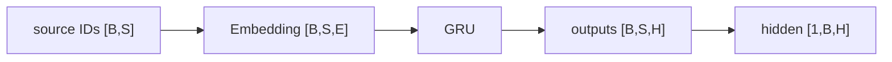
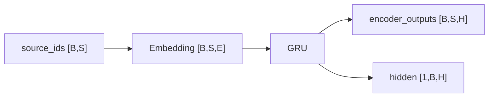
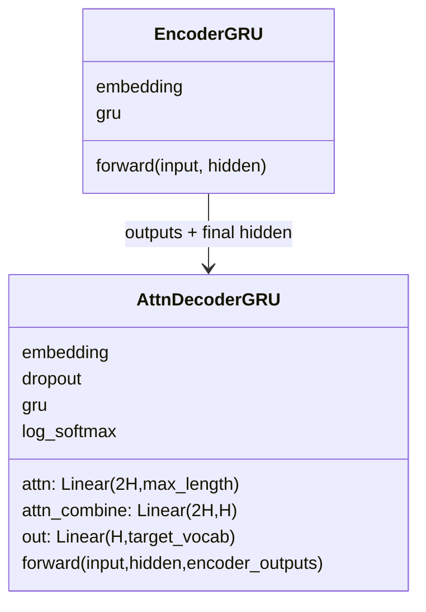

# 第 9 节：GRU Encoder：Embedding 后保留每个时间步输出

> 笔记编号 9/26 · 对应原视频 P88 · [打开这一集](https://www.bilibili.com/video/BV14mdfBDE4Q?p=88)

[← 上一节：8 构建 DataLoader：用 batch_size=1 检查英法 ID 序列](./08-dataloader.md) · [返回总目录](./README.md) · [下一节：10 测试 Encoder：先验形状再运行 →](./10-test-encoder.md)

## 这节解决什么问题

课程版 Encoder 怎样用 Embedding、batch_first GRU 和显式初始 hidden 把英文 ID 变成所有时间步输出？


图从左向右读。先跟着数据或推理过程走一遍，再学习下面的术语。

## 辅助流程图



### Encoder 的形状流



### Seq2Seq 模块 UML



## 老师原声整理稿（按讲解顺序）

### 0:00–5:39　Seq2Seq 不是一个模型类就结束，而是先后构建 Encoder 与两版 Decoder

老师先说明本章至少要写 Encoder、无 Attention Decoder、有 Attention Decoder，以及各自测试。当前只处理左侧 Encoder：它读英文序列，生成交给后续 Decoder 的状态。

图中橙色部分是张量，蓝色部分是网络层。当前输入不是原始单词，而是英文 token ID；Embedding 先把 ID 转成词向量，再由 GRU 把上一步 hidden 与当前表示结合。

### 5:39–10:57　初始化只接 input_size 与 hidden_size，但两者语义不同

`input_size` 在本节表示英文词表大小，当前数据约为 2803；`hidden_size` 是每个词的表示和 GRU 隐藏维，课程设为 256。老师提醒“层数”和“维度”不是同一概念：本例 GRU 层数保持默认 1，隐藏维才是 256。

Embedding 因此定义为 `Embedding(input_size, hidden_size)`，把每个英文 ID 映射成 256 维。

### 10:57–14:58　GRU 输入维和隐藏维都是 256，并显式使用 batch_first=True

Embedding 输出最后一维为 256，所以 GRU 的 input_size 与 hidden_size 都写 256。课程设置 `batch_first=True`，张量顺序统一为 `[batch, sequence, feature]`；若不设置，PyTorch 默认前两维是 sequence、batch，整章的形状解释都会交换。

例如一批一条、句长 6，输入 ID 是 `[1,6]`，Embedding 后是 `[1,6,256]`。

### 14:58–20:45　forward 返回所有时间步 outputs 与最终 hidden

forward 接收英文输入和初始 hidden。输入先过 Embedding，再与 hidden 一起送 GRU，得到 outputs 与新的 hidden。若源句长度为 6，outputs 是 `[1,6,256]`；hidden 是 `[1,1,256]`，三维分别是层数、batch、隐藏维。

两项都要返回：无 Attention Decoder 可以主要使用最后 hidden；Attention Decoder 还需要 outputs 中每个英文位置的状态。

### 20:45–23:36　initHidden 创建 [1,1,256] 零张量并迁移到同一设备

老师单独编写初始化隐藏状态的方法，按“层数 1、batch 1、hidden_size”创建零张量，并放到全局 device。虽然 PyTorch GRU 在省略 h0 时会自动使用零状态，课堂显式创建是为了让状态来源和形状可见。

到这里 Encoder 类完成；下一节必须用真实 DataLoader 样本核验源序列长度是否在 outputs 中原样保留。

## 完整原声逐段记录

[查看本节按时间戳整理的完整音轨转写](./transcripts/p088.md)

逐段记录用于核查老师讲解是否遗漏；正文会进一步纠正口误和语音识别中的技术术语。

## 零基础先记住

- input_size 是英文词表大小
- hidden_size=Embedding 维=GRU 隐藏维
- 课程使用 batch_first=True
- outputs 保留每个源位置
- hidden 形状是 [层数,B,H]

## 最小可运行代码

下面代码默认从项目根目录运行；专题配套实现见 [seq2seq_from_scratch 配套实现](../../seq2seq_from_scratch/README.md)。

```python
import torch
from seq2seq_from_scratch.model import EncoderGRU
m=EncoderGRU(100,16,32)
out,h=m(torch.randint(0,100,(4,7)))
print(out.shape,h.shape)
```

### 输入和输出怎么看

outputs=[4,7,32]，hidden=[1,4,32]。

## 最容易踩的坑

不要把 input_size 当成词向量维，也不要漏写 batch_first=True 后仍按 [S,B,H] 解读输出。

## 本节知识链

`source IDs [B,S] → Embedding [B,S,E] → GRU → outputs [B,S,H] → hidden [1,B,H]`

## 自测

**问题：B=4、S=7、H=32 时 outputs 形状？**

<details>
<summary>点开核对答案</summary>

[4,7,32]。

</details>

## 学完检查

- [ ] 我能用自己的话复述老师的讲解顺序
- [ ] 我能在运行前预测关键输出或张量形状
- [ ] 我知道这节方法最容易用错的地方
- [ ] 我能独立回答自测题

[← 上一节：8 构建 DataLoader：用 batch_size=1 检查英法 ID 序列](./08-dataloader.md) · [返回总目录](./README.md) · [下一节：10 测试 Encoder：先验形状再运行 →](./10-test-encoder.md)
