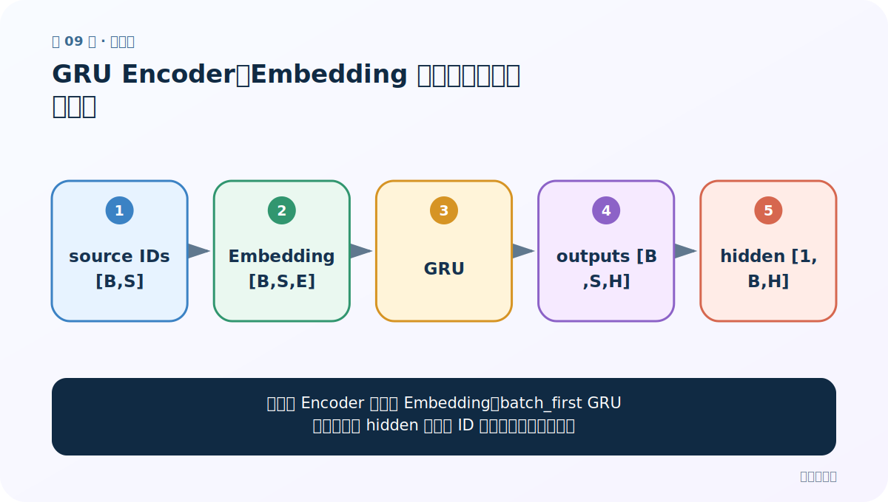
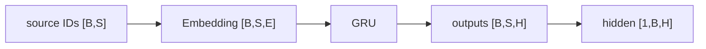
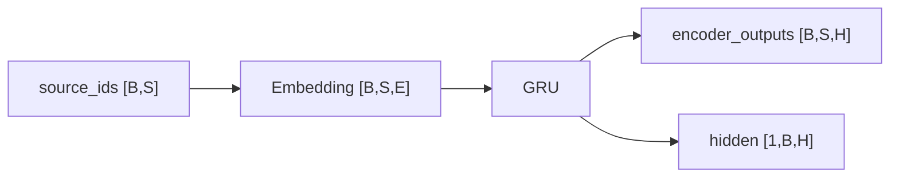
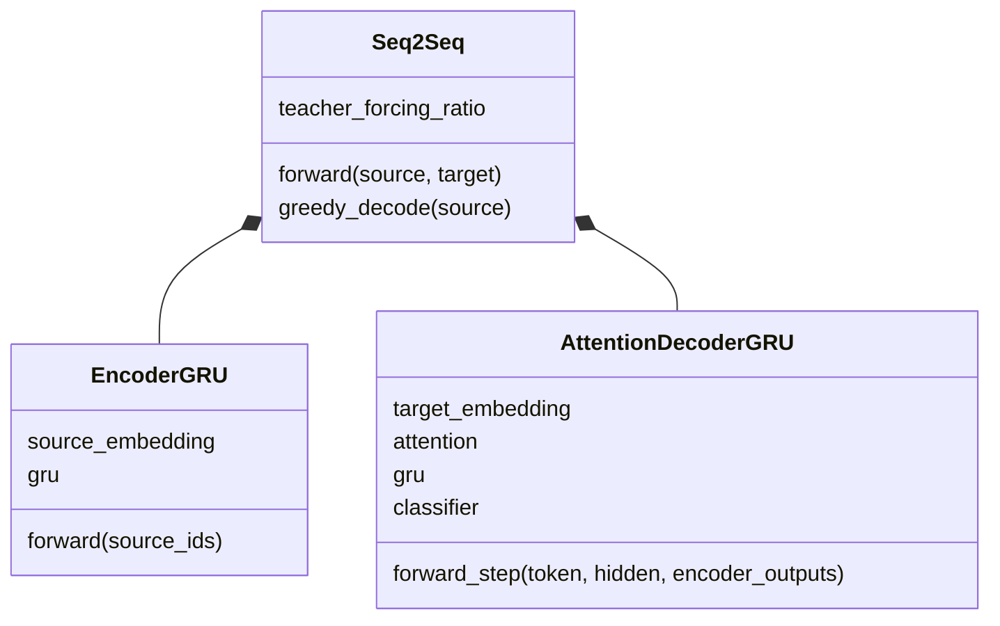

# 第 9 节：GRU Encoder：Embedding 后保留每个时间步输出

> 笔记编号 9/26 · 对应原视频 P88 · [打开这一集](https://www.bilibili.com/video/BV14mdfBDE4Q?p=88)

[← 上一节：8 获取 DataLoader：补齐、长度和 mask 一起产出](./08-dataloader.md) · [返回总目录](./README.md) · [下一节：10 测试 Encoder：先验形状再运行 →](./10-test-encoder.md)

## 这节解决什么问题

Encoder 为什么既返回 outputs，又返回 final hidden？



图从左向右读。先跟着数据或推理过程走一遍，再学习下面的术语。

## 辅助流程图



### Encoder 的形状流



### Seq2Seq 模块 UML



## 老师原声整理稿（按讲解顺序）

### 0:00–6:51　类的两层

Encoder 由 Embedding 和 GRU 组成。Embedding 把离散词 ID 变成连续 E 维向量；GRU 将序列编码成上下文状态。

### 6:51–14:49　forward 形状

source_ids[B,S]→embedded[B,S,E]→outputs[B,S,H] 与 hidden[1,B,H]。若课程代码按 seq_first，前两维顺序会相反；本笔记统一 batch_first。

### 14:49–20:45　为什么 outputs 不能丢

无注意力 Decoder 可能只需 final hidden；注意力 Decoder 要与每个源位置匹配，所以必须保留全部 outputs。

### 20:45–23:36　初始化与 device

GRU 可省略 h0 使用零状态，也可显式创建。输入、初始状态和模型参数应在同一设备。

## 完整原声逐段记录

[查看本节按时间戳整理的完整音轨转写](./transcripts/p088.md)

逐段记录用于核查老师讲解是否遗漏；正文会进一步纠正口误和语音识别中的技术术语。

## 零基础先记住

- Embedding 输出维 E，GRU 隐藏维 H
- outputs 保留源位置轴 S
- attention 需要全部 outputs

## 最小可运行代码

下面代码默认从项目根目录运行；专题配套实现见 [seq2seq_from_scratch 配套实现](../../seq2seq_from_scratch/README.md)。

```python
import torch
from seq2seq_from_scratch.model import EncoderGRU
m=EncoderGRU(100,16,32)
out,h=m(torch.randint(0,100,(4,7)))
print(out.shape,h.shape)
```

### 输入和输出怎么看

outputs=[4,7,32]，hidden=[1,4,32]。

## 最容易踩的坑

把 outputs 只取最后一步后，注意力就失去逐源词选择能力。

## 本节知识链

`source IDs [B,S] → Embedding [B,S,E] → GRU → outputs [B,S,H] → hidden [1,B,H]`

## 自测

**问题：B=4、S=7、H=32 时 outputs 形状？**

<details>
<summary>点开核对答案</summary>

[4,7,32]。

</details>

## 学完检查

- [ ] 我能用自己的话复述老师的讲解顺序
- [ ] 我能在运行前预测关键输出或张量形状
- [ ] 我知道这节方法最容易用错的地方
- [ ] 我能独立回答自测题

[← 上一节：8 获取 DataLoader：补齐、长度和 mask 一起产出](./08-dataloader.md) · [返回总目录](./README.md) · [下一节：10 测试 Encoder：先验形状再运行 →](./10-test-encoder.md)
