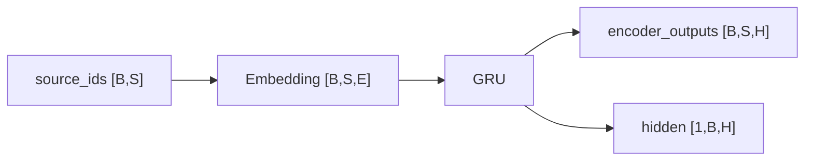

# 第 10 节：测试 Encoder：先验形状再运行

> 笔记编号 10/26 · 对应原视频 P89 · [打开这一集](https://www.bilibili.com/video/BV14mdfBDE4Q?p=89)

[← 上一节：9 GRU Encoder：Embedding 后保留每个时间步输出](./09-gru-encoder.md) · [返回总目录](./README.md) · [下一节：11 无 Attention Decoder 思路：只靠 final hidden 生成 →](./11-plain-decoder-plan.md)

## 这节解决什么问题

如何用 DataLoader 的真实英文样本验证 EOS、outputs 和 hidden，并解释一次测试中句长看似不一致的原因？


图从左向右读。先跟着数据或推理过程走一遍，再学习下面的术语。

## 辅助流程图


### Encoder 的形状流



## 老师原声整理稿（按讲解顺序）

### 0:00–3:48　先取得 DataLoader，再按 2803 和 256 创建 Encoder

老师调用上一节函数取得 DataLoader，设置英文词表大小约 2803、hidden_size=256，并实例化 Encoder。若使用 GPU，还要把模型移动到与数据相同的 device；CPU 环境不需要额外迁移。

这里不使用随机造出的 ID，而是直接取课程 Dataset 产出的真实英文张量，能同时验证数据管道与模型接口。

### 3:48–7:39　打印 X 的形状和内容，确认最后一个 ID 始终是 EOS=1

遍历 DataLoader 取得 X/Y 后，老师先打印英文 X。不同句子长度可能是 6、7、9 等，但列表最后一个编号都应为 1，因为 Dataset 已在英文末尾追加 EOS。

shuffle=True 使每次第一条样本不同，所以不应背某一串 ID；应检查的是 batch 维为 1、dtype 与 device 正确、结尾 EOS 存在。

### 7:39–10:37　创建 h0 并执行前向，先预测两个返回形状

调用 Encoder 的 initHidden 得到 `[1,1,256]`，再把 X 与 h0 送入模型。若 X 是 `[1,S]`，按 batch_first 约定，outputs 应为 `[1,S,256]`；hidden 始终为 `[1,1,256]`。

outputs 的 S 随句长变化，hidden 的层数、batch 与隐藏维在本例固定。

### 10:37–14:25　为何一次日志里 X 长 6，outputs 却显示长 7

老师现场遇到看似矛盾的打印：上方 DataLoader 预览函数内部先随机取了一条并打印，测试函数随后又遍历同一个 shuffle DataLoader，实际拿到的是另一条。两次随机样本的句长不同，却被误当成同一条比较。

这不是 GRU 改变了序列长度，而是调试代码重复消费 DataLoader。老师停下来追踪调用路径，说明排错不能只看相邻日志，还要确认日志是否来自同一批数据。

### 14:25–17:03　去掉内部预览后，outputs 的序列长度必须与当前 X 完全一致

注释掉 DataLoader 函数中额外的预览遍历后，当前测试只消费一次样本。此时 X 若为 `[1,9]`，outputs 就是 `[1,9,256]`；X 若为 `[1,5]`，outputs 就是 `[1,5,256]`。

老师以此完成 Encoder 验收：前向能运行，outputs 保留输入序列长度，hidden 为 `[1,1,256]`。这里只证明接口正确，不代表未训练状态已经包含可用翻译语义。

## 完整原声逐段记录

[查看本节按时间戳整理的完整音轨转写](./transcripts/p089.md)

逐段记录用于核查老师讲解是否遗漏；正文会进一步纠正口误和语音识别中的技术术语。

## 零基础先记住

- 真实 X 末尾应为 EOS=1
- outputs 的 S 必须等于当前 X 的 S
- hidden 固定 [1,1,256]
- 重复遍历 shuffle DataLoader 会拿到不同样本

## 最小可运行代码

下面代码默认从项目根目录运行；专题配套实现见 [seq2seq_from_scratch 配套实现](../../seq2seq_from_scratch/README.md)。

```python
import torch
from seq2seq_from_scratch.model import EncoderGRU
x=torch.randint(0,50,(2,5)); out,h=EncoderGRU(50,8,12)(x)
assert out.shape==(2,5,12) and h.shape==(1,2,12)
print("ok")
```

### 输入和输出怎么看

断言通过后打印 ok。

## 最容易踩的坑

不要拿 DataLoader 内部预览的 X 与测试循环下一次随机样本的 outputs 比较；它们可能不是同一条句子。

## 本节知识链

`造 source IDs → 实例化 Encoder → 前向 → 检查 outputs → 检查 hidden/梯度`

## 自测

**问题：当前 X 是 [1,8] 时，课程 Encoder 的 outputs 和 hidden 应是什么形状？**

<details>
<summary>点开核对答案</summary>

outputs=[1,8,256]，hidden=[1,1,256]。

</details>

## 学完检查

- [ ] 我能用自己的话复述老师的讲解顺序
- [ ] 我能在运行前预测关键输出或张量形状
- [ ] 我知道这节方法最容易用错的地方
- [ ] 我能独立回答自测题

[← 上一节：9 GRU Encoder：Embedding 后保留每个时间步输出](./09-gru-encoder.md) · [返回总目录](./README.md) · [下一节：11 无 Attention Decoder 思路：只靠 final hidden 生成 →](./11-plain-decoder-plan.md)
