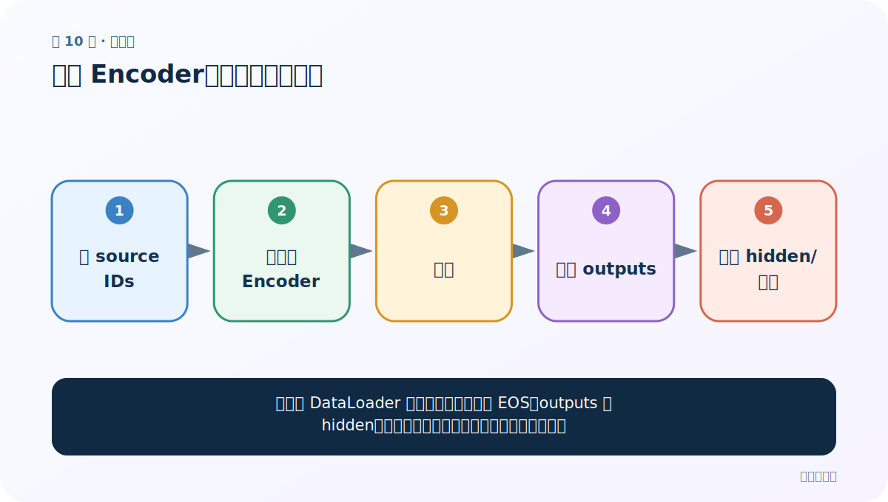
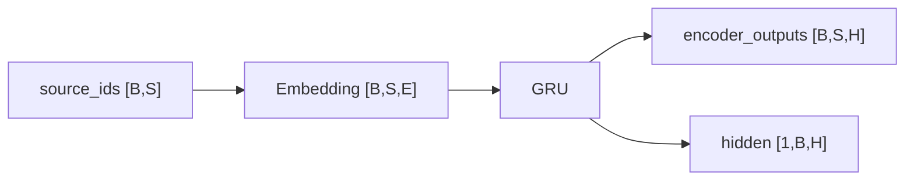

# 第 10 节：测试 Encoder：先验形状再运行

> 笔记编号 10/26 · 对应原视频 P89 · [打开这一集](https://www.bilibili.com/video/BV14mdfBDE4Q?p=89)

[← 上一节：9 GRU Encoder：Embedding 后保留每个时间步输出](./09-gru-encoder.md) · [返回总目录](./README.md) · [下一节：11 无 Attention Decoder 思路：只靠 final hidden 生成 →](./11-plain-decoder-plan.md)

## 这节解决什么问题

怎样在接 Decoder 前证明编码器接口完全正确？



图从左向右读。先跟着数据或推理过程走一遍，再学习下面的术语。

## 辅助流程图


### Encoder 的形状流



## 老师原声整理稿（按讲解顺序）

### 0:00–5:57　准备随机 ID

随机数范围必须小于词表大小，dtype 为 long；batch 和句长选择小数便于查看。

### 5:57–11:51　检查两类返回值

outputs 的序列维等于输入 S，末维等于 H；hidden 第一维等于层数×方向，第二维 B，末维 H。

### 11:51–17:03　数值测试边界

随机未训练输出没有翻译意义。应再检查 PAD embedding、device、反向传播，以及相同随机种子下可复现形状/数值。

## 完整原声逐段记录

[查看本节按时间戳整理的完整音轨转写](./transcripts/p089.md)

逐段记录用于核查老师讲解是否遗漏；正文会进一步纠正口误和语音识别中的技术术语。

## 零基础先记住

- 随机 ID 必须在词表范围
- shape 测试先于业务训练
- 随机输出只验证接口

## 最小可运行代码

下面代码默认从项目根目录运行；专题配套实现见 [seq2seq_from_scratch 配套实现](../../seq2seq_from_scratch/README.md)。

```python
import torch
from seq2seq_from_scratch.model import EncoderGRU
x=torch.randint(0,50,(2,5)); out,h=EncoderGRU(50,8,12)(x)
assert out.shape==(2,5,12) and h.shape==(1,2,12)
print("ok")
```

### 输入和输出怎么看

断言通过后打印 ok。

## 最容易踩的坑

torch.randn 产生浮点数，不能直接作为 Embedding 的 token ID。

## 本节知识链

`造 source IDs → 实例化 Encoder → 前向 → 检查 outputs → 检查 hidden/梯度`

## 自测

**问题：为什么用 randint 而非 randn？**

<details>
<summary>点开核对答案</summary>

Embedding 需要离散整数索引。

</details>

## 学完检查

- [ ] 我能用自己的话复述老师的讲解顺序
- [ ] 我能在运行前预测关键输出或张量形状
- [ ] 我知道这节方法最容易用错的地方
- [ ] 我能独立回答自测题

[← 上一节：9 GRU Encoder：Embedding 后保留每个时间步输出](./09-gru-encoder.md) · [返回总目录](./README.md) · [下一节：11 无 Attention Decoder 思路：只靠 final hidden 生成 →](./11-plain-decoder-plan.md)
