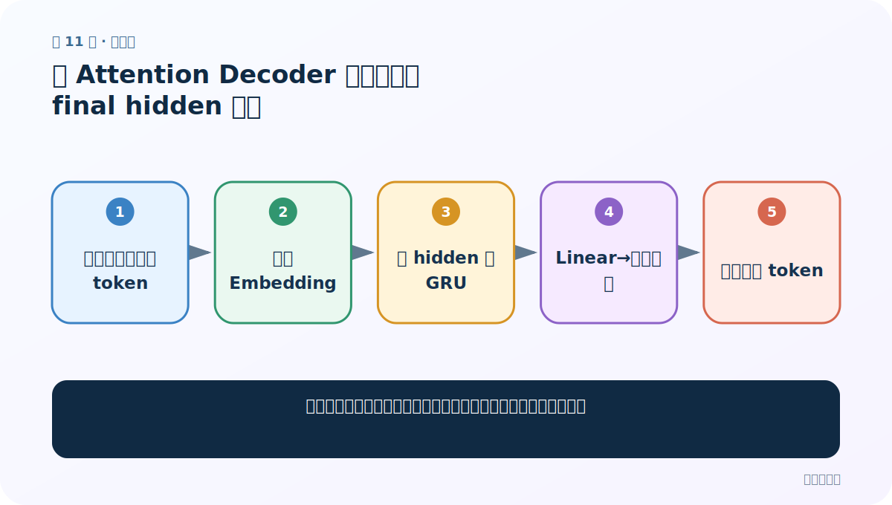
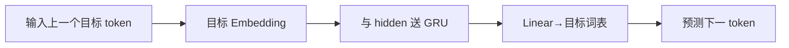
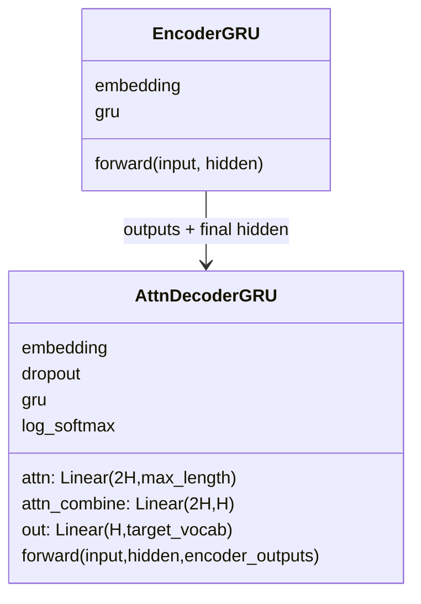

# 第 11 节：无 Attention Decoder 思路：只靠 final hidden 生成

> 笔记编号 11/26 · 对应原视频 P90 · [打开这一集](https://www.bilibili.com/video/BV14mdfBDE4Q?p=90)

[← 上一节：10 测试 Encoder：先验形状再运行](./10-test-encoder.md) · [返回总目录](./README.md) · [下一节：12 构建无 Attention GRU Decoder：LogSoftmax 必须配 NLLLoss →](./12-plain-decoder-code.md)

## 这节解决什么问题

无注意力版本怎样工作，它为什么是理解有注意力版本的对照组？



图从左向右读。先跟着数据或推理过程走一遍，再学习下面的术语。

## 辅助流程图



### Seq2Seq 模块 UML



## 老师原声整理稿（按讲解顺序）

### 0:00–1:40　先沿结构图区分张量和网络层

老师先标出当前输入 token、上一 hidden、本次 GRU output 与新 hidden。当前输入是一个法语词 ID，先经 Embedding 变成 `[1,1,256]`；ReLU 只改变数值，不改变形状。

### 1:40–3:38　GRU 用当前词表示和上一 hidden 得到本步状态

上一 hidden 形状同样是 `[1,1,256]`，最初可直接来自 Encoder final hidden。二者送入 GRU 后，本步 output 和新 hidden 仍保持 256 维。这里就是无 Attention 版本接收源句信息的唯一通道。

### 3:38–5:19　输出层把 256 维映射到 4345 个法语候选

GRU output 经过 Linear 映射成约 4345 个法语词的分数，再经 LogSoftmax 成为对数概率。概率最高的候选就是当前预测词。

老师本节主要讲形状流，下一节才写代码。固定一个 final hidden 承担全部源句信息，是无 Attention 版本与后续逐步重算权重版本的主要差别。

## 完整原声逐段记录

[查看本节按时间戳整理的完整音轨转写](./transcripts/p090.md)

逐段记录用于核查老师讲解是否遗漏；正文会进一步纠正口误和语音识别中的技术术语。

## 零基础先记住

- 当前输入与 hidden 都整理为 [1,1,256]
- GRU output/hidden 仍是 256 维
- 输出维等于法语词表 4345
- 无 Attention 只通过 final hidden 接收源句信息

## 最小可运行代码

下面代码默认从项目根目录运行；专题配套实现见 [seq2seq_from_scratch 配套实现](../../seq2seq_from_scratch/README.md)。

```python
print("token + hidden → GRU → Linear(target_vocab)")
```

### 输入和输出怎么看

显示无注意力单步的最短数据流。

## 最容易踩的坑

目标 Embedding 的词表大小必须用法语词表，而非英语词表。

## 本节知识链

`输入上一个目标 token → 目标 Embedding → 与 hidden 送 GRU → Linear→目标词表 → 预测下一 token`

## 自测

**问题：无注意力 Decoder 从哪里得到源句信息？**

<details>
<summary>点开核对答案</summary>

Encoder 的最终 hidden。

</details>

## 学完检查

- [ ] 我能用自己的话复述老师的讲解顺序
- [ ] 我能在运行前预测关键输出或张量形状
- [ ] 我知道这节方法最容易用错的地方
- [ ] 我能独立回答自测题

[← 上一节：10 测试 Encoder：先验形状再运行](./10-test-encoder.md) · [返回总目录](./README.md) · [下一节：12 构建无 Attention GRU Decoder：LogSoftmax 必须配 NLLLoss →](./12-plain-decoder-code.md)
