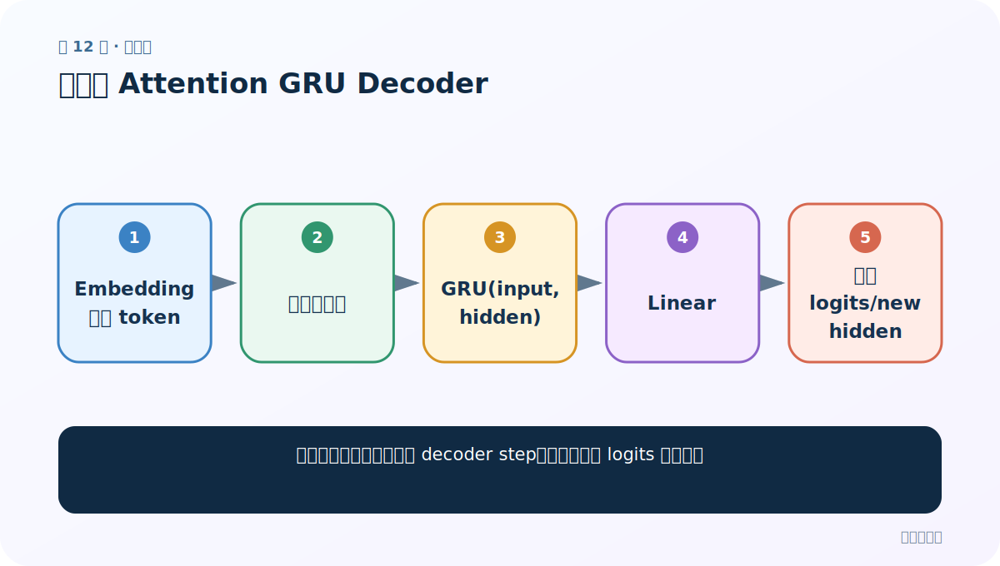
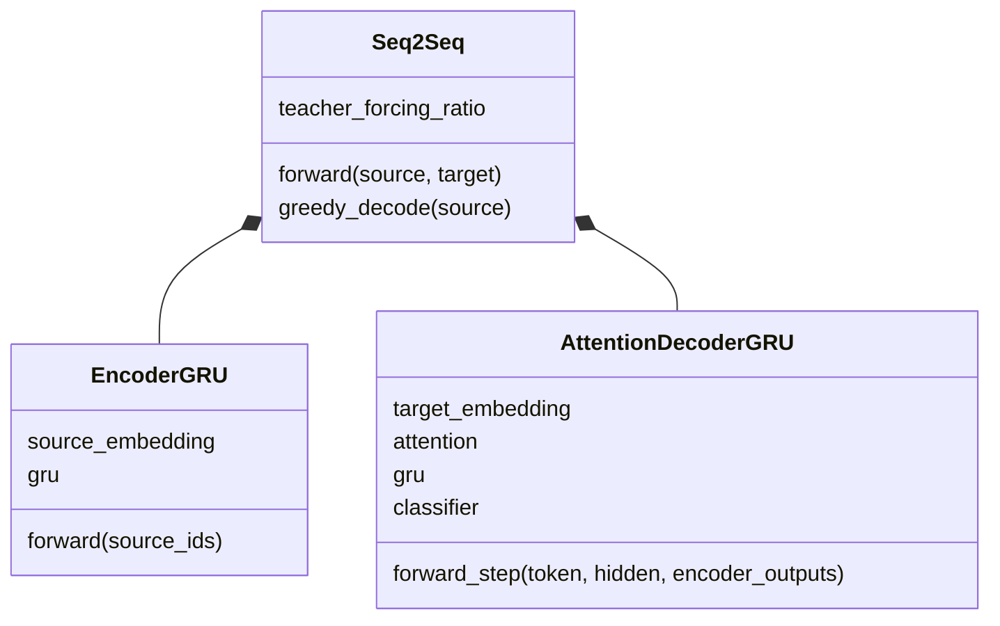

# 第 12 节：构建无 Attention GRU Decoder

> 笔记编号 12/26 · 对应原视频 P91 · [打开这一集](https://www.bilibili.com/video/BV14mdfBDE4Q?p=91)

[← 上一节：11 无 Attention Decoder 思路：只靠 final hidden 生成](./11-plain-decoder-plan.md) · [返回总目录](./README.md) · [下一节：13 测试无 Attention Decoder：逐词循环与 EOS →](./13-test-plain-decoder.md)

## 这节解决什么问题

怎样写一个可重复调用的 decoder step，并清楚区分 logits 与概率？



图从左向右读。先跟着数据或推理过程走一遍，再学习下面的术语。

## 辅助流程图


### Seq2Seq 模块 UML



## 老师原声整理稿（按讲解顺序）

### 0:00–6:54　初始化

定义目标 Embedding、GRU、Linear。GRU input_size 等于 embedding_size，Linear 从 hidden_size 映射到 target_vocab_size。

### 6:54–13:58　forward 单步

token[B]→Embedding[B,E]→unsqueeze 得 [B,1,E]→GRU→output[B,1,H]→squeeze→Linear 得 logits[B,Vt]。

### 13:58–20:29　返回值与损失

返回 logits 与 new hidden。训练配 CrossEntropyLoss 时不要先 Softmax；推理需要概率可在外部 softmax。

## 完整原声逐段记录

[查看本节按时间戳整理的完整音轨转写](./transcripts/p091.md)

逐段记录用于核查老师讲解是否遗漏；正文会进一步纠正口误和语音识别中的技术术语。

## 零基础先记住

- 单步输入 token 形状 [B]
- GRU 仍需要长度为 1 的时间维
- CrossEntropyLoss 接 logits

## 最小可运行代码

下面代码默认从项目根目录运行；专题配套实现见 [seq2seq_from_scratch 配套实现](../../seq2seq_from_scratch/README.md)。

```python
import torch
emb=torch.nn.Embedding(120,16); gru=torch.nn.GRU(16,32,batch_first=True); fc=torch.nn.Linear(32,120)
x=emb(torch.tensor([1,1])).unsqueeze(1); out,h=gru(x)
print(fc(out.squeeze(1)).shape)
```

### 输入和输出怎么看

两样本得到 [2,120] 目标词表 logits。

## 最容易踩的坑

不要 squeeze() 不指定维度，batch=1 时可能把 batch 维也删掉。

## 本节知识链

`Embedding 当前 token → 增加时间维 → GRU(input,hidden) → Linear → 返回 logits/new hidden`

## 自测

**问题：为什么 unsqueeze(1)？**

<details>
<summary>点开核对答案</summary>

把 [B,E] 变为 GRU 需要的 [B,1,E]。

</details>

## 学完检查

- [ ] 我能用自己的话复述老师的讲解顺序
- [ ] 我能在运行前预测关键输出或张量形状
- [ ] 我知道这节方法最容易用错的地方
- [ ] 我能独立回答自测题

[← 上一节：11 无 Attention Decoder 思路：只靠 final hidden 生成](./11-plain-decoder-plan.md) · [返回总目录](./README.md) · [下一节：13 测试无 Attention Decoder：逐词循环与 EOS →](./13-test-plain-decoder.md)
