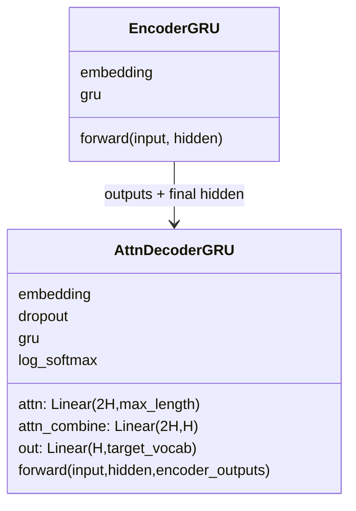

# 第 12 节：构建无 Attention GRU Decoder：LogSoftmax 必须配 NLLLoss

> 笔记编号 12/26 · 对应原视频 P91 · [打开这一集](https://www.bilibili.com/video/BV14mdfBDE4Q?p=91)

[← 上一节：11 无 Attention Decoder 思路：只靠 final hidden 生成](./11-plain-decoder-plan.md) · [返回总目录](./README.md) · [下一节：13 测试无 Attention Decoder：连接编码器并逐步验形状 →](./13-test-plain-decoder.md)

## 这节解决什么问题

课堂怎样把一个目标词 ID 和上一隐藏状态变成 4345 个法语词的对数概率，并正确选择损失函数？


图从左向右读。先跟着数据或推理过程走一遍，再学习下面的术语。

## 辅助流程图


### Seq2Seq 模块 UML



## 老师原声整理稿（按讲解顺序）

### 0:00–6:53　从结构图确定三层尺寸：4345→256→256→4345

老师先用图核对 Decoder 的职责。目标词来自法语词表，所以 Embedding 是 `Embedding(4345, 256)`；GRU 的输入维和隐藏维都是 256；Linear 再把 256 维隐藏状态映射回 4345 个法语候选。

4345 不是词向量维度，而是当前语料的法语词表大小。每一步输出 4345 个值，后面才能从中选择最可能的法语词。Encoder 不需要词表分类层，是因为它的状态还要继续交给 Decoder；Decoder 才负责目标词分类。

### 6:53–13:58　隐藏状态先更新，再由 Linear 得到当前词的候选分布

前向传播接收当前目标词和上一步 hidden。当前词先经过 Embedding，再经 ReLU，随后与 hidden 一起送入 GRU。GRU 同时返回本步 output 和更新后的 hidden；课程代码再取合适的二维视图交给 Linear，得到 `[1, 4345]`。

老师借 RNN 公式再次说明顺序：当前输入和旧状态先产生新状态，再依据新状态判断当前输出词。形状变换必须保留 batch 语义，不能使用不带维度的 `squeeze()` 把 batch=1 一并删掉。

### 13:58–20:29　课程代码返回 LogSoftmax，训练时必须使用 NLLLoss

本节实际在输出层之后调用 `LogSoftmax(dim=-1)`，因此返回的是每个法语词的对数概率，而不是未经归一化的 logits。老师明确提醒：既然模型里已经做了 LogSoftmax，后面的损失就应使用 `NLLLoss`；若再使用会内部执行 LogSoftmax 的 `CrossEntropyLoss`，就会重复处理。

课程配套的现代化示例代码采用另一种等价约定：模型直接返回 logits，损失使用 CrossEntropyLoss。两种写法都成立，但必须成对出现，不能把“LogSoftmax + CrossEntropyLoss”混搭。本节正文以老师实际实现“LogSoftmax + NLLLoss”为准。

## 完整原声逐段记录

[查看本节按时间戳整理的完整音轨转写](./transcripts/p091.md)

逐段记录用于核查老师讲解是否遗漏；正文会进一步纠正口误和语音识别中的技术术语。

## 零基础先记住

- 目标 Embedding 和输出层都使用法语词表大小
- GRU output 与 hidden 含义不同
- 课堂返回 log-probabilities
- LogSoftmax 配 NLLLoss；raw logits 配 CrossEntropyLoss

## 最小可运行代码

下面代码默认从项目根目录运行；专题配套实现见 [seq2seq_from_scratch 配套实现](../../seq2seq_from_scratch/README.md)。

```python
import torch
emb = torch.nn.Embedding(120, 16)
gru = torch.nn.GRU(16, 32, batch_first=True)
fc = torch.nn.Linear(32, 120)
log_softmax = torch.nn.LogSoftmax(dim=-1)
x = torch.relu(emb(torch.tensor([1])).unsqueeze(1))
out, hidden = gru(x)
log_probs = log_softmax(fc(out.squeeze(1)))
print(log_probs.shape, torch.exp(log_probs).sum(-1))
```

### 输入和输出怎么看

得到 [1,120] 的对数概率；取 exp 后 120 个候选的概率和为 1。

## 最容易踩的坑

模型已经输出 LogSoftmax 时不要再配 CrossEntropyLoss；若想用 CrossEntropyLoss，就删除模型内的 LogSoftmax 并返回 logits。

## 本节知识链

`Embedding 当前词 → ReLU → GRU 更新状态 → Linear 映射到法语词表 → LogSoftmax 后配 NLLLoss`

## 自测

**问题：老师本节的 Decoder 已调用 LogSoftmax，训练时应配什么损失？**

<details>
<summary>点开核对答案</summary>

NLLLoss；CrossEntropyLoss 适用于模型返回未经 LogSoftmax 的 logits。

</details>

## 学完检查

- [ ] 我能用自己的话复述老师的讲解顺序
- [ ] 我能在运行前预测关键输出或张量形状
- [ ] 我知道这节方法最容易用错的地方
- [ ] 我能独立回答自测题

[← 上一节：11 无 Attention Decoder 思路：只靠 final hidden 生成](./11-plain-decoder-plan.md) · [返回总目录](./README.md) · [下一节：13 测试无 Attention Decoder：连接编码器并逐步验形状 →](./13-test-plain-decoder.md)
