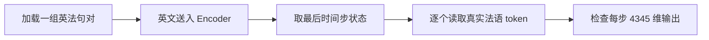
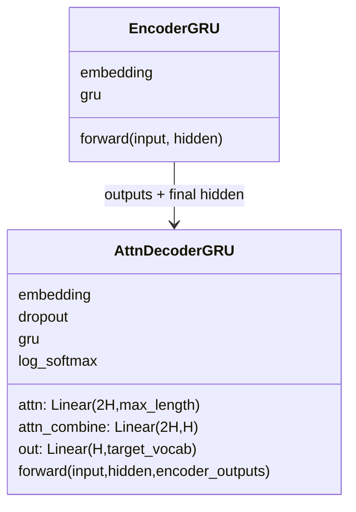

# 第 13 节：测试无 Attention Decoder：连接编码器并逐步验形状

> 笔记编号 13/26 · 对应原视频 P92 · [打开这一集](https://www.bilibili.com/video/BV14mdfBDE4Q?p=92)

[← 上一节：12 构建无 Attention GRU Decoder：LogSoftmax 必须配 NLLLoss](./12-plain-decoder-code.md) · [返回总目录](./README.md) · [下一节：14 课程版 Attention Decoder：拼接查询与隐藏状态计算 10 个权重 →](./14-attention-decoder-plan.md)

## 这节解决什么问题

无 Attention Decoder 单独写完后，怎样把它接到 Encoder 上，并用一条真实句对确认每一步的数据流和输出维度都正确？


图从左向右读。先跟着数据或推理过程走一遍，再学习下面的术语。

## 辅助流程图



### Seq2Seq 模块 UML



## 老师原声整理稿（按讲解顺序）

### 0:00–5:00　测试 Decoder 之前仍要先创建 Encoder

老师先取得 DataLoader，再分别实例化 Encoder 和无 Attention Decoder，并把两者移动到同一设备。虽然本节标题是“测试 Decoder”，但 Decoder 需要由 Encoder 产生的中间语义状态；只创建右半边模型，测试链路并不完整。

这里也顺手纠正词表方向：英译法时，Encoder 的输入词表是英文，课堂数据大小约为 2803；Decoder 的输出词表是法文，约为 4345；两边隐藏维都设为 256。老师把 `.to(device)` 直接接在构造结果后面，是为了避免模型和输入张量分处 CPU、GPU。具体词表数字来自当前语料，不是通用常量。

### 5:00–14:51　从打印出的层结构读懂 2803、4345 和 256

老师没有急着喂数据，而是先打印两套模型。Encoder 的 Embedding 把 2803 个英文词映射为 256 维词向量，GRU 接收 256 维输入并维持 256 维隐藏状态；这里没有额外分类输出层，因为编码结果还要继续传给 Decoder，而不是在源语言侧直接做类别预测。

Decoder 的 Embedding 面向 4345 个法语词，GRU 仍使用 256 维状态，最后的 Linear 再把当前隐藏状态映射为 4345 个分数。老师借 RNN 图重新解释：当前输入和上一步状态先得到当前隐藏状态，再由当前隐藏状态推目标词。因而 `Linear(256, 4345)` 的含义不是“输出一个词向量”，而是给法语词表中的每个候选词一个预测分数。

### 14:51–21:51　从 DataLoader 取一条配对样本，先完成英文编码

模型结构确认后，老师从 DataLoader 中取一批数据，并用 `break` 只观察一组英文、法文样本。调试时先打印形状而不是整批内容：例如英文长度为 6、法文长度为 7，说明它们是一条配对样本，但源句和目标句的词数不必相同。

随后英文张量进入 Encoder。课堂实现直接返回 GRU 处理后的各时间步结果，因此一条含 6 个 token 的句子会得到近似 `[1, 6, 256]` 的序列表示；老师讲解时常省略 batch=1，写成 `[6, 256]`。每个源位置都有一个 256 维状态，越靠后的状态已经累积了更多前文信息。这一步验证的是“英文词 ID → 编码序列”能够跑通。

### 21:51–25:48　只取最后一个源时间步，作为无 Attention Decoder 的初始状态

无 Attention 版本不会在每个目标步回看全部 Encoder outputs，所以老师从编码序列中取最后一个时间步的 256 维状态，作为 Decoder 的起始隐藏状态。索引操作的语义是：保留 batch 中的第一个样本，再取源序列最后一个位置，而不是随便从二维数组里拿最后一行。

这正是固定语义向量 C 的瓶颈：前面 6 个英文 token 的信息都要压到最后状态里。短例子可以用来验证接口，句子变长后早期信息可能被稀释，这也是后续加入 Attention 的动机。此处的完成标准只是状态形状能与 Decoder 的隐藏维匹配，并不代表翻译质量已经可靠。

### 25:48–33:41　课堂循环读取真实法语 token，而不是让模型自由生成

老师接着遍历目标句长度 `y.shape[1]`，每次从真实法语张量中取出第 i 个 token ID。`y[0, i]` 原本是一个标量，再用 `.view(1, -1)` 整理成 Decoder 当前实现所要求的输入形状。老师用 123、297、126 等假想 ID 解释：循环每次拿到一个真实词编号，改好形状后送入同一个 Decoder step。

这一点必须与真正预测区分开：本节没有从 SOS 开始做 argmax，也没有把模型上一步的预测回送，更没有靠 EOS 终止。老师明确按真实目标句的词数运行，目的是让每个位置都能经过 Decoder，观察模块是否连通。这种写法更接近“带真实输入的接口测试”，不能被表述成完整推理算法。

### 33:42–39:36　每个目标位置输出一份 4345 维分数，跑通不等于会翻译

每一步把当前真实目标 token 和前一步隐藏状态交给 Decoder，得到新的隐藏状态以及法语词表上的输出。课堂打印的每个结果形状都是 `[1, 4345]`：batch 中这一个样本，在当前法语位置上对 4345 个候选词各给一个分数。目标句有 8 个位置，就会打印 8 份这样的分布。

老师说明，训练完成后才可以从这些分数中选最大值、映射回法语词并拼成句子；当前模型还没有训练，直接取最大值只能得到没有意义的结果。本节真正证明的是 Encoder 与无 Attention Decoder 的尺寸、设备和调用接口能贯通。后续训练会用这些输出计算损失，而真正无真值预测则要另写以模型输出驱动下一步的循环。

## 完整原声逐段记录

[查看本节按时间戳整理的完整音轨转写](./transcripts/p092.md)

逐段记录用于核查老师讲解是否遗漏；正文会进一步纠正口误和语音识别中的技术术语。

## 零基础先记住

- 测试 Decoder 仍需 Encoder 提供初始状态
- 课堂按真实目标长度逐词喂入 token，只做接口验形状
- 每步输出 [1,4345]，代表法语词表候选分数
- 未训练时跑通不等于已经会翻译

## 课堂接口伪代码（需配合完整 Encoder/Decoder）

下面代码默认从项目根目录运行；专题配套实现见 [seq2seq_from_scratch 配套实现](../../seq2seq_from_scratch/README.md)。

```python
# 与 P91 的 batch_first=True 形状约定保持一致
encoder_outputs, encoder_hidden = encoder(source)  # [B,S,H], [1,B,H]
decoder_hidden = encoder_outputs[:, -1, :].unsqueeze(0)  # [1,B,H]
for i in range(target.shape[1]):
    decoder_input = target[:, i]                    # [B]
    output, decoder_hidden = decoder(decoder_input, decoder_hidden)
    print(i, output.shape)                           # [B,4345]
```

### 输入和输出怎么看

目标句有多少个时间步，就打印多少个 [1,4345] 的候选词分数张量。

## 最容易踩的坑

不要把这段接口测试误写成自由推理；还要注意 GRU hidden 是 [层数,B,H]，不能在 B>1 时把它写成 [B,1,H]。

## 本节知识链

`加载一组英法句对 → 英文送入 Encoder → 取最后时间步状态 → 逐个读取真实法语 token → 检查每步 4345 维输出`

## 自测

**问题：为什么模型还没训练，课堂仍然要逐步打印 [1,4345]？**

<details>
<summary>点开核对答案</summary>

为了确认英文编码结果能初始化 Decoder、每个真实目标 token 的输入形状正确，而且输出维确实覆盖整个法语词表；这只能验接口，不能证明翻译正确。

</details>

## 学完检查

- [ ] 我能用自己的话复述老师的讲解顺序
- [ ] 我能在运行前预测关键输出或张量形状
- [ ] 我知道这节方法最容易用错的地方
- [ ] 我能独立回答自测题

[← 上一节：12 构建无 Attention GRU Decoder：LogSoftmax 必须配 NLLLoss](./12-plain-decoder-code.md) · [返回总目录](./README.md) · [下一节：14 课程版 Attention Decoder：拼接查询与隐藏状态计算 10 个权重 →](./14-attention-decoder-plan.md)
