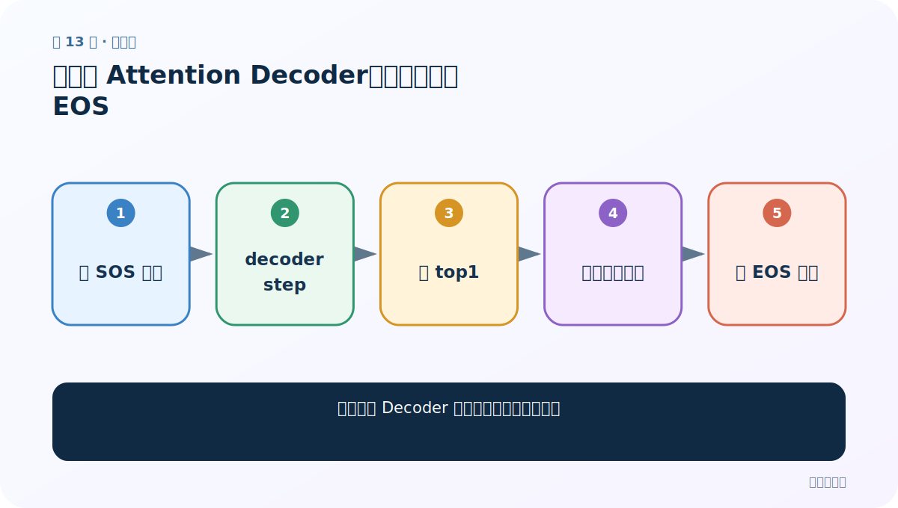
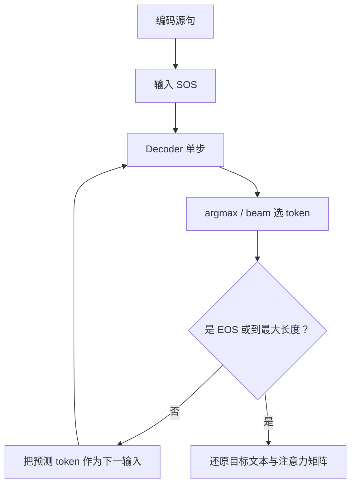

# 第 13 节：测试无 Attention Decoder：逐词循环与 EOS

> 笔记编号 13/26 · 对应原视频 P92 · [打开这一集](https://www.bilibili.com/video/BV14mdfBDE4Q?p=92)

[← 上一节：12 构建无 Attention GRU Decoder](./12-plain-decoder-code.md) · [返回总目录](./README.md) · [下一节：14 有 Attention Decoder 思路：每步重新查询源句 →](./14-attention-decoder-plan.md)

## 这节解决什么问题

一个单步 Decoder 怎样循环成完整目标句？



图从左向右读。先跟着数据或推理过程走一遍，再学习下面的术语。

## 辅助流程图


### 推理时逐词生成流程



## 老师原声整理稿（按讲解顺序）

### 0:00–8:56　单步测试

用 Encoder hidden 初始化 Decoder，输入 SOS，检查 logits[B,Vt] 与 hidden[1,B,H]。

### 8:56–18:52　循环生成

argmax 选下一 token，重新送入 Decoder，直到 EOS 或 max_length。若不设最大长度，未训练或异常模型可能无限生成。

### 18:52–29:46　训练与推理差别

测试循环用自身预测作为下一输入；训练可用真实上一词。不要在推理时偷用目标答案。

### 29:46–39:36　接口验收

检查每步词 ID 范围、hidden 形状不变、EOS 能终止。无注意力输出作为后续注意力版本对照。

## 完整原声逐段记录

[查看本节按时间戳整理的完整音轨转写](./transcripts/p092.md)

逐段记录用于核查老师讲解是否遗漏；正文会进一步纠正口误和语音识别中的技术术语。

## 零基础先记住

- SOS 启动，EOS 终止
- 最大长度是安全上限
- 推理下一输入来自模型预测

## 最小可运行代码

下面代码默认从项目根目录运行；专题配套实现见 [seq2seq_from_scratch 配套实现](../../seq2seq_from_scratch/README.md)。

```python
tokens=["<SOS>"]
for predicted in ["je","suis","ici","<EOS>"]:
    tokens.append(predicted)
    if predicted=="<EOS>": break
print(tokens)
```

### 输入和输出怎么看

生成序列在 EOS 处结束。

## 最容易踩的坑

忘记 break 或最大长度会造成死循环。

## 本节知识链

`以 SOS 开始 → decoder step → 选 top1 → 作为下一输入 → 遇 EOS 停止`

## 自测

**问题：推理时能把真实法语上一词喂进去吗？**

<details>
<summary>点开核对答案</summary>

不能，真实目标在实际使用中不存在。

</details>

## 学完检查

- [ ] 我能用自己的话复述老师的讲解顺序
- [ ] 我能在运行前预测关键输出或张量形状
- [ ] 我知道这节方法最容易用错的地方
- [ ] 我能独立回答自测题

[← 上一节：12 构建无 Attention GRU Decoder](./12-plain-decoder-code.md) · [返回总目录](./README.md) · [下一节：14 有 Attention Decoder 思路：每步重新查询源句 →](./14-attention-decoder-plan.md)
