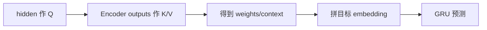
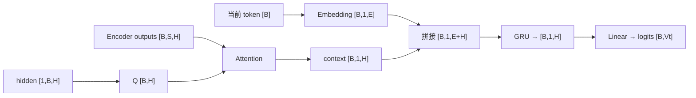
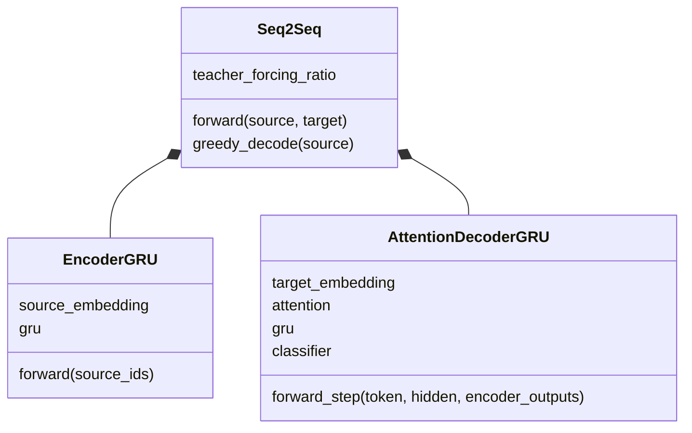

# 第 14 节：有 Attention Decoder 思路：每步重新查询源句

> 笔记编号 14/26 · 对应原视频 P93 · [打开这一集](https://www.bilibili.com/video/BV14mdfBDE4Q?p=93)

[← 上一节：13 测试无 Attention Decoder：逐词循环与 EOS](./13-test-plain-decoder.md) · [返回总目录](./README.md) · [下一节：15 有 Attention Decoder 代码（上）：定义层与接口 →](./15-attention-decoder-code-part1.md)

## 这节解决什么问题

相比无注意力版本，单步 Decoder 新增了哪些输入和计算？


图从左向右读。先跟着数据或推理过程走一遍，再学习下面的术语。

## 辅助流程图



### 带注意力 Decoder 单步形状流



### Seq2Seq 模块 UML



## 老师原声整理稿（按讲解顺序）

### 0:00–5:59　新增 Encoder outputs

除了当前 token 与 hidden，还要传入 Encoder 全部 outputs[B,S,H]。hidden[-1] 作为当前 Q。

### 5:59–11:57　计算 context

Q 与 S 个 key 打分，mask PAD，Softmax 得 [B,S] 权重，再加权 values 得 [B,1,H] context。

### 11:57–16:46　融合再送 GRU

当前目标 embedding[B,1,E] 与 context[B,1,H] 拼成 [B,1,E+H]，因此 Decoder GRU 的 input_size 要设 E+H。

### 16:46–20:25　返回注意力矩阵

每步除 logits/hidden 外再返回 weights；所有目标步堆叠后形成 [B,T,S]，可画翻译对齐热力图。

## 完整原声逐段记录

[查看本节按时间戳整理的完整音轨转写](./transcripts/p093.md)

逐段记录用于核查老师讲解是否遗漏；正文会进一步纠正口误和语音识别中的技术术语。

## 零基础先记住

- attention 每个目标步重算
- Decoder GRU 输入维变 E+H
- 返回 weights 便于解释和调试

## 最小可运行代码

下面代码默认从项目根目录运行；专题配套实现见 [seq2seq_from_scratch 配套实现](../../seq2seq_from_scratch/README.md)。

```python
import torch
from seq2seq_from_scratch.model import AttentionDecoderGRU
m=AttentionDecoderGRU(120,16,32)
logits,h,w=m.forward_step(torch.tensor([1]),torch.zeros(1,1,32),torch.randn(1,5,32))
print(logits.shape,h.shape,w.shape)
```

### 输入和输出怎么看

logits=[1,120]、hidden=[1,1,32]、weights=[1,5]。

## 最容易踩的坑

忘记把 context 拼进 GRU 输入，模型就没有真正利用注意力结果。

## 本节知识链

`hidden 作 Q → Encoder outputs 作 K/V → 得到 weights/context → 拼目标 embedding → GRU 预测`

## 自测

**问题：源长 S=5 时每个目标步有几个权重？**

<details>
<summary>点开核对答案</summary>

5 个。

</details>

## 学完检查

- [ ] 我能用自己的话复述老师的讲解顺序
- [ ] 我能在运行前预测关键输出或张量形状
- [ ] 我知道这节方法最容易用错的地方
- [ ] 我能独立回答自测题

[← 上一节：13 测试无 Attention Decoder：逐词循环与 EOS](./13-test-plain-decoder.md) · [返回总目录](./README.md) · [下一节：15 有 Attention Decoder 代码（上）：定义层与接口 →](./15-attention-decoder-code-part1.md)
