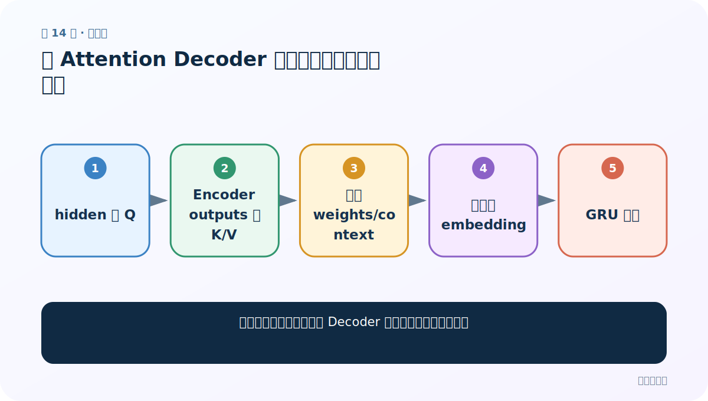
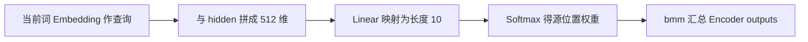
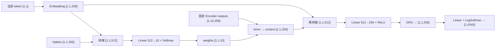
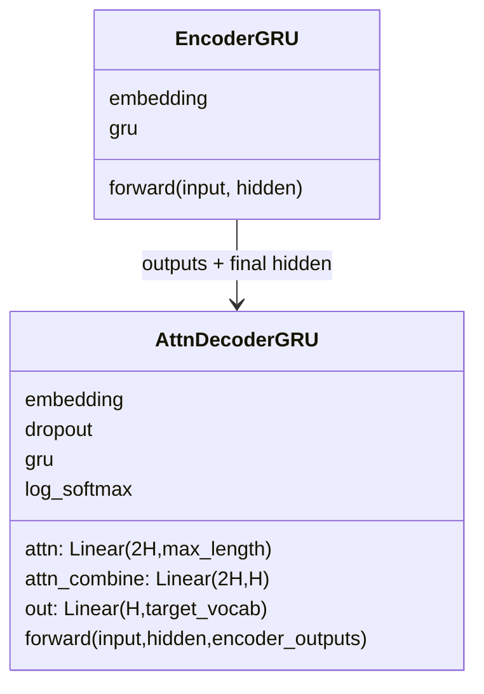

# 第 14 节：课程版 Attention Decoder：拼接查询与隐藏状态计算 10 个权重

> 笔记编号 14/26 · 对应原视频 P93 · [打开这一集](https://www.bilibili.com/video/BV14mdfBDE4Q?p=93)

[← 上一节：13 测试无 Attention Decoder：连接编码器并逐步验形状](./13-test-plain-decoder.md) · [返回总目录](./README.md) · [下一节：15 有 Attention Decoder 代码（上）：初始化九个成员 →](./15-attention-decoder-code-part1.md)

## 这节解决什么问题

老师采用的课程版 Attention Decoder 怎样把当前输入、上一隐藏状态和固定长度的 Encoder outputs 组合起来？



图从左向右读。先跟着数据或推理过程走一遍，再学习下面的术语。

## 辅助流程图



### 带注意力 Decoder 单步形状流



### Seq2Seq 模块 UML



## 老师原声整理稿（按讲解顺序）

### 0:00–5:24　先沿图识别三路输入，不能把这套实现误说成点积注意力

老师从结构图出发：当前目标词先经 Embedding 得到 `[1,1,256]`，上一时刻 hidden 也是 `[1,1,256]`，Encoder 则保留源句所有时间步的状态。当前词表示在图中承担查询 Q 的角色，但课堂实现不是直接计算 QK 点积。

本课程采用 PyTorch 早期 Seq2Seq 教程常见的“拼接后过线性层”方案：把当前词表示和 hidden 拼成 512 维，再用 Linear 一次产生最大源长度个分数。它与前面讲过的注意力三步思想相通，但具体打分公式不同。

### 5:24–10:03　固定最大句长为 10，所以注意力层输出 10 个位置分数

课程把英文句子的最大长度预设为 10。拼接后的 `[1,1,512]` 经过 `Linear(512,10)`，再用 Softmax 得到 `[1,1,10]` 的注意力权重。10 表示十个源位置，不是隐藏维度，也不是法语词表大小。

真实英文句子可能只有 6、7 或 8 个 token，测试阶段会先把 Encoder outputs 复制到一个 `[1,10,256]` 的零张量里。当前实现没有单独的 PAD mask，所以补出的零位置仍参与 Softmax；这是教学简化，不能把它描述成已经实现了 mask。

### 10:03–15:46　权重通过 bmm 汇总 Encoder outputs，得到本步上下文

`[1,1,10]` 的权重与 `[1,10,256]` 的 Encoder outputs 做批量矩阵乘法，得到 `[1,1,256]` 的 attention-applied context。它表示当前生成步骤从十个源位置汇总出的信息。

老师反复让同学对照形状理解：权重的最后一维必须等于固定源长度 10，Encoder outputs 的中间维也必须是 10，二者才能相乘。隐藏维 256 在加权求和后保留下来。

### 15:46–20:25　再把当前词表示与 context 融合，交给 GRU 和法语分类层

得到 context 后，课程又把它与当前目标词的 Embedding 拼成 512 维，通过 `attn_combine` 线性层降回 256 维，经过 ReLU 再送入 GRU。GRU 更新 hidden，最后 Linear 把 256 维映射到 4345 个法语词。

每个目标时间步都会重新计算一组十维权重，因此生成不同法语词时关注的英文位置可以不同。输出端还会返回这组权重，后面绘制注意力热力图。

## 完整原声逐段记录

[查看本节按时间戳整理的完整音轨转写](./transcripts/p093.md)

逐段记录用于核查老师讲解是否遗漏；正文会进一步纠正口误和语音识别中的技术术语。

## 零基础先记住

- 课堂使用 concat+Linear 打分，不是点积 QK
- max_length 固定为 10
- 权重 [1,1,10] 与 Encoder outputs [1,10,256] 做 bmm
- context 与当前词表示再次拼接后送 GRU

## 最小可运行代码

下面代码默认从项目根目录运行；专题配套实现见 [seq2seq_from_scratch 配套实现](../../seq2seq_from_scratch/README.md)。

```python
import torch
B,H,L=1,256,10
embedded=torch.randn(B,1,H); hidden=torch.randn(1,B,H)
score_layer=torch.nn.Linear(H*2,L)
weights=torch.softmax(score_layer(torch.cat((embedded,hidden.transpose(0,1)),dim=-1)),dim=-1)
encoder_outputs=torch.randn(B,L,H)
context=torch.bmm(weights,encoder_outputs)
print(weights.shape,context.shape)
```

### 输入和输出怎么看

课程默认尺寸下，weights=[1,1,10]，context=[1,1,256]。

## 最容易踩的坑

不要把课程实现改写成 hidden 与 Encoder outputs 的点积注意力，也不要声称本节已做 PAD mask。

## 本节知识链

`当前词 Embedding 作查询 → 与 hidden 拼成 512 维 → Linear 映射为长度 10 → Softmax 得源位置权重 → bmm 汇总 Encoder outputs`

## 自测

**问题：为什么注意力层 Linear 的输出维是 10？**

<details>
<summary>点开核对答案</summary>

课程把源句最大长度固定为 10，要为这十个源位置各产生一个权重。

</details>

## 学完检查

- [ ] 我能用自己的话复述老师的讲解顺序
- [ ] 我能在运行前预测关键输出或张量形状
- [ ] 我知道这节方法最容易用错的地方
- [ ] 我能独立回答自测题

[← 上一节：13 测试无 Attention Decoder：连接编码器并逐步验形状](./13-test-plain-decoder.md) · [返回总目录](./README.md) · [下一节：15 有 Attention Decoder 代码（上）：初始化九个成员 →](./15-attention-decoder-code-part1.md)
