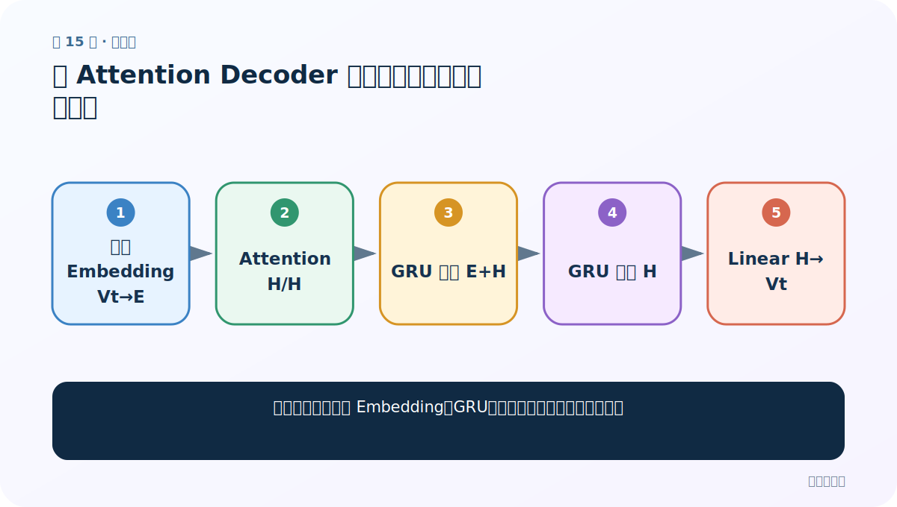
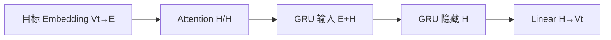
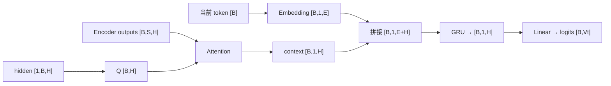

# 第 15 节：有 Attention Decoder 代码（上）：定义层与接口

> 笔记编号 15/26 · 对应原视频 P94 · [打开这一集](https://www.bilibili.com/video/BV14mdfBDE4Q?p=94)

[← 上一节：14 有 Attention Decoder 思路：每步重新查询源句](./14-attention-decoder-plan.md) · [返回总目录](./README.md) · [下一节：16 有 Attention Decoder 代码（下）：逐行完成 forward_step →](./16-attention-decoder-code-part2.md)

## 这节解决什么问题

初始化参数怎样与 Embedding、GRU、分类层的输入输出一一对应？



图从左向右读。先跟着数据或推理过程走一遍，再学习下面的术语。

## 辅助流程图



### 带注意力 Decoder 单步形状流



## 老师原声整理稿（按讲解顺序）

### 0:00–4:52　构造参数

target_vocab_size 决定 Embedding 行数与最终类别数；embedding_size=E；hidden_size=H。

### 4:52–8:48　层的尺寸

Embedding(Vt,E)，GRU(E+H,H)，Linear(H,Vt)。只要把这三行尺寸推出来，后面大部分形状不会乱。

### 8:48–11:35　forward_step 接口

输入 current_ids[B]、hidden[1,B,H]、encoder_outputs[B,S,H]、可选 source_mask[B,S]；输出 logits、new_hidden、weights。

## 完整原声逐段记录

[查看本节按时间戳整理的完整音轨转写](./transcripts/p094.md)

逐段记录用于核查老师讲解是否遗漏；正文会进一步纠正口误和语音识别中的技术术语。

## 零基础先记住

- GRU input_size=E+H
- Linear out_features=目标词表大小
- mask 形状与源序列一致

## 最小可运行代码

下面代码默认从项目根目录运行；专题配套实现见 [seq2seq_from_scratch 配套实现](../../seq2seq_from_scratch/README.md)。

```python
from seq2seq_from_scratch.model import AttentionDecoderGRU
m=AttentionDecoderGRU(vocabulary_size=120,embedding_size=16,hidden_size=32)
print(m.gru.input_size,m.classifier.out_features)
```

### 输入和输出怎么看

GRU 输入维 48，分类输出 120。

## 最容易踩的坑

把 source_vocab_size 用到 Decoder Embedding 会产生错误词义映射。

## 本节知识链

`目标 Embedding Vt→E → Attention H/H → GRU 输入 E+H → GRU 隐藏 H → Linear H→Vt`

## 自测

**问题：E=16、H=32 时 GRU input_size 是多少？**

<details>
<summary>点开核对答案</summary>

48。

</details>

## 学完检查

- [ ] 我能用自己的话复述老师的讲解顺序
- [ ] 我能在运行前预测关键输出或张量形状
- [ ] 我知道这节方法最容易用错的地方
- [ ] 我能独立回答自测题

[← 上一节：14 有 Attention Decoder 思路：每步重新查询源句](./14-attention-decoder-plan.md) · [返回总目录](./README.md) · [下一节：16 有 Attention Decoder 代码（下）：逐行完成 forward_step →](./16-attention-decoder-code-part2.md)
